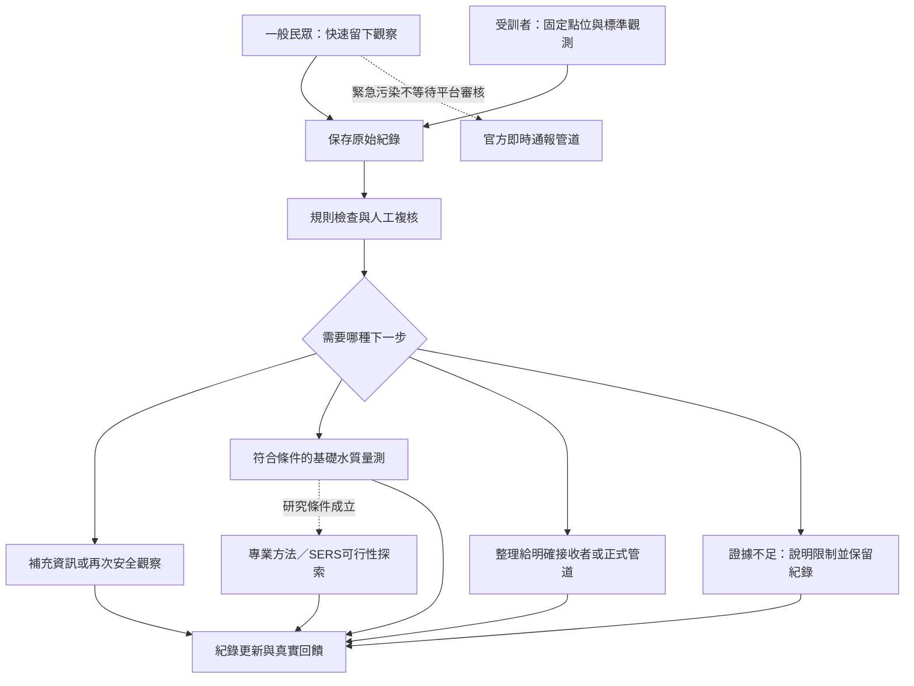

# 河眼 RiverEye｜第二版企劃書

## 從三十秒隨手回報，到可複核、可交接的河川公民觀察

**提案定位：低門檻公民觀察 × 人工與 AI 輔助整理 × 分層水質驗證 × 結果回饋**

| 基本資料 | 內容 |
|---|---|
| 參賽活動 | 2026 永續智慧創新黑客松競賽 |
| 場次與語系 | 11-M，中文組 |
| 正式命題 | 如何運用公民科學，讓民眾加入河川永續的行列 |
| 命題企業 | 聯合報系；河好如初河川永續議題 |
| 本命題負責單位 | 東海大學 |
| 整體賽事主辦 | 中國醫藥大學 |
| 提案名稱 | 河眼 RiverEye |
| 文件版本 | V2.0，小組討論與實作驗證用企劃底稿 |
| 編製日期 | 2026-09-28 |
| 團隊身分 | 正式隊名、成員與指導教師尚未定案；本稿採職能分工，不虛構姓名或合作關係 |
| 主要依據 | 第一週初稿〈黑客松-初步想法.txt〉、後續討論、桌面參賽攻略，以及本文列示的一手來源 |

> **版本聲明：** 本稿將原案改寫為可執行、可驗證的第二版，而不是把規劃包裝成已完成成果。依團隊自述，目前已有回報系統原型，尚未完成本企劃所規劃的田野、量測與實際合作驗證。本次未進行程式驗收，因此各功能仍須由團隊測試確認。
>
> **AI 輔助揭露：** 本文件由 OpenAI ChatGPT／Codex 輔助閱讀第一週初稿、查核資料、重整企劃及草擬第零至六節文字與表格。文內引用的外部資料另列來源；企劃目標、預算及測試設計為第二版建議，尚非團隊實測結果或已核准預算。最終提交前，團隊須人工審閱並依競賽規範保留使用工具、範圍及授權紀錄。

### 文件用途

- **第零至四節**：提案摘要與企劃正文，對應官方模板的計畫目標、創意構想、提案內容、預期效益與商業化潛力。
- **第五節**：四／五人跨域分工及決策責任。
- **第六節**：第一版到第二版變更、歷屆經驗、驗收情境、正式繳件注意事項與來源。
- 本文件是內容較完整的工作底稿，**不宣稱已符合排版後十頁上限**；正式提交須轉入當年度模板，按第 6.4 節取捨正文與附件。[R02][R04]

---

## 零、提案摘要

本計畫以「民眾願意關心，卻可能在找窗口、判斷現象與填寫資料的過程中放棄」為待驗證問題，提出河眼 RiverEye 河川公民觀察服務。第一階段以東海大學校園或周邊一處安全、可取得必要許可的水路為候選示範場域，規劃三至五個固定觀測點，串聯偶發民眾回報、受訓者定期觀察、基礎水質量測及必要時的專業分析。

與第一版不同，第二版不要求所有民眾先學會標準拍攝、完成認養或連續觀察，才可以留下資料。一般使用者可透過網頁，以約三十秒為設計目標，記錄時間、位置與所見現象，附上照片或異味描述。**此處的完成，指平台確認保存觀察，不代表政府已受理或污染已確認。** 需要較完整影像、觀測卡與儀器操作的任務，交由受訓觀測者承接。

平台先以明確規則與人工審核整理資料，保留原始觀察、修正原因與事件關聯；AI 僅在有可驗證效益時協助品質提示、摘要與疑似重複整理，不直接判定污染物、違法來源或取代緊急通報。受訓者在符合安全、設備與方法條件下量測水溫、pH、導電度及濁度。原案的 SERS 保留為單一目標物之進階方法可行性研究，不作為平台成立的前提，也不以文獻成績冒充本隊成果。

本計畫預期產出一套可操作的回報與審核流程、一份公民觀察方法、一輪四週試辦、可追溯的觀察與量測紀錄，以及資料接收端的使用回饋。成效將同時評估民眾完成率、有效紀錄比例、人工處理時間與交接可用性，而不是只計算上傳量。若試行發現獨立平台並未比既有管道更有價值，團隊將縮小為既有管道的引導與資料整理服務，而不強行擴張另一個回報入口。

---

## 一、計畫目標與問題界定

### 1.1 問題不是「沒有通報管道」，而是資訊與行動能否順利銜接

環境部已有公害污染陳情網路受理系統、0800-066-666 專線及公害報報 App。官方說明列有 GPS 定位、污染項目選擇與案件查詢功能。[R06][R07] 因此，RiverEye 不以「官方不能拍照、沒有定位、不能追蹤」作為市場前提，也不預先宣稱所有人都覺得官方流程麻煩。

本案需要驗證的是下列流程斷點：

> 發現疑似異常 → 不確定是否值得回報 → 不知道應留下哪些資訊 → 找窗口或填寫時中斷 → 沒有可用紀錄，或紀錄到達接收端後仍需反覆補件。

團隊目前對這條行為鏈的理解，主要來自第一週構想與後續討論，尚缺目標族群訪談、現場紀錄及公平的既有管道比較。第二版把這些缺口列為前期必做工作，而非用更完整的文案掩蓋。

### 1.2 需要回答的三個問題

1. **參與問題：** 低負擔入口是否真的讓原本會放棄的人，完成一筆有用的觀察？
2. **資料問題：** 偶發照片與描述，經補充情境及人工複核後，是否能支援下一步現場確認或管理溝通？
3. **協作問題：** 新平台是否降低了民眾與接收者的總負擔，而非把民眾省下的時間轉嫁給審核者？

「三十秒」只回答其中一部分。本案不把速度、資料品質與實際用途彼此割裂。

### 1.3 目標使用者與服務邊界

| 角色 | 主要情境與需求 | RiverEye 提供的價值 | 不要求／不承諾 |
|---|---|---|---|
| 偶爾路過的學生、居民、河岸使用者 | 看見或聞到異常，想做一點事但不想承擔長期任務 | 低負擔記錄、清楚告知、可選擇查看後續 | 不強制認養、積點、學完整課程或先安裝 App |
| 自願再參與者 | 願意補充或想知道自己回報是否有用 | 補件、回訪、個人觀察歷程與結果說明 | 不以再次回報次數決定是否有資格看進度 |
| 受訓觀測者 | 社團、課程或志工需要一致的方法與清楚任務 | 固定點位、觀測卡、標準紀錄、量測與安全 SOP | 不假定已有社團或課程承諾投入 |
| 資料接收與複核者 | 需要可定位、可追溯、可理解的事件資訊 | 人工待辦、事件彙整、品質標記與可交接資料包 | 不承諾任何政府機關自動收件、派案或回覆 |
| 教師或實驗室 | 需要可評估的研究問題、樣本來源與方法紀錄 | 分層量測、方法可行性紀錄、適當的研究問題 | 不把專業諮詢或設備借用寫成已取得 |

### 1.4 計畫目標與範圍

**近期核心目標：** 完成一個場域內「觀察—核對—必要複核—交接或說明—回饋」的可追蹤流程，驗證低門檻入口與資料可用性是否可以並存。

**試辦範圍：**

- 一處候選水路場域，先以三個合格點位建立基線，條件允許再增加至五點。
- 保留第一版四類外觀觀察：水色／混濁、泡沫／油膜、垃圾／藻類、生態異常；異味作為可獨立提交的觀察情境，不要求一定有照片。
- 一套沿用既有原型改善的網頁服務，不重新開發另一套不相容平台。
- 水溫、pH、導電度、濁度四項基礎指標作為量測設計目標，須以設備、校正與安全條件支持。
- 一項單一目標物的 SERS 可行性研究；是否進入實驗由資源與安全條件決定。
- 四週小規模試辦；不以全台上線或大量案件為首階段目標。

**明確不做：** 自動認定化學污染、公布違法排放者、取代官方稽查、全天候緊急救援、以照片直接產出水質合格判定，以及尚未取得合作就承諾政府串接。

### 1.5 與本題五項評分的對應

本題官方評分為創新性、參與度、可行性、影響力、擴散性，各 20%。第一版將「完整性」列成評分面向，第二版改以正式命題為準；完整性仍是企劃品質要求，但不擅自新增權重。[R01]

| 官方面向 | 第二版回應 | 要交出的證據，而非形容詞 |
|---|---|---|
| 創新性 | 把偶發觀察接到可追溯事件與複核，而非僅增加上傳入口 | 既有流程比較、資料完整性與處理負擔差異 |
| 參與度 | 一次性參與與持續觀測分工，不強迫路人認養 | 首次使用、放棄原因、自願回訪與受訓者試辦紀錄 |
| 可行性 | 小場域、人工先行、技術與實驗設啟動條件 | 可操作原型、SOP、工時、成本、設備與安全確認 |
| 影響力 | 形成可用觀察、支援查核與環境理解 | 有效紀錄、接收端評語、交接及回饋；不以件數代替環境改善 |
| 擴散性 | 以一校一河段為可移轉方法，而非只複製軟體 | 觀測包、培訓、資料字典、權責表與第二使用者操作測試 |

---

## 二、創意構想與原型建構

### 2.1 核心構想：雙入口、分層驗證、真實回饋

RiverEye 保留初稿「公民觀測＋AI 輔助＋分層水質驗證」的架構，調整的是負擔分配：**一般人負責留下線索，受訓者負責較完整觀測，專業端負責相應方法的驗證。**

每件觀察不必走過所有量測與實驗階段。基礎量測、SERS 或教師回覆，都不應成為緊急案件正式通報的前置關卡。

### 2.2 一般民眾入口：三十秒是可測試的目標，不是既成成果

**服務主張：一般觀察不強制註冊、不先認養、不先承諾週期，不因只貢獻一次就失去價值。** 正式陳情仍依適用管道提供必要身分與聯絡資料，兩者不能混為一談。

| 步驟 | 使用者要做的事 | 系統處理與邊界 |
|---|---|---|
| 1. 留下現象 | 拍照或選擇異味／其他外觀描述 | 照片不是所有情境的必填；異味不能靠照片證明 |
| 2. 確認位置與時間 | 同意定位或手動標記；確認是否為現在觀察 | 區分拍攝／觀察時間與上傳時間，允許舊照但不冒充即時 |
| 3. 確認簡短描述與用途 | 選現象、必要時補一句話，閱讀精簡告知後送出 | 不要求一般人判斷污染物、責任者或填完整環工表格 |
| 4. 收到保存結果 | 保存查詢連結，自願選擇後續通知 | 顯示「觀察已保存」，不顯示「政府已受理」 |

三十秒定義為：**首次使用者從打開可用入口，到平台確認保存一筆符合基本使用條件的觀察。** 計時須涵蓋頁面載入、必要權限、照片選取或拍攝、告知及傳送，不把它縮成「照片已拍好後按上傳」的時間。

「看到現象到願意打開入口」另以訪談、現場觀察與入口取得方式評估，不由網站日誌假裝量出完整動機時間。送往正式管道及正式受理時間另列，不能算作同一個三十秒承諾。

### 2.3 受訓觀測入口：把標準化負擔放在願意承擔的人身上

受訓者使用點位編號、固定安全站位、觀察時段與較完整欄位。標準照片以安全位置可取得的環境全景及水面特寫為主，只有在不需靠近或追查時，才附加疑似來源方向的場景說明。

原案觀測卡保留，包含點位編號、QR Code、拍攝提示、尺度參考及安全提醒。色塊可協助拍攝條件紀錄，但**一般照片加色卡不等於校正完成的濁度計，也不能量測特定化學污染物**。卡片不應為拍攝需要而放入水中或設置於未獲許可的位置。

固定觀測也記錄「本次在可見範圍內未見所列異常」，避免只收負面事件。這只代表當次觀察，不代表水質安全或沒有污染。

### 2.4 公民科學問題與觀察方法

本案不把所有陳情自動稱為公民科學，而以兩個可研究的問題建立方法：

1. **服務驗證問題：** 加入低負擔提示與後端結構化整理後，民眾完成率與接收端可用率是否提升？補件與整理時間是否下降？
2. **環境觀察問題：** 在示範場域與有限時段內，哪些外觀或異味觀察反覆出現？哪些值得安排安全複訪或相應水質量測？

採集方法分為「機會式觀察」及「固定點位例行觀察」，兩類資料分開分析。每筆均保留時間、位置來源、方法、描述及品質狀態；量測另記儀器、單位、方法與校正紀錄。

**可推論範圍：** 哪些紀錄可供下一步判讀、哪些位置與時段有值得追蹤的觀察。  
**不可直接推論：** 全河污染率、污染源歸屬、化學物濃度、法規超標或治理成效。

ECSA 公民科學原則強調真正的知識或管理貢獻、參與者回饋、資料品質與偏差處理；本案以此作方法參照，不把它誤稱為競賽另訂的強制規格。[R16]

### 2.5 取代 D／C／B／A 單軸可信度：分開記錄三件事

第一版將單人回報、多次一致、受訓量測、實驗室分析排成 D 至 A 級。這容易讓人誤以為「人多就真」「做一次儀器分析就證明整個事件」。第二版改成以下三個獨立維度，不用單一分數掩蓋限制。

| 維度 | 紀錄內容 | 不代表什麼 |
|---|---|---|
| 證據種類 | 民眾描述／影像、受訓者紀錄、基礎量測、特定方法實驗結果；可並存 | 不是從低等級自動升成確定污染 |
| 資料品質 | 未檢視、基本資訊可用、待補充、方法或來源有疑義、已按指定方法核對 | 不是法律認證，也不保證因果正確 |
| 工作優先序 | 一般待辦、優先人工查看、需引導即時正式通報等 | 不是 AI 判定危害程度或保證稽查時效 |

多位使用者一致可增加值得查看的理由，但需考慮共用照片、轉貼、同一來源及環境共同干擾。不能自動把聲量轉為真實性。資料少的魚類死亡觀察，仍可能需要優先關注；資料完整的舊垃圾照片，也未必急迫。

### 2.6 分層水質驗證：保留環工與實驗能力，但限制主張

| 層級 | 執行者 | 主要內容 | 產出與解釋限制 |
|---|---|---|---|
| 第一層：公民觀察 | 一般民眾或受訓觀測者 | 時間、位置、外觀、照片及異味描述 | 異常線索，不是化學分析 |
| 第二層：基礎水質 | 具訓練、許可與安全條件的成員 | 水溫、pH、導電度、濁度；DO、ORP 或營養鹽等待研究必要性與資源確認後再增列 | 指定時地與方法的數值，不能回溯證明先前照片原因 |
| 第三層：專業方法 | 指導教師與適當實驗室 | 依特定問題選擇方法；SERS 為原案保留的可行性研究方向 | 只支持目標物、樣本及驗證條件內的結論，不自動成為正式稽查結果 |

**基礎量測的啟動條件：**

- 明確指定方法顧問、儀器保管與校正責任人。
- 確認設備規格、適用範圍、可用校正材料、維護與讀值穩定判準；具體數值由採用方法與教師核定，不在未選儀器前杜撰。
- 每次量測保留點位、實際時間、天候情境、採樣或現地方式、儀器識別、單位、校正與異常紀錄。
- 與影像作近同時同點位配對；如果隔日才量測，清楚標示時間差，不視為同一次事件的直接驗證。
- 校正不合格、方法不明、超量程或操作問題的數值標為不可用，不為補齊表格硬填。
- 只使用適當設備；若僅有未確認性能的教學工具，結果標為教育性探索，不誇稱精密監測。

上述方法以 USGS 現場量測指南作技術參考，仍須依臺灣場域、選用設備及合作教師要求形成實際 SOP。[R14]

### 2.7 SERS 子計畫：保留進階驗證，不讓它拖垮主線

SERS（表面增強拉曼光譜）原案方向保留，但其價值在**對限定分析問題建立方法可行性**，不是為企劃多掛一個高階技術名稱。

原初稿所列研究確實存在，正式題名為 *Determination of Trace Organic Contaminant Concentration via Machine Classification of Surface-Enhanced Raman Spectra*，研究以模型污染物光譜及機器學習探索濃度分類。[R15] 這支持方法研究的可能性，不代表本隊已具備河水分析能力，也不能把文獻準確率拿來當 RiverEye 效能。

| 階段 | 工作與通過條件 | 可以報告的成果 |
|---|---|---|
| S0 資源與問題確認 | 指導者、實驗室安全、儀器、基板、單一目標物與標準品均確認；目標物與場域問題有合理關聯 | 方法選擇與資源可行性備忘錄；條件不足即停留此階段 |
| S1 受控條件下方法探索 | 在核准的實驗室條件下建立空白、標準與重複性紀錄 | 指定條件的光譜品質、再現性與限制；若用模型物，明說是模型物 |
| S2 真實基質適用性 | 經指導者核准，評估水樣背景與干擾；需要時設適當對照 | 基質影響、不可判讀比例與方法限制，不把看見峰當成普遍定量能力 |
| S3 特定樣本分析與交叉確認 | 具足夠方法驗證及適合的參考方法／合作條件 | 僅對該樣本、目標物與方法支持的範圍做結論 |

本期至少完成 S0 的可行性判斷與資源紀錄；能否進入 S1 以上，於前期資源盤點後由團隊及指導者決定。沒有條件時，不以假數據、生成光譜或另一種儀器名稱充當已完成的 SERS 實驗。若改採其他驗證方法，必須記錄變更理由與主張範圍。

### 2.8 AI 與系統架構

沿用既有網頁原型，以清楚的模組邊界承接研究工作；本版不指定尚未評估的框架、模型或付費服務，不為企劃而重寫整套系統。

| 模組 | 核心功能 | 本期驗收方式 |
|---|---|---|
| 民眾端 | 低負擔觀察、定位修正、時間確認、純異味路徑、保存與查詢 | 非開發者首次使用與弱網／拒絕定位測試 |
| 觀測者端 | 點位、標準觀察、例行無異常紀錄、量測表單 | 受訓者依 SOP 完成，能辨識不適用與缺值 |
| 審核端 | 待檢視、補件、品質標記、事件關聯及更正 | 使用同批樣例比較補件與整理工時 |
| 資料端 | 原始觀察、事件、量測與交接分開保存，保留版本 | 可追查合併與更正，不覆寫原始證據 |
| 交接與回饋端 | 事件摘要、去識別輸出、接收紀錄、查詢與說明 | 接收者能理解內容；沒有外部回執不顯示已受理 |
| AI 輔助端 | 品質提示、摘要、疑似同事件建議；優先序僅作人工參考 | 與規則／人工基準比較，列錯誤與時間，無效則不啟用 |

**AI 權限原則：**

- 照片過暗或模糊可提示，不強迫民眾靠近危險位置重拍；保留繼續送出的途徑。
- 色彩與歷史差異只作影像線索；陰影、反光、雨後混濁與鏡頭差異均可能造成變化。
- 同事件聚類須可撤銷，保留每筆原始觀察；不把不同時間的相似照片全部刪除。
- 在沒有足夠標註資料與領域規準前，不公布「污染準確率」；模型信心也不是事件可信度。
- 重要異常漏判、錯誤合併、審核工時與不確定比例，比單一準確率更有用。
- 系統不因等待 AI、量測或 SERS 而延遲官方緊急污染通報。

### 2.9 案件狀態與正式通報邊界

第一版將「已收到→審核→再次觀測→現場複核→完成檢測→協助通報」排成一本道路，容易造成每案必須檢測的錯覺。本版分開呈現平台狀態與外部交接狀態。

**平台狀態：** 已保存、待檢視、需補充、已整理、資訊不足已說明，或在具體紀錄支持下標示已完成某項觀察／量測。  
**外部狀態：** 未轉交、待確認接收方式、已送出、已受理、已收到回覆。後三者各需對應實際交接紀錄、回執或回覆，不能由系統自行推進。

正式公害陳情要求具體地點、污染類別、情形、真實姓名及聯絡方式；急迫案件由官方即時管道受理。[R06] RiverEye 可協助整理資訊與引導，是否代為轉交、以誰的身分、需要什麼同意與個資，均須先確認。

無法判斷時，回饋「目前證據不足，未能確認原因」；沒有證據就不能把案件關閉成「自然現象」或「沒有污染」。

---

## 三、提案內容與執行規劃

### 3.1 候選場域及選點方法

延續第一版，以東海大學校園或周邊安全水路為候選，但目前不指定未經勘查、未取得權限的點位，不宣稱校方或管理單位已合作。

選點先通過四個門檻：

1. 可由合法、安全、穩定的位置觀察，不需入河、翻越或進入私地。
2. 有可描述的水路脈絡與管理窗口，能分清校園設施、水路及河川等不同管理情境。
3. 照片及量測方法可重複，且網路、定位與可達性已確認。
4. 可以取得必要的觀察、器材設置、採樣或場地許可；不同活動的許可分開確認。

先建立三點基線，點位角色依現場可行性設定，例如相對上段、中段或匯入口附近、下段；**相對上下游不等於可以證明特定來源污染**。新增第四、第五點必須有研究理由與人力，不為湊數增加路線。

若候選場域不安全或未獲許可，先更換合法場域並更新計畫；不以逾越權限換取實拍。這是場域選擇程序，不是自行取消實地驗證。

### 3.2 前期需求研究

| 工作 | 第二版建議規模 | 應產出什麼 | 避免的偏誤 |
|---|---|---|---|
| 民眾需求訪談 | 約 8–12 位，包含曾回報、曾放棄及不願使用者 | 最近一次經驗、阻力、需要的回饋 | 不只問同學「這功能好不好」 |
| 接收端需求訪談 | 至少 2 種角色，爭取其中 1 位提供樣例判讀 | 必要欄位、使用情境、不能承諾的事與交接條件 | 支持創意不等於承諾收件 |
| 安全走訪 | 至少 2 次不同時段，依情況增加 | 路線、安全、位置、光線、網路與權限紀錄 | 不要求必須拍到污染或死魚 |
| 既有流程比較 | 官方網路／App 與本原型的同類任務 | 入口取得、填寫、補件、狀態理解與時間差異 | 不拿匿名保存和正式具名陳情直接比速度 |

以上是小規模探索設計，不是統計上代表全體民眾的抽樣，也不是官方規定的最低人數。

流程測試使用不送出的操作、經同意的測試環境或真實且合適的案例；不為測試撥打假陳情、重複提報不存在的污染或占用緊急行政資源。

### 3.3 四週試辦設計

**試辦暫定期間：2026-10-12 至 2026-11-08。** 以場域、知情同意、方法與基本系統通過前期門檻為開始條件；如有延誤，誠實縮短觀察期並調整可以主張的結果，不補造四週留存。

| 資料來源 | 工作安排 | 預計形成的資料 | 分析限制 |
|---|---|---|---|
| 固定觀察 | 三點、每週三次、四週，在核准安全時段執行 | 36 筆「點位—時段」觀察機會；包含無異常紀錄 | 遇不安全條件取消並記缺測，不為達標冒險 |
| 基礎量測 | 三點、每週一次、四週，與當次標準觀察盡量配對 | 12 筆點位量測紀錄；四項指標均完成時最多 48 個參數值 | 48 個參數值不是 48 個獨立樣本；未通過品質條件不能列有效 |
| 偶發民眾回報 | 試點範圍內自願提交 | 真實存在且取得適當同意的機會式觀察 | 不設污染事件配額、不誘導製造異常 |
| 人工流程演練 | 至少三種不同情境，如資訊完整、需補件、同事件多筆 | 已標示演練的操作與交接測試紀錄 | 演練不計為真實污染或政府處理件數 |
| 專業分析 | 依 SERS 啟動條件與指導者核准安排 | 方法可行性與實際做到的階段 | 不為湊成果而偽稱已完成目標物檢測 |

原案「至少 100 筆」保留為擴張目標，而不是最低污染回報量。先完成可解釋的固定觀察與有效資料；若自然參與不足以達 100 筆，就報告實際數量及原因。複數照片、重送、修正版本及同一量測的四個數值，不拆算為獨立觀察來衝量。

### 3.4 使用者測試與三十秒驗證

分兩輪執行：首輪約十位非開發成員找可用性問題；修改後再邀約二十位新使用者測試，累計以三十位不同使用者為目標。原初稿的三十至一百人，改為先完成三十人探索，再依人力與招募情形擴大，不以一百人的展示數字壓過測試品質。

測試包含首次定位權限、拒絕定位、純異味、選舊照片、網路不穩、無法拍清楚與不願留聯絡方式等情境。若比較不同介面，安排不同順序並標示學習效應；不讓只有開發者熟悉的流程得到不公平優勢。

記錄四個層面：

- **完成率**：開始任務的人有多少成功留下可用紀錄。
- **時間**：成功者的時間分布、較慢案例與失敗時間；失敗不填零，也不從整體報表消失。
- **資料可用性**：由接收端依事先定義的規準判斷，是否足以知道何時、何地、何種現象及下一步。
- **總負擔**：操作、補件、平台審核與接收者整理合計，避免只把工作往後移。

若無法同時達到三十秒與足夠資料品質，優先保留必要資訊，公開時間結果並修改速度主張。三十秒是可被試驗推翻的假設，不是不能承認失敗的品牌標語。

### 3.5 參與與「河川水滴」機制

**第一次回報不展示認養合約、連續四週任務或兌換門檻。** 報完先回答：「系統收到了什麼？接下來可能怎麼用？目前還不能確認什麼？」

持續參與採三條自願路徑：

1. **只看後續**：保留查詢連結或自願通知，不必再報一次。
2. **偶爾補充**：願意時補充位置、時間或安全範圍內的新觀察。
3. **固定觀測**：受訓學生、課程或志工承接點位；認養是組織端的管理選項，不是每個人的入口。

原案「河川水滴」保留為可選的參與試驗。試辦初期先以真實進度、資料採用說明與觀察歷程為主；只有在預算、條款及合作資源確認後，才公開可兌換的獎勵。

| 原案設計 | 第二版處理 |
|---|---|
| 新手安全測驗給 5 點 | 受訓固定觀測者的培訓可保留；一般一次性回報不以考試當門檻 |
| 標準觀測 10 點、完整再加 5 點 | 若試行，按完成且通過基本規準記錄一次；完整性已是必要條件，不重複給分鼓勵堆欄位 |
| 連續四週加點 | 僅適用自願固定觀測者；因安全停測不懲罰，不要求冒險維持連續紀錄 |
| 大雨前後對照加點 | 不發布豪雨前後限時任務，不因危險天候額外獎勵；安全恢復後的正常觀察另按方法紀錄 |
| 污染越嚴重越有價值 | 不依污染嚴重度、死魚數或接近污染源的程度給點 |
| 同帳號同點位每天只計一次 | 可限制獎勵計次，但不能限制真實的新觀察；資料保存與獎勵分開 |
| 四筆觀察換 50 元／抽獎 | 有預算與明確名額才公告；不得把抽獎寫成保證兌換，也不假設已找到店家 |

**獎勵預算示例：** 一個四週試辦若採二十份、每份五十元的定額獎勵，最高支出為 1,000 元。若改為一百人各保證兌換五十元，最高為 5,000 元；需要另行核准，且不能據此宣稱必然取得四百筆有效資料。

研究測試的合理時間補貼與平台任務獎勵分開記帳。所有有獎勵的參與結果須標示，不能把受獎勵影響的回訪當成無補貼下的自然留存。

### 3.6 接收端與合作開發

本案先接觸校園水路或場域管理者、相關教師及在地團體，尋找可以評讀資料的具體角色。合作分成不同強度，文件分開記錄：

| 合作程度 | 可寫進企劃的內容 | 不能越級宣稱 |
|---|---|---|
| 曾接受訪談 | 該角色提供需求或意見 | 已成為合作單位 |
| 願意評讀樣例 | 同意檢視指定批次資料、給回饋 | 同意長期接收所有案件 |
| 同意小範圍試行 | 約定期間、角色、資料與工作量 | 全校／全市正式採用 |
| 正式接收或轉交安排 | 有明確方式、同意與責任範圍 | 存在未確認的 API、自動派案或法定處理承諾 |

命題疑問透過主辦或執行單位聯繫，不私下向命題企業尋求競賽解答。[R03] 現場需求訪談也必須表明學生團隊身分，不暗示代表河好如初、校方或環保局。

交接資料包包含：事件摘要、觀察時間與地點、原始紀錄關聯、必要照片、已做與未做的複核、資料限制、交接目的及聯絡同意。**CSV 是其中一種格式，不是合作本身。**

### 3.7 營運分工與服務能力

試辦期先以定期人工檢視為主，不宣稱二十四小時即時服務。上線前在介面列出實際檢視時段與服務範圍；工作優先序僅供團隊分配人工注意力。

營運能力以實際工時計算。例如每天二十筆、每筆三分鐘初審，即需六十分鐘，尚未包含補件與交接。這是估算示例，不是現有流量或已測工時。

當案件超過可處理量時：先顯示能力限制與正式管道，減少宣傳與擴張、調整試辦上限、增補人力；不以尚未驗證的 AI 宣稱問題會自行消失。

### 3.8 初步資源與預算

以下為**四週小規模試辦的討論用預算情境**，不是報價、已核准經費或已取得資源。假設手機與開發設備由團隊既有資源提供；不得為了符合此估算，使用不適當量測器材。實際支出須依報價與借用條件調整。

| 項目 | 規劃用途 | 討論用金額（新臺幣） |
|---|---|---:|
| 觀測卡與印製 | 方法卡、點位與測試說明；設置先取得同意 | 400 |
| 交通 | 小場域走訪、訪談與試辦 | 1,200 |
| 安全與紀錄用品 | 個人防護、樣本標示及必要紀錄用品 | 800 |
| 量測校正與耗材 | 依所用方法確認；不含未核准化學實驗 | 1,600 |
| 設備借用／租用預留 | 適當水質儀器之取得成本；不足時重估 | 3,000 |
| 平台與儲存 | 試辦期間主機、影像及必要網路資源 | 600 |
| 使用者測試支出 | 測試行政與合理參與成本，不要求正面評價 | 1,000 |
| 水滴獎勵試驗 | 二十份五十元之支出上限，啟用前確認規則 | 1,000 |
| 預備金 | 以核准用途補實際差額 | 1,400 |
| **小計** | **上述九項合計** | **11,000** |

**SERS 獨立估算：** 若已可借用實驗室與儀器，可先討論最高 3,000 元的前期耗材額度；這不是對完整 SERS 驗證足夠的保證。兩者合計情境上限為 14,000 元，不含人力工時、不含購置拉曼儀器，也不代表已找到經費。未獲核准前不得對外承諾。

另行記錄團隊投入工時。即使學生沒有領薪，審核、維護與教學都不是零成本；後續擴散須把人力列入。

### 3.9 里程碑與交付物

| 日期 | 工作 | 可驗收交付物／決策 |
|---|---|---|
| 9/28–10/04 | 確認四／五人投入、需求訪談、場域及設備盤點 | 角色責任、候選場域、安全及資源清單；初稿假設是否成立 |
| 10/05–10/11 | 原型盤點、方法審查、首輪測試、合作樣例確認 | 雙入口、狀態與告知、觀察 SOP；是否具備量測及 SERS 啟動條件 |
| 10/12–10/25 | 四週試辦前半、固定觀察、基礎量測、第二輪使用者測試 | 原始資料、校正與缺測紀錄、補件與工時；修改最大阻力 |
| 10/26–11/05 | 試辦後半、接收端評讀、獎勵條件試驗與成本整理 | 交接樣例、品質問題、持續參與紀錄；完成報名作業 |
| 11/06 | 官方報名截止 | 不等最後一刻才確認隊員與資格 |
| 11/07–11/17 | 完成試辦彙整、計畫書、AI 揭露及文件核對 | 按實際完成度整理結果、限制、下一步與授權紀錄 |
| 11/18 | 官方初賽繳件截止 | 提案計畫書、切結書、學生證／在學證明及選配資料 |
| 11/26 | 官方晉級名單公告 | 依結果調整決賽準備；不是此時才首次進現場 |
| 11/27–12/12 | 補充驗證、十分鐘展示、問答與備援 | 原始測試紀錄、完整展示及五分鐘問答準備 |
| 12/13 | 決賽 | 區分已完成、試行中及規劃中，不以模擬充作現場成果 |

日期依查證時官方首頁。[R02] 新公告與實際安全、同意及資源條件優先；若試辦延誤，記錄原因並縮限結果的解釋，不倒填時程。

---

## 四、預期效益與商業化潛力分析

### 4.1 驗證指標：量與品質、前端與後端一起看

以下數值是第二版建議的試辦目標，不是官方門檻或已達成成果。比例必須同時報告分子、分母、觀察期間與失敗原因；小樣本結果不外推全體民眾。

| 指標 | 第二版目標／觀察項目 | 操作定義與限制 |
|---|---|---|
| 場域與點位 | 一處、三點基線；可行再增至五點 | 每點須通過安全、權限與方法條件 |
| 使用者測試 | 三十名不同使用者為目標，分輪迭代 | 開發者與重複測試另外列示，不能灌人數 |
| 快速入口 | 成功完成者中位時間以三十秒為目標，同時揭露整體完成率 | 不僅測熟練者，不省略權限、告知與傳送，也不隱藏失敗 |
| 首次完成率 | 探索性目標至少 80% | 完成基本可用觀察人數／所有開始任務人數；不代表官方受理率 |
| 基本可用率 | 目標至少 80%，依接收者事先規準核對 | 能識別時間、位置、現象與下一步的紀錄／試辦觀察紀錄；缺照異味不自動判無效 |
| 固定觀察 | 36 筆點位—時段觀察機會 | 記錄實到、未到及停測；有效筆數另列 |
| 基礎量測 | 12 筆點位量測紀錄，四項指標為規劃目標 | 校正與方法合格才列有效；四個指標不算四次獨立觀察 |
| 四週參與 | 自願固定觀測群以至少 30% 完成約定週期為探索目標 | 分母為進入完整四週觀察期的自願參與者；失聯計流失，安全停測另記，不處罰個人 |
| 100 筆觀察 | 保留為擴張目標，不列最低污染事件數 | 依實際觀察與人力決定，不以洗點、重送或模擬湊數 |
| 後端負擔 | 記錄審核、補件、彙整與交接每件耗時 | 必須與資料可用性一起比較；速度變快但品質下降不算成功 |
| 交接能力 | 至少一次接收端樣例評讀與流程回饋 | 演練與正式真實交接分列；無回執不稱機關已受理 |
| SERS | 完成 S0 可行性紀錄；其餘依條件 | 評估結果可以是不適合，不以未完成實驗冒充成果 |
| 環境理解 | 自願參與者前後簡短問答，呈現原始變化 | 不宣稱因果或普遍學習效果；須說明樣本與其他影響 |

四週參與率不適用所有一次性回報者。對偶發使用者，更適合看是否理解用途、能否取得回饋及有新需求時是否願意使用；不以「沒遇到異常所以沒再報」直接判定服務失敗。

### 4.2 預期效益及不越界的主張

- **短期：** 把原本可能流失的觀察整理得更完整，了解真實阻力、資料可用性與接收端負擔。
- **中期：** 形成由受訓者或既有組織承接的固定觀測，以及能說明限制的資料包與回饋習慣。
- **長期：** 以一校一河段的觀測包與營運規格，移轉至其他願意承接的場域；是否能支援決策，須由實際使用紀錄證明。

本期不直接宣稱水質改善、稽查效率提升或污染源更早被查獲。若沒有可比的時間與接收資料，也不宣稱已縮短異常「發生到發現」時間；平台只能確知自己收到與處理紀錄的時間。

### 4.3 差異化不是「拍照＋AI」，而是雙端總負擔

| 比較對象 | 已有／已知能力 | RiverEye 要驗證的差異 |
|---|---|---|
| 官方公害陳情與公害報報 | 正式受理管道、定位、案件查詢 | 是否有特定族群需要更低負擔的前段觀察與補件協助；不能預先認定官方不好用 |
| 一般社群照片分享 | 易分享、能引發討論 | 是否補上可定位、可追溯、可更正與明確用途，且不增加負擔 |
| 既有固定觀測或課程 | 通常有較完整方法與持續性，依各計畫而異 | 是否能讓偶發民眾貢獻與固定方法互補，而非再建一個孤立資料庫 |
| 河好如初既有提案 | 有資訊整合、環境回報、教育及場域實作的先例 | 是否以實測補上聚焦、透明、小規模驗證與複製性，不以「他們沒做成」當優勢 |

第一版「一般單次通報只供個案、我們才有長期資料」的二分比較撤回。既有機關也可能累積與分析資料；本案必須在實際工作流程中證明額外價值。

### 4.4 營運與商業化假設

本案近期以校園試辦與公共利益為主，不要求一般民眾付費才能回報或看自己的結果。不以出售個資、按嚴重度收費或贊助者介入判讀作為收入來源。

| 階段 | 可能資源／支付方 | 提供的服務 | 必須先成立的條件 |
|---|---|---|---|
| 小規模驗證 | 團隊、校內計畫、競賽資源或合法補助 | 方法、原型與試辦 | 實際預算同意；不把得獎獎金當確定收入 |
| 校園／地方移轉 | 願意承接的學校、團體或場域管理者 | 培訓、點位與資料格式設定、後台維護、成果整理 | 證明服務有用、責任可承擔、成本可估 |
| 長期服務 | 經驗證的機構委託、專案服務或透明贊助 | 維運、資料品質支援、方法更新 | 有支付意願與契約、授權、個資、資訊安全及服務責任安排 |

本版不設定虛構售價或市場規模。定價前先計算：固定平台與資安成本、實際審核工時、培訓與現場支持、資料整理及必要器材成本。是否有機構願意付費，以訪談或試行後的決策為準；若沒有，應評估接入既有公民科學計畫，而非勉強打造商業平台。

「一校一河段」的複製包至少包含：點位選擇、安全與權限清單、觀測與量測方法、資料字典、培訓、角色分工、審核和交接流程，以及成本表。單純把程式部署到另一台主機不等於完成擴散。

### 4.5 風險管理

| 風險 | 後果 | 第二版控制措施 |
|---|---|---|
| 入口負擔過大 | 民眾第一次就放棄 | 一次性入口與受訓入口分開；三張照片、認養、積點不作首次門檻 |
| 匿名保存被誤認正式陳情 | 民眾以為政府已接到緊急案件 | 明示平台性質、緊急電話；外部狀態由回執支持 |
| 資料不完整或不可信 | 接收者無法使用 | 事先規準、必要補件、人工核對、品質狀態及限制說明 |
| AI 漏判或錯誤合併 | 延誤查看、破壞證據 | 人工覆核、保留原始資料、可撤銷合併、急迫案件不等待模型 |
| 影像被當化學量測 | 誤指控或錯誤安全判斷 | 觀察與量測分開、不得憑照片推論污染物與違法來源 |
| 量測不適用 | 看似專業但方法無效 | 設備與校正責任、時間地點配對、不合格結果留痕不列有效 |
| SERS 或設備未取得 | 進度與主張失真 | 資源門檻與階段成果；把未做部分列規劃，不以別的成果偷換 |
| 獎勵誘導洗點或冒險 | 假資料、危險採樣 | 獎勵與紀錄分離、同事件保留但不重複給點、取消天候刺激 |
| 個資與名譽侵害 | 人臉、車牌、個人軌跡或未證指控曝光 | 私密原始紀錄與公開摘要分離、必要遮蔽、最小權限、同意與更正 |
| 人力不足 | 回報累積卻無人處理 | 量出每件工時、公布實際服務能力、限制試辦量、不承諾全天候 |
| 場域許可與安全不足 | 違規進入或事故 | 先確認權限；不下水、不跨越、不單人採樣、不在危險條件出隊 |
| 無外部接收者 | 平台成為新資料終點 | 早期取得樣例評讀；若無合作，誠實停在方法與整理試驗，不宣稱治理已完成 |

**資料保護設計：** 聯絡方式與公開觀察分開；原始影像限必要人員查看；公開資料按用途去識別，不能將精確個人軌跡、完整 EXIF 或未核實指控直接開放。試辦開始前定義保存期間、刪除／撤回方式與同意內容；不以「科學資料應開放」為由忽略隱私。

### 4.6 停止或轉向條件

- 若主要阻力是怕具名、怕報復或不信任，而不是填寫時間，應調整產品與問題定義。
- 若審核與補件負擔不降，先改善採集方法，不急著擴大招募。
- 若沒有安全、設備或指導條件，停止相關量測／SERS 實驗；保留可行性結論，不捏造完成。
- 若既有管道已能滿足需求且新增平台沒有額外價值，改為既有管道的引導、資料整理或培訓工具。
- 若要調整原訂主要成果，記錄原因、影響與團隊決議；不能到了繳件時才偷偷換成容易完成的另一個題目。

---

## 五、團隊組成與責任分工

### 5.1 分工原則

保留第一版的電機／環工、環工、企管、資管與偏資工能力組合。這是擬議角色，不代表成員與學籍已全部確認。正式隊名、姓名、學校與必要聯絡資料，應由團隊確認後按官方模板填寫；本稿不虛構履歷、得獎或指導關係。

企管不只負責簡報美化，資工也不承擔所有需求、後台、AI、部署與維運。每項工作必須有主要負責者、第二位可接手者，以及可驗收產出。

### 5.2 五人方案

| 職能角色 | 主要責任 | 可驗收交付物 |
|---|---|---|
| 電機加環工 | 技術統整、儀器需求、SERS 資源盤點、教師協調與科學主張審查 | 設備與方法清單、SERS 階段決策、技術限制表 |
| 環工 | 場域、水路脈絡、安全、觀察與量測 SOP、品質核對 | 安全選點表、校正與量測紀錄、資料解釋與限制 |
| 企管 | 使用者訪談、參與機制、合作開發、預算與排程 | 需求證據、合作狀態表、成本／工時、試辦招募與成果彙整 |
| 資管 | 雙入口服務設計、資料字典、介面、後台需求及使用者測試 | 流程、欄位、測試紀錄、可追溯狀態與展示腳本 |
| 資管偏資工 | 系統實作、資料保存、權限、部署與 AI 基準比較 | 可運作版本、驗收紀錄、資料匯出、模型或規則限制與維護說明 |

五人方案的價值在有人真正承接場域與方法，不是科系名稱較多。每次採樣或量測仍至少兩名符合要求的人員共同執行，不能把安全責任全推給單一環工成員。

### 5.3 四人方案

四人方案由電機加環工角色整合環境方法工作，其他三個角色維持。必須額外安排：

- 有第二名受訓成員陪同現場工作，而不是單人外勤。
- 教師或適當專業者對方法、數值解讀及安全提供審查；尚未取得就列為前期門檻。
- 資工端不做沒有標註資料支持的自訓大型模型；先完成可靠資料流程。
- SERS 保留 S0 可行性工作，是否進入實驗依人力與資源決定，不能由唯一環工角色無限加班補缺。

**選擇建議：** 有穩定投入的第五人與可承接任務時採五人；否則四人以明確邊界運作。此建議不代替團隊最終決定。

### 5.4 近期需要小組決定的事項

| 決策 | 決定依據 | 建議完成時點 |
|---|---|---|
| 四人或五人、誰任隊長 | 實際投入與每週可承擔工作，不以科系湊數 | 10/04 前盤點，正式報名前確認 |
| 候選場域與接收角色 | 安全、權限、可達性、資料用途 | 10/11 前 |
| 四項基礎量測設備 | 借用條件、校正、指導與成本 | 試辦開始前 |
| SERS 是否進實驗 | 單一目標物、指導者、儀器、基板與安全條件 | 10/11 前先作 S0 決策 |
| 獎勵是否啟用 | 預算來源、條款、成效評估及防弊 | 招募公告之前 |
| 服務時段與資料保存 | 人力、隱私、接收者需要 | 實際開放試辦之前 |

這些是明確的團隊決策工作，不是用未填空格假裝已經完成的企劃。

---

## 六、附件與補充參考資料

### 6.1 第一版到第二版的實質變更

| 第一週初稿 | 第二版處理 | 原因 |
|---|---|---|
| 河眼 RiverEye、公民觀測＋分層驗證 | 保留名稱及跨域主軸 | 不把原案改成只有軟體介面的另一個計畫 |
| 「異常預警平台」 | 正文改以公民觀察與複核服務定位 | 避免未具即時能力卻承諾預警／處置 |
| 東海校園／周邊一場域三至五點 | 保留，新增安全與權限門檻 | 候選場域不等於已取得試辦許可 |
| 每人先拍三張、填完整觀察 | 拆成一般快速入口與受訓標準入口 | 減少首次參與負擔，標準化由適合的人承接 |
| 河段認養與點數維持所有人 | 一次性參與、自願回訪、組織固定觀測並存 | 不強迫路人為一次關心承諾長期服務 |
| D／C／B／A 可信度 | 改成證據種類、資料品質、工作優先序三軸 | 不把重複次數、儀器或 AI 信心當成污染真實性 |
| AI 輸出風險等級 | 改成可覆核的品質、摘要與工作建議 | 先定規準與評估，避免黑箱決定重要案件 |
| 完成量測／SERS 再通報 | 任務分流；急迫事件直接引導官方管道 | 不讓學生研究拖延正式通報 |
| 至少三至四項水質指標 | 具體規劃水溫、pH、導電度、濁度，新增校正與配對要求 | 測得數字與有效資料是兩件事 |
| SERS 單一目標物 | 保留為分階段可行性研究 | 文獻存在不代表已具備場域檢測能力 |
| 雨前雨後觀察加點 | 移除危險天候的任務刺激 | 避免為點數冒險 |
| 每日同點只能一次 | 獎勵限制與資料接收分開 | 真實新事件及時間序列不能被刪掉 |
| 三十至一百人、至少一百筆 | 先做三十人與四週可解釋資料，百筆列擴張目標 | 不用樣本數字壓迫品質或製造污染紀錄 |
| 一百人五十元可取得四百筆 | 只列成本與條件，不保證資料產量 | 獎勵不能推導有效率或參與成果 |
| 四人／五人方案 | 保留，補第二位現場人員、接手與驗收責任 | 把跨域能力轉成真正工作分工 |
| 一般通報沒有長期價值 | 撤回概括，公平比較官方既有能力 | 避免錯誤競品描述 |
| 初稿多項參考名稱但缺鏈結 | 新增可追的一手來源與規範年份限制 | 正式提案可查證、可修正 |

### 6.2 五場歷屆經驗如何進入本案設計

下列按起始活動或命題公布時間排序；「借鏡」是本案分析，不冒充 2026 評審的內部想法。

| 時序 | 歷屆證據 | 本案吸收與不照抄的部分 |
|---|---|---|
| 2025/5 大同首屆工作坊 | 好河伴、ReRiver、與河同行等資訊與參與路線；首屆決選評語涉及小規模測試、透明標準、聚焦及複製性 | 本案優先完成一場域驗證，公開方法，不加觀光寵物等無關主線；Don't污Me 的資源調整提醒我們誠實限制 SERS／AI 主張 |
| 2025/8–12 黑客松 | 青年創新與都市友善河岸命題；WARM／瓶中信首獎 | 後續報導中的 QR 參與阻力提醒我們「步驟少」不等於「有動機」；不能把 2026 後續活動倒推為 2025 得獎原因 |
| 2026/1 東海第二屆工作坊 | 八組入圍，後續波賽噸、濕在必行、河情河理決選前三 | 學波賽噸的量測與測試紀錄、濕在必行的場域接觸；不是為了看起來完整硬加器材，也不宣稱其他隊沒有落地 |
| 2026/6 清華第三屆工作坊 | 文化體驗、浮島、攔截網、材料及親子教育並存；另有未獲獎的河你河我整合構想 | 不以「拍照＋AI＋公民」當創新全部；要展示資料被使用的方式。入圍不是技術已成功的證明 |
| 2026/8 公民科學黑客松命題 | 更明確列品質、公信力、民間點位、數據共享及治理對話 | 入口快以外，必須交代資料方法、接收者及回饋；並非把參與、影響、擴散誤算成六成宣傳分 |

相關來源：[R01][R08][R09][R10][R11][R12][R13]。完整研究脈絡另見桌面〈黑客松2026_河好如初公民科學_完整參賽攻略.md〉，本企劃不重複整份攻略。

### 6.3 原型與流程驗收情境

這是第二版應測試的清單，不表示程式目前已全部通過。

| 情境 | 合格結果 |
|---|---|
| 第一次發現異常，不想認養 | 可以完成基本觀察，不被長期任務阻擋 |
| 只有異味，沒有可拍現象 | 可用時間、位置與描述紀錄；不假造影像判定 |
| 拒絕定位或 GPS 飄到另一岸 | 可修正地圖／地標，保留位置來源與不確定性 |
| 上傳昨天拍的照片 | 保留實際觀察時間，不當成今天即時事件 |
| 照片太暗但現場不宜再靠近 | 可以送出，標示限制，不強迫危險重拍 |
| 弱網或上傳中斷 | 不假顯示成功；可明確知道是否保存及重試 |
| 多人同地不同時間回報 | 可關聯事件並保留觀察，不直接刪除時序資料 |
| 疑似洗點或重送 | 獎勵可凍結待查，不把所有類似資料一概消失 |
| AI 判斷與人工不同 | 人工可覆寫、有理由與紀錄，模型分數不變成最終定論 |
| 量測校正失敗或方法不適用 | 顯示不可用與原因，不拿數字填滿成果表 |
| 緊急污染 | 指引官方即時管道，不要求等審核或 SERS |
| 機關沒有受理回執 | 不顯示已受理，也不把平台內部結案當政府處理完成 |
| 無異常固定觀測 | 可紀錄當次未見異常，但不顯示水質安全保證 |
| 未取得接收單位合作 | 展示真實內部整理或有標示的演練，不生成假案號與假回覆 |

### 6.4 正式繳件與文件規範

2026 首頁要求不含封面四至十頁、主文 12 pt、單行間距，上下邊界 2.5 公分、左右 3 公分。[R02] 2026 模板列上限十頁，中文說明排除封面、團隊介紹、參考資料等；英文並提到附件，文字範圍不完全相同。[R04]

**保守做法：** 正文壓在四至十頁，不把必要方法與主要證據全移到附件規避篇幅；團隊與參考資料的計頁方式若影響繳件，向主辦書面確認。Markdown 本身沒有固定頁數，本稿不可直接宣稱符合頁數。

| 正式版建議頁次 | 內容來源 |
|---|---|
| 1 | 摘要、目標與問題界定：第零節、1.1–1.4 |
| 2 | 需求、使用者與既有流程差異：1.3、3.2、4.3 |
| 3 | 核心構想與雙入口：2.1–2.3 |
| 4 | 公民科學方法與品質：2.4–2.6 |
| 5 | 系統、AI 與交接：2.8–2.9 |
| 6 | 試辦、測試與量測：3.1–3.4；SERS 用精簡條件表 |
| 7 | 參與、合作與營運：3.5–3.7 |
| 8 | 預算、時程與責任：3.8–3.9、第五節精簡版 |
| 9 | 實際結果、預期效益與指標：以試辦完成後的真實資料更新第四節 |
| 10 | 風險、限制、擴散與下一步：4.4–4.6 |

**其他已核對與待確認事項：**

- 當年度模板明列團隊二至七人，指導老師最多兩位，也可不設。[R04]
- 官網「競賽辦法」頁仍含 2024 日期；「報名後只能刪、不得更換或替補」確實出現在該頁，但應向主辦確認 2026 是否沿用，不能只看舊頁就宣稱已完全核對。[R17]
- 該辦法頁要求使用 AI 產出文字、圖片等時，在使用處標明軟體與範圍並取得適用授權；2026 切結書也明列遵守 AI 輔助規範及不侵權、不得不實。[R05][R17] 本案採從嚴揭露，最終稿保留對應標示，不只有一個籠統的「曾使用 AI」。
- 2026 切結書要求獲獎後接受追蹤、交流與文宣配合，並同意使用產品／服務資訊作推廣與媒體曝光。[R05] **這不等於已證明所有智慧財產移轉給主辦，也不等於不存在其他授權條款**；特定權利歸屬有疑義時先確認。
- AI 產生的文字、程式、圖片、模型輸出分別留紀錄。本文不聲稱程式曾用哪個模型或版本；實際程式與視覺資產由製作者補足真實紀錄。
- 初賽資料依官方範本繳交提案計畫書、團隊切結書與學籍證明；格式與時程以最新公告為準。[R02]

### 6.5 決賽十分鐘呈現建議

1. **一分鐘：** 一個有訪談或觀察支持的問題情境，說明為什麼現有流程仍可能出現缺口。
2. **兩分鐘：** 一次性入口與受訓入口的完整流程，清楚標示平台保存與正式受理的差異。
3. **兩分鐘：** 試辦資料、首次使用時間、失敗與修正；沒有完成就不填假數據。
4. **兩分鐘：** 基礎量測方法、品質與一個交接樣例，SERS 只報告實际做到的階段。
5. **兩分鐘：** 參與、接收端、人力、成本及可複製性。
6. **一分鐘：** 限制、未完成事項與具體下一步。

問答準備聚焦：為什麼不直接用公害報報、三十秒省掉了什麼、誰用資料、如何構成公民科學、AI 錯了怎麼辦、沒合作時如何誠實呈現，以及人力能否持續。

### 6.6 本稿的證據與待決事項

**已完成於本次文件工作：** 初稿全文讀取與承接、官方命題及模板核對、既有通報管道核對、SERS 原引用存在性核對、第二版流程與試辦設計。

**尚未完成且不能冒稱的團隊成果：** 原型逐項驗收、實際訪談、場域許可、教師與接收者承諾、三十秒實測、四週資料、基礎量測、SERS 實驗、獎勵資源及營運成效。

這些缺口不是靠文案可以補掉；第二版的用途，是把它們轉成有責任、有期限、有驗收條件的工作。

### 6.7 參考資料

#### 原始文件

- 小組第一週初稿：`C:\Users\YUser\Downloads\黑客松-初步想法.txt`，題名〈河眼 RiverEye 完整初步企劃書〉；本版保留原檔，未覆寫。
- 前期研究攻略：`C:\Users\YUser\Desktop\黑客松2026_河好如初公民科學_完整參賽攻略.md`。屬研究整理，正式引用仍回到以下一手來源。

#### 官方競賽與既有服務

- [R01] 本命題全文與五項評分。
- [R02] 2026 賽事首頁：期程與初賽文件。
- [R03] 2026 企業命題列表與聯絡方式。
- [R04] 2026 官方提案計畫書模板，確認結構、頁數、格式與二至七人。
- [R05] 2026 官方團隊參賽切結書。
- [R06] 環境部公害污染陳情網路受理系統：具名資料與緊急案件指引。
- [R07] 臺南市環保局公害陳情說明：GPS、案件查詢與專線。
- [R17] 官網競賽辦法頁：含 AI 揭露與成員變更條文，但內文仍有舊年度日期，適用性須確認。

#### 歷屆作品

- [R08] 首屆決選報導與公開評語。
- [R09] 2025 黑客松河好如初命題。
- [R10] 瓶中信後續綠川實踐報導。
- [R11] 東海工作坊八組入圍作品。
- [R12] 波賽噸冠軍專訪；效能為報導中的團隊自述，不是本隊量測。
- [R13] 清華工作坊五組入圍。

#### 方法參考

- [R14] USGS，*Use of Multiparameter Instruments for Routine Field Measurements*，2023。作為儀器校正、操作、紀錄與品質管理的參考，具體 SOP 仍須依設備與指導要求制定。
- [R15] Jayaprakash 等，*Determination of Trace Organic Contaminant Concentration via Machine Classification of Surface-Enhanced Raman Spectra*，2024，arXiv:2402.00197；僅作 SERS／機器學習方法可行性參考，不引用其效能為本案成果。
- [R16] ECSA，*Ten Principles of Citizen Science*，2015。作為研究成果、參與回饋、資料品質、偏差與倫理的參照。

[R01]: https://sustainabilityhackathon-tw.org/如何運用公民科學，讓民眾加入河川永續的行列/ "2026公民科學正式命題"
[R02]: https://sustainabilityhackathon-tw.org/ "2026競賽首頁"
[R03]: https://sustainabilityhackathon-tw.org/企業命題-3/ "2026命題與窗口"
[R04]: https://docs.google.com/document/d/1CfISMoKpYEYsOwChh7BDWi1Cj91nqAnS/edit "2026提案計畫書模板"
[R05]: https://docs.google.com/document/d/1O8dmPPbpfLM2QpHI3gYCQ2vbhb6wWe9t/edit "2026參賽切結書"
[R06]: https://ww3.moenv.gov.tw/Public/Index.aspx "公害污染陳情網路受理系統"
[R07]: https://web.tainan.gov.tw/epb/News_Content.aspx?n=15950&s=3736003 "公害報報與公害陳情功能"
[R08]: https://river.udn.com/river/story/124359/9274076 "首屆決選評語"
[R09]: https://sustainabilityhackathon-tw.org/「河好如初」青年永續行動方案設計/ "2025河好如初命題"
[R10]: https://river.udn.com/river/story/124793/9551445 "瓶中信綠川實踐"
[R11]: https://river.udn.com/river/story/124359/9262907 "東海八組入圍作品"
[R12]: https://river.udn.com/river/story/124359/9611440 "波賽噸專訪"
[R13]: https://river.udn.com/river/story/124359/9602260 "清華五組入圍"
[R14]: https://pubs.usgs.gov/publication/tm9A6.8/full "USGS現場多參數儀器指南"
[R15]: https://arxiv.org/abs/2402.00197 "SERS機器學習方法研究"
[R16]: https://zenodo.org/records/5127534/files/ECSA_Ten_Principles_of_CS_English.pdf "ECSA公民科學十原則"
[R17]: https://sustainabilityhackathon-tw.org/競賽辦法/ "含舊年度內容的競賽辦法，適用條款須確認"
