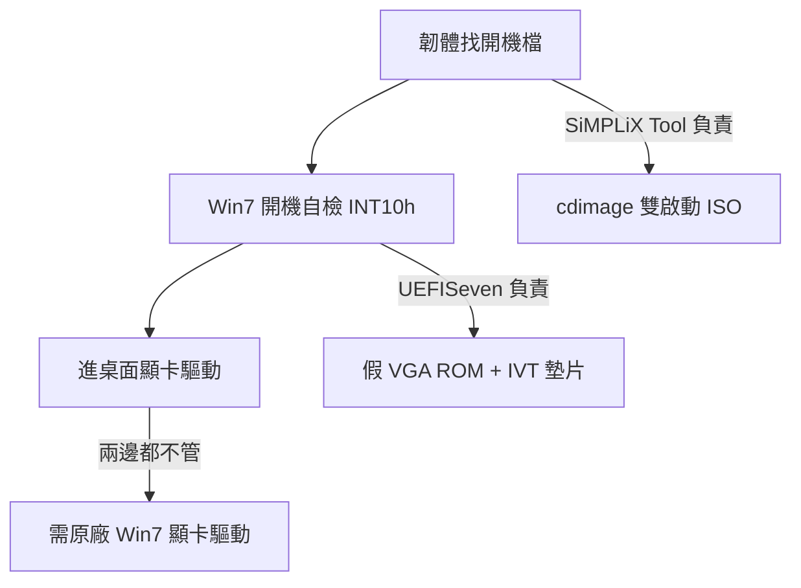

# Windows 7 UEFI 開機深度研究：UEFISeven vs SiMPLiX Tool

> 日期：2026-09-20｜UEFISeven v1.30｜SiMPLiX AiO ISO Bare Tool 4.2_26.1.15
> 結論先行：兩者正交。SiMPLiX Tool 解決「裝不裝得進去＋驅動全不全」，
> UEFISeven 解決「裝完開不開得起來」。Class 3 新機器（無 CSM）兩個要疊用。

---

## 一、UEFI 開機三關



| 關卡 | 問什麼 | 誰負責 |
|---|---|---|
| 1. 韌體認碟 | `bootx64.efi` / `bootmgfw.efi` 找不找得到 | SiMPLiX Tool（`cdimage` 封片） |
| 2. 開機自檢 | `INT 10h` 呼叫有沒有人回 | UEFISeven（EFI 墊片） |
| 3. 桌面顯示 | 有沒有真顯卡驅動 | 原廠驅動，兩邊都幫不上 |

---

## 二、為什麼 Windows 7 在 UEFI Class 3 上掛掉

### 2.1 病根：寫死在 Legacy 時代的顯示初始化

Win7 開機鏈 `bootmgfw.efi → winload.efi → VGA 初始化` 會硬呼叫 BIOS 中斷 `INT 10h`：

* `AX=4F00` 回傳 VESA Controller 資訊
* `AX=4F01` 回傳 Mode 資訊（只認 `0xF1`）
* `AX=4F02` 設定顯示模式（只認 `0x40F1`，即 `1024x768x32` LFB）
* `AX=4F03/4F10/4F15/AH=00` 回傳現行模式、電源管理、EDDC、Legacy 文字模式

安裝程式對 `1024x768` 是寫死的，不到此解析度直接判定失敗。

### 2.2 CSM 有 vs Class 3 無，差在 `0xC0000`

* 有 CSM 的機器：韌體提供真 VGA ROM（佔據實體位址 `0xC0000`，大小 `0x10000`），
  中斷向量表 `IVT[0x10]` 指向 ROM 內的 handler，呼叫有人回，正常開機。
* Class 3（Intel 2020 年後砍掉 Legacy，消費筆電幾乎全滅）：
  `0xC0000` 是空的，`IVT[0x10]` 指向 `0000:0000`。
  Win7 等不到回應，凍結在 `Starting Windows` 或報 `0xc000000d`。

這就是 Reddit / SuperUser / SevenForums 上一堆「Win7 UEFI 卡 logo」串的共同病根，
解法不是換 ISO，是補一個有人回 `INT 10h` 的墊片。

### 2.3 GOP / UGA 背景

* UEFI 原生顯示是 `GOP`（Graphics Output Protocol），舊一點有 `UGA`。
* Win7 不懂 GOP，只懂 VESA BIOS。CSM 就是韌體裡的翻譯層；拿掉 CSM 就斷線。
* UEFISeven 的做法：用 GOP 查出 framebuffer，再包一層假 VESA 騙 Win7。

---

## 三、UEFISeven 原理深挖（v1.30，EDK2 Application）

原始碼：`UefiSevenPkg/Platform/UefiSeven/`，進入點 `UefiSeven.c:UefiMain`。

### 3.1 執行順序（對照 `UefiSeven.c:640-972`）

1. **搶 IVT**：`AllocatePages(AllocateAddress)` 先佔住 `0x00000`（1 page），
   避免後續配置踩掉。以 `IDT 已初始化` 為前提直接覆寫 IVT。
2. **找顯示器**（`Display.c:InitializeDisplay`）：
   先問 `ConsoleOutHandle` 上的 GOP，失敗再全域 `LocateProtocol`；
   GOP 沒有才退回 UGA。只記錄 `HorizontalResolution / VerticalResolution /`
   `PixelFormat / PixelsPerScanLine / FrameBufferBase / FrameBufferSize`。
3. **硬切 `1024x768`**（`Display.c:SwitchVideoMode`）：
   列舉 `GOP->Mode->MaxMode`，逐一 `QueryMode` 找 `1024x768`＋32-bit 色深，
   命中就 `SetMode`。切不到就進下一步。
4. **作弊 hack**（`Display.c:ForceVideoModeHack`）：
   直接改寫 `GOP->Mode->Info` 結構體的 `HorizontalResolution / VerticalResolution /`
   `PixelsPerScanLine / FrameBufferSize`，謊稱自己是 `1024x768`。
   螢幕會糊（GPD MicroPC 直式小螢幕實測「glitchy but workable」），但能裝完。
5. **自檢短路**（`IsInt10hHandlerDefined`）：
   讀 `IVT[0x10]` → 換算 `Segment<<4 + Offset`，落在 `0xC0000..0xD0000` 且首 byte
   不是 `0xFF / 0x00`（保護性 opcode）就認定已有合法 handler，`goto Exit` 直接 chainload。
   這是它在有 CSM 機器上成為 no-op 的原因。
6. **解鎖 VGA ROM 區**（`EnsureMemoryLock(0xC0000, UNLOCK)`）：
   三招連試——`LegacyRegion.UnLock` → `LegacyRegion2.UnLock` →
   `MTRR CacheUncacheable`，每招後用 `CanWriteAtAddress`（寫入＋1 再還原）驗證。
   三招全敗就 `abort`（Ryzen 4800H 回報的 `Unable to unlock VGA ROM` 即此，issue #7）。
7. **植入 stub**：把 `Int10hHandler.asm` 編出的 `INT10H_HANDLER[]`
  （`Int10hHandler.h`，前 512 bytes 是 `nop` 保留區）拷進 `0xC0000`，
   再用 `ShimVesaInformation` 把 VESA 結構填進保留區：
   `Signature="VESA" / V3.0 / Mode 0xF1 / 1024x768x32 / DirectColor /`
   `LFB = GOP framebuffer + 中央置中偏移 / ModeAttr=BIT7|BIT6|BIT5|BIT4|BIT3|BIT1|BIT0`
   （linear framebuffer only、無 bank/paging）。
8. **鎖回＋指 IVT**：`EnsureMemoryLock(LOCK)`（失敗只警告），
   `IVT[0x10] = C000:offset`，再跑一次 `IsInt10hHandlerDefined` 自檢。
9. **chainload**：找同目錄 `*.original.efi`（`ChangeExtension(...".original.efi")`），
   `Launch()` 交棒。找不到就 `Press Enter to continue` 卡住等人工。
   附帶：F8 偵測（進 Win7 開機選單用文字模式切換）、開機按 `v` 強制 verbose。

### 3.2 `Int10hHandler.asm` 行為表

| 輸入 | 回應 |
|---|---|
| `AX=4F00` | 拷 256 bytes `VbeInfo` 到 `ES:DI`，`AX=004Fh` |
| `AX=4F01, CX=00F1` | 拷 256 bytes `VbeModeInfo`，`AX=004Fh`（其他 mode 直接 `Hang`） |
| `AX=4F02, BX=40F1` | 什麼都不做（EFI 端已切好），`AX=004Fh`（其他直接 `Hang`） |
| `AX=4F03` | `BX=40F1`，`AX=004Fh` |
| `AX=4F10/4F15` | `AX=014Fh`（unsupported，但不斷線） |
| `AH=00, AL=03/12` | 假裝成功（`AL=30h/20h`），其他 `Hang` |
| 未知 | `Hang`（無限迴圈，故意凍住以便除錯，而非亂回） |

設計哲學：只騙 Win7 開機需要的最小集合，其他寧可凍住也不亂答。

### 3.3 `UefiSeven.ini` 四開關

```ini
[config]
skiperrors=0      ; 跳過警告直進（量產 USB 設 1）
force_fakevesa=0  ; 有真 handler 也硬蓋（除錯用，平時 0）
verbose=0         ; 詳細輸出（同目錄放 UefiSeven.verbose 或開機按 v 同效）
logfile=0         ; 寫 UefiSeven.log（抓 issue 回報用）
```

舊版用同名空檔案（`UefiSeven.verbose` 等）觸發，新版讀 `ini`，程式碼保留相容。

---

## 四、SiMPLiX Tool 的 UEFI 處理（本機 4.2_26.1.15 實測）

整棵樹 `grep uefiseven|int10|shim|GOP` 零命中（僅中網卡 `.inf` 的
`IF_TYPE_ETHERNET_CSMACD` 雜訊）：**完全沒內含 UEFISeven**。

### 4.1 Modern 路線：借 Win10 的開機層

* `W7_x64_AiO_3.2_Modern.cmd:343-365`：
  `bootmgr`、`bootmgr.efi`、`Sources\boot.wim`、`setup.exe` 全從 Win10 ISO 拷過來，
  只貼三張 Win7 皮（`:373-377` 的 `background.bmp / arunimg.dll / spwizimg.dll`）。
* 封片：`:626`
  `cdimage -bootdata:2#p0,e,b"etfsboot.com"#pEF,e,b"efisys.bin" ...`
  → Legacy＋UEFI 雙啟動。
* 效果：USB 安裝 PE 是 Win10 核心，原生懂 GOP，Class 3 上**裝得起來**。
* 極限：第一次重開後跑的是硬碟裡 Win7 自己的 `bootmgfw`，INT10h 需求原地復活。
  作者自白 `Modern_README.txt:23`：`UEFI booting (x64 and needs CSM enabled)`，
  最終系統還是要 CSM。Modern 只解決第一關（安裝環境），第二關沒碰。

### 4.2 Legacy 路線：純 Win7 開機層，還要手動補

* `boot.wim` 就是 Win7 自己的，`:461-462` 手動把 `install.wim` 裡的
  `bootmgfw.efi` 抽出改名 `bootx64.efi` 補回 `EFI\Boot\`（Win7 原 ISO 缺的）。
* `:497-511` 對 `boot.wim` 兩個 index 各掛一次，灌 NVMe 驅動＋
  `Updates_NVME_Boot\` 的 `KB2990941 / KB3087873`。
* x64 另有 `Fixing ability for USB UEFI booting` 段。
* 效果：連安裝 PE 都是 Win7 核心，Class 3 上**連裝都裝不起來**，
  USB 開機那關就要先套 UEFISeven（`bootx64.efi` 那層）。

### 4.3 兩路線共同點（與 UEFI 無關，但常被誤會）

SKU 由 Ultimate 反推六版、USB3 / NVMe / (W)LAN 驅動 `/Add-Driver`、
DaRT `.tpk` 注入、UpdatePack＋`.WA`、SmartFix、ESD / WIM / SWM 壓制——
全是 install.wim 內容層，不碰 EFI 開機邏輯。

---

## 五、差異對照表

| 維度 | SiMPLiX Tool | UEFISeven |
|---|---|---|
| 性質 | ISO 重打包器（batch script＋DISM/wimlib） | EFI 開機墊片（EDK2 C＋16-bit asm） |
| 層級 | 離線映像內容 | 開機當下韌體→OS 交界 |
| 修什麼 | 驅動、更新、SKU、DaRT、壓制格式 | `INT 10h`＋`1024x768` VESA 欺騙 |
| Modern UEFI | 借 Win10 boot 層，安裝 PE 可開；裝完仍要 CSM | 不管安裝 PE，管裝完後每次開機 |
| Legacy UEFI | 純 Win7 boot 層，需 CSM 或墊片連裝都難 | USB＋硬碟各套一次可解 |
| 顯示 | 不管顯卡 | 只撐過開機動畫，不管桌面解析度 |
| 體積 | 數 GB（ISO） | 數十 KB（`bootx64.efi`＋ini） |
| Secure Boot | 不碰（Win7 本體就不支援，必關） | 不碰（無簽章，必關） |
| 更新影響 | 重跑一次腳本 | `bootmgfw` 被 Win7 更新重寫就要重套 |
| x86 | 有 x86 腳本（但 x86 本來不支援 UEFI 開機） | 只編 `X64` |

一句話記：**工具管內容，墊片管開機**。

---

## 六、疊加實戰手順（Modern＋UEFISeven，Class 3 標準）

1. 照常跑 Modern 腳本產 ISO，寫進 USB（GPT＋FAT32）。
2. USB `EFI\Boot\bootx64.efi` 改名 `bootx64.original.efi`，
   把 UEFISeven 的 `bootx64.efi`＋`UefiSeven.ini`（`skiperrors=1` 量產用）放進去。
3. 照常安裝，到「重開機前」提示時**關機，不要讓它自己重開**
  （作者原話 `Power off`，避免第一次無墊片開機留下壞狀態）。
4. 進 EFI Shell（或 WinPE U 盤），把硬碟
   `EFI\Microsoft\Boot\bootmgfw.efi` 改名 `bootmgfw.original.efi`，
   再把同一顆 UEFISeven `bootx64.efi` 拷貝冒充 `bootmgfw.efi`。
5. 開機。`verbose=1` 排錯，`logfile=1` 留 log。
6. Legacy ISO 同理，但第 2 步是必須（否則 USB 先掛），共套兩次。

Win10 雙開機建議：別共用 `\EFI\Microsoft\`（UEFISeven 只認同目錄 `original.efi`，
會把 Win10 的 chainload 錯）。用 rEFInd 或 BIOS F12 手選 ESP 最乾淨。

---

## 七、限制與陷阱

1. **Secure Boot 必關**：Win7 bootloader 無簽章，墊片亦無。
2. **桌面解析度另案**：「能開機但永遠 1024x768」是 `VGASave`，
   要裝真顯卡驅動。10 代後 Intel iGPU／新 N 卡無 Win7 驅動即無解。
3. **更新會沖掉墊片**：Win7 更新重寫 `bootmgfw` 就要重套第 4 步，
   `*.original.efi` 留著就是為了加速此步。
4. **特殊硬體三坑**：
   `Unable to unlock VGA ROM`（MTRR/LegacyRegion 全敗，如部分 Ryzen）、
   原生無 1024x768 GOP（靠 `ForceVideoModeHack` 糊過去）、
   直式螢幕（GPD 實測中央 1024x768 糊但可用）。
5. **x86 免談 UEFI**：UEFI 開機本來就只支援 x64，x86 ISO 沒這題。

---

## 八、選型建議

| 目標機器 | 做法 |
|---|---|
| 有 CSM 可開 | 開 CSM＋SiMPLiX 任一路線，不用墊片 |
| Class 3、全新安裝 | Modern（PE 省事）＋硬碟套 UEFISeven |
| Class 3、要升級/修復安裝 | Legacy＋USB/硬碟各套一次 UEFISeven |
| 新核顯/無 Win7 顯驅 | 先確認驅動存在，否則開得起來也只有 1024x768 |

---

## 參考來源

* manatails/uefiseven（repo、README、releases、issues）
  `https://github.com/manatails/uefiseven`
* 作者部落格 PoC（Galaxy Book 12、GPD MicroPC）
  `https://manatails.net/blog/2020/08/uefiseven-easily-boot-windows-7-on-uefi-class-3-devices/`
* 原始碼：`UefiSeven.c`（進入點、chainload）、`Display.c`
  （`InitializeDisplay/SwitchVideoMode/ForceVideoModeHack`）、
  `Int10hHandler.asm`（最小 VESA stub）、`UefiSeven.h`（`0xC0000/IVT` 常數）、
  `Version.h`（`1.30`）、`UefiSeven.ini`（四開關）
* 本機腳本：`W7_x64_AiO_3.2_Modern.cmd:343-377,626`、
  `W7_x86_x64_4.2_Legacy...cmd:461-462,497-511`、
  `Modern_README.txt:23`、`Legacy_README.txt`、`Changelog.txt`
* 社群病徵：SuperUser 1210716、r/windows ia3aje、r/windows7 1r873nv、sevenforums 426700

## 附錄：關鍵路徑

* 工具根：`C:\Users\YUser\Downloads\SiMPLiX_AiO_ISO_Bare_Tool_4.2_26.1.15_Updated_WA\`
* Modern 腳本：`W7_x64_AiO_3.2_Modern.cmd`、`W7_x64_Single_Index_Only_3.2_Modern.cmd`
* Legacy 腳本：`W7_x86_x64_4.2_Legacy_WIN7_Based_ISO_ESU_With_AiO.cmd`
* 包裝器：`SiMPLiX.bat`（install.wim）、`SiMPLiX_Boot.bat`（＋boot.wim）
* 墊片：UEFISeven release 的 `bootx64.efi`＋`UefiSeven.ini`（USB 放 `EFI\Boot\`、
  硬碟冒充 `EFI\Microsoft\Boot\bootmgfw.efi`，原檔改名 `*.original.efi` 保留）
