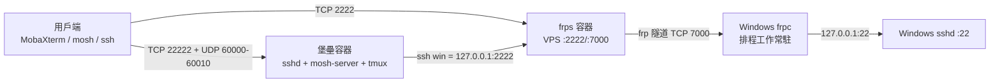
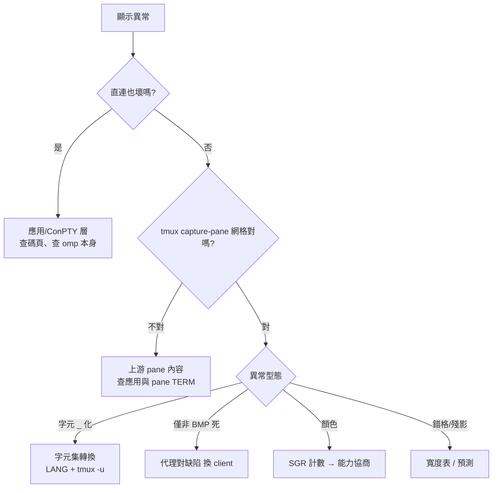

# win-reverse-gw 完整實戰報告

**Windows Server 反向 SSH 閘道（FRP + Mosh + tmux）— 建置、MobaXterm 導入、五大疑難雜症全記錄**

- 期間：2026-09-22 ～ 2026-09-25
- 環境：VPS `Oracle Linux 9.8 aarch64`（`161.153.59.149`）× Windows Server 2025 VM（Hyper-V NAT 內）× 用戶端 `MobaXterm 26.5（Installer）`
- 方法論：**大膽假設、小心求解**——所有根因皆以位元組級取證或 A/B 對照實驗定案，零猜測

---

## TL;DR

|項目|結果|
|---|---|
|目標|NAT 內的 Windows Server 經 VPS 公網存取，三入口同時可用|
|成果|建置完成＋全鏈實證；mosh 端到端（UDP）實測通過|
|過程|收服 **5 起疑難雜症**＋2 起自身誤判（誠實列案）；「顯示不正常」排錯全過程＝**§5 專章＋§5.5 作戰手冊**|
|根因分佈|1× 手滑輸入、1× 開源腳本 NAT 啟發式缺陷、2× tmux 用戶端能力判定、1× Cygwin 非 BMP 缺陷|

---

## 1. 架構總覽



### 埠與帳號對照（本案最重要的一張表）

|連接埠|到達|使用者|用途|
|---|---|---|---|
|22|VPS 本身（Oracle Linux）|`opc`|VPS 管理|
|**2222**|Windows Server（frps→frpc 轉發）|`administrator`|直達 Windows PowerShell|
|**22222**|堡壘容器（mosh/tmux）|`gw`|一鍵到底（tmux 自動連 Windows）|
|UDP 60000-60010|堡壘容器 mosh-server|—|mosh 資料通道（刻意縮小自預設千埠）|
|7000|frps|—|frpc→frps 隧道控制（token 驗證，不對外提供服務）|

### 三入口日常指令

|指令|效果|
|---|---|
|`ssh win`|直達 Windows（已配 `~/.ssh/config` Host 區塊，免參數）|
|`ssh gw`|堡壘：自動 attach tmux `main`、win 視窗自動連 Windows、斷線自動重連|
|`mosh -p 60000:60010 gw`|同上＋UDP 抗漫遊（手機網路切換不斷線）|

> 設計要點：mosh/tmux 必須跑在 Linux 端（Windows 無 POSIX），故設堡壘容器；Windows 藏在 NAT 後，故用 FRP 反向隧道把 22 埠掛上公網。

---

## 2. 建置檔案地圖

### VPS（`opc@161.153.59.149`）

|檔案|內容要點|
|---|---|
|`~/win-gw/frps.toml`|`bindPort=7000`、`proxyBindAddr=0.0.0.0`、`auth.method="token"`（token 勿落盤於文件）|
|`~/win-gw/ssh/`|`win_ed25519`（堡壘→Windows 專用鑰）、`authorized_keys`（= 用戶公鑰）、`config`（gw 的 ssh client 設定）|
|`~/win-gw/hostkeys/`|堡壘 sshd host key（**只產一次**，單檔掛載進容器＝跨重建穩定，客戶端 host key 不變）|
|`~/win-gw/bastion/Containerfile`|alpine＋`bash mosh-server tmux openssh-server openssh-client ncurses-terminfo`；`adduser gw`＋`sed 's/^gw:!:/gw:*:/'`（解鎖陰影帳戶）|
|`~/win-gw/bastion/entrypoint.sh`|把 `/mnt/ssh-gw` 複製進 tmpfs 的 `~/.ssh` 並 `chown gw`（修 rootless UID 映射的權限問題）|
|`~/win-gw/bastion/login.sh`|gw 的 login shell：`-c` 原樣轉交（mosh bootstrap 命令靠它）；`export LANG=C.UTF-8`＋`exec tmux -u new -A -s main "win; exec bash -l"`|
|`~/win-gw/bastion/sshd_config`|`Port 22222`、`HostKey` 只列 ED25519、`PasswordAuthentication no`、`KbdInteractiveAuthentication no`、`AllowUsers gw`|
|`/etc/tmux.conf`（容器內）|`terminal-features ',*:RGB'`＋`terminal-overrides ',*:Tc'`＋`default-terminal 'tmux-256color'`|
|`~/.config/containers/systemd/win-gw-{frps,bastion}.container`|Quadlet（rootless、`Network=host`、**不** `DropCapability=all`—sshd 需 SETUID）|
|`/etc/fail2ban/jail.local`|三 jail（見 §3）|

### Windows（`administrator@172.23.74.46`）

|檔案|內容要點|
|---|---|
|`C:\frp\frpc.exe` + `C:\frp\frpc.toml`|`loginFailExit=false`（開機網路未就緒不退出）、`auth.method="token"`、proxy `win-ssh`：remotePort 2222 → 127.0.0.1:22|
|排程工作 `frpc`|SYSTEM／AtStartup＋**每分鐘心跳觸發**（`IgnoreNew` 保單例）／`ExecutionTimeLimit=Zero`／RestartCount 999|
|`C:\ProgramData\ssh\sshd_config`|`AuthenticationMethods publickey`＋`PasswordAuthentication no`＋`KbdInteractiveAuthentication no`（三者皆在 `Match Group administrators` **之前**）|
|`administrators_authorized_keys`|用戶公鑰＋堡壘 `win_ed25519` 公鑰|
|`Documents\WindowsPowerShell\Microsoft.PowerShell_profile.ps1`|`chcp 65001`＋`[Console]::Output/InputEncoding=UTF8`（非 PTY 管道輸出亂碼的解方）|

### 實證紀錄（抽樣）

- `frps verify` / `frpc verify` 語法驗證通過；frps log 顯示 frpc 登入＋`[win-ssh] tcp proxy listen port [2222]`
- host key 指紋：`:2222` = Windows VM 本機鍵（`SHA256:rD/3K1+…`）、`:22222` = S1 掛載鍵（`SHA256:ES/AgOwJ…`）——重建映像不變
- mosh 端到端：`MOSH CONNECT 60000 …` → tmux `main` → Windows PowerShell，`hostname` = `WIN-O131Q016RJK`
- 強殺 frpc 後 ~60 秒復活（心跳觸發實測）
- Windows 登入加固：password／keyboard-interactive 嘗試皆 `Permission denied (publickey)`

---

## 3. DNS、OCI 與 fail2ban

### Cloudflare（灰雲！）

A 記錄 → `161.153.59.149`，**Proxy 必須「DNS only（灰雲）」**——橘雲只走 80/443，ssh/mosh 全被丟包。

### OCI Security List / NSG（Stateful Ingress ×4）

|協定|埠|用途|
|---|---|---|
|TCP|7000|frpc→frps（**這條不通整條鏈死**）|
|TCP|2222|直達 Windows|
|TCP|22222|堡壘 sshd／mosh bootstrap|
|UDP|60000-60010|mosh 資料通道|

### fail2ban（VPS，fail2ban 1.1.0 + fail2ban-firewalld）

|jail|港口|計分依據|門檻 → 封禁|
|---|---|---|---|
|`sshd`|22|sshd 認證失敗|5 次/10 分 → 1h|
|`bastion-sshd`|22222|真實認證行為（專用 filter；「連了就走」刻意不計）|5 次/10 分 → 1h|
|`frps-conn`|2222|連線速率（frp 看不到認證成敗）|30 次/10 分 → 30m|

- `ignoreip = 127.0.0.1/8 ::1 118.163.199.0/24`——**家用 ISP 的 /24 動態池整段白名單**：frpc 隧道與自家測試走這池，誤封＝自己斷線（實測 IP 於 .170/.157 之間輪替）
- 坑：`bastion-sshd` 內建 sshd filter 只認 daemon 名 `sshd`，容器識別碼是 `win-gw-bastion` → 前綴殘留令全部規則漏接（實測 0/7）→ 自寫 `filter.d/bastion-sshd.conf`（`.*` 吸前綴）
- 日常：`sudo fail2ban-client status [<jail>]`；誤ban解封 `sudo fail2ban-client set <jail> unbanip <ip>`

---

## 4. MobaXterm 導入紀要

|事項|結論|
|---|---|
|安裝|`winget install -e --id Mobatek.MobaXterm`（26.5，雜湊驗證）；工具箱解壓至 `AppData\Roaming\MobaXterm\slash\mx86_64b\`|
|金鑰|**OpenSSH 血統**（內建 `ssh.exe`/`ssh-keygen.exe`），`.key` 直用，**免 .ppk**|
|內建 mosh|`mosh-client.exe`＋`moshsession`（bootstrap 腳本）俱在；GUI 有 Mosh session 型態|
|ssh config 預寫|`home/YUser/.ssh/config`：Host `win`/`gw` 兩段（含金鑰路徑、`StrictHostKeyChecking accept-new` 壓回——全域預設是 `no` 不核對 host key）|
|Session 參數|SSH：host＋port（2222 或 22222）＋user＋key；Mosh：SSH port 22222＋Mosh ports `60000:60010`＋key，其餘 auto|
|moshsession 補丁|① 補 `etc/resolv.conf`（`toybox host` 直讀它，缺檔→解析死）② 停用 `SSH_CONNECTION` 啟發式分支（NAT 主機會抓到私網 IP）|
|⚠️ 升級注意|MobaXterm 更新會重解壓 slash 樹 → **兩筆補丁可能被覆蓋**；症狀復發＝`Server IP addr` 變 10.x，照原樣重貼|

---

## 5. 五大疑難雜症病歷（核心經驗）

### 案一：`Network error: Connection timed out`（MobaXterm 連不上）

- **症狀**：兩個 SSH session 全數逾時（靜默丟包，非 refused/denied）
- **排除鏈**：DNS 正常（A = 真 IP）→ `Test-NetConnection` 全通 → frpc 隧道活著 → fail2ban 未封 → **全滅於網路層，兇手在用戶端設定**
- **根因**：session 埠填 `222`（**少一個 2**）。該埠無人放行 → SYN 靜默丟棄 = timeout
- **症狀學**：金鑰錯＝秒回 denied；host 錯＝`No such host`；**唯有「無人應答的埠」才是 timeout**
- **教訓**：timeout 的第一嫌疑人永遠是「打錯地方」；ini/session 編碼可直接解出填了什麼（`%host%port%user%`）

### 案二：mosh 指向 `10.0.0.187`（UDP 永遠不通）

- **症狀**：`mosh did not make a successful connection to 10.0.0.187:60001`（19 秒超時）
- **根因（三段因）**：
  1. `moshsession` 的 IP 探測：`toybox host` 讀 `/etc/resolv.conf` → **MobaXterm slash 樹沒有此檔** → 解析段全滅
  2. 回落分支取 `SSH_CONNECTION` 的 `awk $5`（服務端自報位址）→ **OCI 經 NAT，sshd 自報私網 10.0.0.187**
  3. `mosh-client IP PORT` 只吃數字位址 → 對私網發 UDP → 必死
- **修法**：補 `resolv.conf`（nameserver 1.1.1.1/8.8.8.8）＋停用該啟發式分支；實測 `toybox host` 回 `161.153.59.149`
- **教訓**：「用連線自報位址決定 UDP 目標」在 NAT 雲主機＝先天殘；同類啟發式見一個疑一個

> **本章是全報告的核心**。顯示問題的第一課是「先定層，再動刀」——本案管線共五層，任何一層都可能犯罪：
> `omp.exe → ConPTY（Win 控制台→VT 翻譯） → ssh 通道 → tmux（網格＋能力協商） → mosh/ssh 用戶端 → MobaXterm`
> 以下三案＋誤判案完整記錄「如何用證據把五層逐一排除」，並在 §5.5 收斂成可複用的作戰手冊。

### 案三：tmux 裡 TUI 字元全變 `_`（顯示異常 ①：字元蒸發）

**症狀**：經 tmux 連入的 omp 畫面，`█ ▒`、`╭ ╮ ╰ ╯`、`π ◕`、emoji 全變成 `_`；詭異的是**中文與基本框線 `─│┴` 完好無損**。

**證據鏈（四步定案）**：

1. **雙視圖逐字 diff**（使用者貼直連/經 tmux 兩份畫面）：文字內容**完全相同** → 不是內容錯，是顯示層。
2. **死亡名單 vs 倖存名單的「選擇性」＝字元集轉換指紋**：

   |死亡|倖存|含意|
   |---|---|---|
   |`█ ▒`（方塊元素）|`─ │ ┬ ┴`（ACS 圖形集可表）|ACS 可表達者過關|
   |`╭ ╮ ╰ ╯`（圓角框）|中文|目標字集（Big5 類）有者過關|
   |`π ◕ ▶`、`👋 🗑`|ASCII|其餘一律替換成 `_`|

3. **`tmux capture-pane -p` 抓 tmux 網格**：`██████████`、`╰──┴──╯` **完好** → 上游（pane 內容）是對的，轉換發生在 **tmux→用戶端那一腳**。
4. **修復後原始位元組驗收**：用戶端串流出現 `e2 96 88`（`█` 的 UTF-8）✓，`PROBE: ____` 替換症候群消失。

**根因**：堡壘的 sshd **刻意不設 `AcceptEnv`**（防注入設計，正確！）→ 用戶端 `LANG` 被 sshd 剝掉 → `tmux new` 的 attach 行程**沒有 UTF-8 locale** → tmux 判定「非 UTF-8 用戶端」→ 啟動輸出轉碼 → 無法表達的字元替換成 `_`。

**修法**（`login.sh`，兩行）：

```sh
export LANG=C.UTF-8 LC_ALL=C.UTF-8   # sshd 不收 AcceptEnv → 補回 locale
exec tmux -u new -A -s main "..."     # -u：強制 UTF-8，雙保險
```

**教訓**：「選擇性死亡名單」＝字元集問題的指紋（全滅＝編碼、選擇性＝字元集）；`capture-pane` 一刀切開「上游對 vs 顯示錯」；`AcceptEnv` 與 locale 的交互是隱形坑——安全設計（不收環境變數）會誤傷 locale，補償點在 login shell 而非 sshd。

### 案四：顏色變淡/深淺不同（顯示異常 ②：色彩降級）

**症狀**：直連顏色正常，經 tmux 變淡、漸層斷階——**兩份貼文逐字相同**，差異純在色彩。

**證據鏈（三步定案）**：

1. **SGR 序列計數**（客觀化色彩問題的關鍵儀器）：直連 `38;5;…`（256 色）× 40 筆；經 tmux 第一輪量測 **0 筆**。
2. 一輪誤判（見附案）後升級儀器＝正規表示式補吃**冒號型寫法**（`38:5:`）＋延長捕捉窗 → 經 tmux 實際有 **55 筆 256 色序列穿隧**。
3. **tmux 伺服器自白**：`terminal-features[3] *:RGB`、`terminal-overrides[1] *:Tc`、`default-terminal tmux-256color` 三行皆載入；用戶端事實 `xterm-256color | attached, focused, UTF-8`。

**根因**：tmux 對未宣告色彩能力的用戶端會「好心降級」深度（256 → 16）；omp/ConPTY 本來就發 **256 色**（兩路 `truecolor=0` 一致——不是 24-bit，別追錯目標）。

**修法**（容器內 `/etc/tmux.conf`）：

```tmux
set -as terminal-features ',*:RGB'      # RGB 直通
set -ga terminal-overrides ',*:Tc'      # truecolor 能力宣告
set -g default-terminal 'tmux-256color' # pane 用完整色彩能力（terminfo 全庫已裝）
```

**教訓**：色彩問題用 SGR 計數客觀化，**勿靠肉眼證詞定案**；正規表示式漏抓冒號型 SGR 會誤導整輪（儀器的 bug 比病更可怕）；「兩路 truecolor=0」這種反直覺事實也是證據——先量 baseline 再談降級。

### 案五：mosh 路徑掉 emoji（顯示異常 ③：非 BMP 蒸發）

**症狀**：SSH 路徑完美；mosh 路徑 **非 BMP 字元（👋 🗑）蒸發**、BMP（`π ◕ ▶`）無恙＋OSC 標題序列偶爾裸奔成文字＋畫面重影。

**同版本異平台 A/B（控制變因實驗，全案最漂亮的一刀）**：

|條件|Linux mosh-client 1.4.0（容器）|Cygwin mosh-client 1.4.0（MobaXterm 內建）|
|---|---|---|
|同一 mosh-server / 同一 tmux 會話 / 同一幀 omp|—|—|
|`👋`（U+1F44B）|✅ 渲染完好|❌ 蒸發|
|`🗑`（U+1F5D1）|✅ 渲染完好|❌ 蒸發|
|`π ◕ ▶ ┃`（BMP）|✅|✅|
|框線/中文|✅|✅|

**判決**：mosh-server、tmux、omp 全數無罪；**兇手＝Windows 端 Cygwin 編譯的 `mosh-client.exe` 非 BMP（代理對）處理缺陷**。「BMP 活、非 BMP 死」＝代理對/寬字元缺陷的指紋。

**處方（擇一）**：

1. **推薦**：Windows 的 mosh 改用 **WSL 的 Linux 版**（與實驗同款＝痊癒）；生產端 Termux（Android）＝Linux 版＝天然無此病。
2. mosh 只留漫遊場景（手機/切網），桌面日常用 SSH session（已完美）。
3. Mosh session 的 prediction 欄位改 `never`（減預測殘像，不救 emoji）。

**附註（兩個非缺陷的「怪」）**：畫面重影＝內嵌 TUI 逐幀上捲的**正常歷史**（omp 不用 alt-screen）＋可能的預測殘像；狀態列的 `"系統管理員: C:\WINDO`＝tmux 追蹤 conhost 視窗標題的正常行為（非漏字）——**先排除「正常但看起來怪」，再談修**。

### 附案：兩起自身誤判（誠實列案＋為什麼被騙）

|誤判|為什麼騙過我|真相|修正|
|---|---|---|---|
|「CP950 是 TUI 殺手」|非 PTY 探針的輸出**真的**是 Big5 亂碼（`chcp` 報 950、`OutputEncoding=big5`）——證據為真，但取樣通道錯了|CP950 只污染**非 PTY 管道輸出**；**PTY 通道（ConPTY）本來就是乾淨 UTF-8**（標題 `系統管理員` 的 UTF-8 位元組 `\xe7\xb3\xbb…` 完整到貨）|保留 `chcp 65001` profile（治非 PTY 亂碼）＋改判渲染層，終破案三/四|
|「terminfo 缺庫是兇手」|`/usr/share/terminfo` **真的**整棵消失——但把「同時存在的異常」誤當「症狀的根因」|缺庫為真但非本案根因（時間先後≠因果）|仍補 `ncurses-terminfo`（Linux 側 ncurses TUI 衛生）|
|（儀器誤判）SGR=256 共 0 筆|正規表示式只吃 `38;5;` 漏掉冒號型 `38:5:`，且捕捉窗太短只抓到無色幀|修儀器後 55 筆現形|儀器先驗證再定案——**量測工具自身要先被量測**|

### 5.5 顯示異常診斷作戰手冊（可複用）

#### 症狀指紋 → 兇手層 → 修法

|觀察到什麼|指紋含意|兇手層|修法|
|---|---|---|---|
|`Connection timed out`|SYN 無人應答|網路/埠|查埠號與防火牆（案一）|
|所有非 ASCII 全亂|碼頁/字元集|管道編碼|`chcp 65001`＋UTF-8 傳輸|
|選擇性 `_`（中文活、符號死）|字元集轉換|tmux 用戶端判定|`LANG`＋`tmux -u`（案三）|
|BMP 活、emoji/非 BMP 死|代理對缺陷|特定 client build|換 Linux 版客戶端（案五）|
|顏色變淡/漸層斷階|色彩能力降級|tmux 能力協商|RGB/Tc 直通（案四）|
|轉義序列裸奔成文字|OSC 被截/吃前綴|mosh 模擬器/預測|prediction `never`／換客戶端|
|框線錯格、右緣歪一格|寬度計算不一致（曖昧寬/全形）|各層 wcwidth|統一 locale 與寬度表|
|畫面重影、殘影|上捲歷史 vs 預測殘像|顯示歷史|先確認是否「正常但怪」，再談修|

#### 判決樹



#### 取證工具箱（照抄可用）

1. **原始位元組抓幀**：`ssh -tt … 'tui-app'` 用 Popen 抓 stdout、N 秒後強殺、看 `repr` 與位元組掃描——判讀值：`e2 96 88`=█、`f0 9f 91 8b`=👋、`38;5;`/`38:5;`=256 色、`38;2;`/`38:2;`=真彩。
2. **tmux 網格真相**：`tmux capture-pane -p -t <pane>`——上游對不對，一看便知。
3. **tmux 伺服器自白**：`tmux show -sg terminal-features`、`tmux show -sg terminal-overrides`、`tmux list-clients -F '#{client_termname}|#{client_flags}'`（UTF-8 旗標在此）。
4. **碼頁體檢**：`chcp`、`[Console]::OutputEncoding`（注意：非 PTY 與 PTY 通道編碼不同，取樣要對通道）。
5. **同版本異平台 A/B**：同 server、同會話、同畫面，只換 client build——平台缺陷的最終裁判。
6. **使用者視網膜＝最終裁判**：機器只能驗到「位元組/深度一致」，觀感殘差要並排截圖判讀。

#### 復發快速卡（30 秒對號入座）

|症狀復發|先檢查|
|---|---|
|mosh 又指到 10.x|MobaXterm 更新蓋掉 slash 樹補丁（`etc/resolv.conf`＋`bin/moshsession`，見 §4）|
|字元又變 `_`|`login.sh` 的 `export LANG` 與 `tmux -u` 是否還在|
|顏色又變淡|容器內 `/etc/tmux.conf` 是否還在（映像重建漏層）|
|emoji 又失|是否用回 MobaXterm 內建 mosh（改 WSL Linux 版）|
|連線逾時|session 埠號（2222/22222）與 DNS 灰雲|

---

## 6. 坑與教訓速查表（可複用）

|坑|症狀|解法|
|---|---|---|
|PS 5.1 `powershell -Command -`（stdin）|**多行 if 區塊無聲吞掉**、無錯誤無輸出|一律 `-EncodedCommand`（UTF-16LE base64）|
|PS 餵 stdin 的中文|OEM codepage 解碼成亂碼|同上（UTF-16 傳輸無損）|
|Python `subprocess` `text=True` 寫 stdin|Windows 把 `\n` 翻成 `\r\n` → 遠端 bash `$'\r'` 爆炸|二進制模式餵入（`input=…encode()`）|
|PS 5.1 原生指令碼引號轉發|內層 `"` 被吃 → 參數拆散（mosh 印 usage）|該層只用單引號（PS `''` 轉義）|
|PowerShell 非 PTY 管道輸出|中文/CP950 亂碼|profile `chcp 65001`＋UTF8 Encoding|
|Quadlet generated unit|`systemctl --user enable` 报 "transient or generated"|**本來就不用 enable**——生成器自動建 `default.target.wants`|
|Task Scheduler RestartCount|**強殺（TerminateProcess）不觸發重啟**（記為終止≠失敗）|加每分鐘心跳觸發＋`IgnoreNew` 保單例（實測 60s 復活）|
|frpc 開機時序|frps 未起時 frpc Fatal 退出|`loginFailExit=false`（上游預設 true）|
|rootless Podman 掛載檔|host UID 1000 → 容器內 root:600，gw 讀不到私鑰|entrypoint 複製＋`chown`（勿直接掛進家目錄）|
|alpine `adduser`|shadow `gw:!:` 鎖定 → sshd 拒公鑰|`sed 's/^gw:!:/gw:*:/'`|
|Quadlet 單元照抄 hlp-blog|`DropCapability=all` 令 sshd SETUID 失敗|堡壘單元不可 DropCapability|
|health-cmd 引號|Quadlet 層吃引號|無引號 bare `nc`（兩映像皆有 `/usr/bin/nc`）|
|Windows sshd 加固位置|設定插在 `Match Group administrators` 之後＝無效|全域段一律插在第一個 Match 之前|
|Windows sshd 漏 `KbdInteractiveAuthentication`|鍵盤互動＝密碼憑證旁門|與 `PasswordAuthentication no` 併用＋`AuthenticationMethods publickey`|
|Task Scheduler 預設時限|3 天殺常駐行程|`ExecutionTimeLimit = Zero`|
|frpc v0.71|**無 `service` 子命令**（無法裝 Windows 服務）|Task Scheduler 常駐（原生、零第三方）|
|moshsession + NAT 雲主機|UDP 指向私網 IP|見案二|
|`toybox host` 無 resolv.conf|解析全滅|補 `/etc/resolv.conf`|
|hub 起 Windows 程式|無副檔名 `docker` shim＝error 193|用真身 `docker.exe`（PE）；`bash` 會解析到 WSL stub|
|hub `args` vs `arguments`|欄位名錯 → 程式空參數跑|schema 欄位是 `args`|
|tmux 非 UTF-8 用戶端|字元 `_` 化|見案三|
|tmux 色彩降級|256→16|見案四|
|Cygwin mosh-client 非 BMP|emoji 消失|見案五|
|ssh-keyscan 舊版 client|`unsupported KEX sntrup761x25519` 掃不動 OpenSSH 10.3|改看 `known_hosts` 指紋（`ssh-keygen -lf`）|

---

## 7. 維運手冊

### 日常

```bash
# VPS
podman ps                                  # 兩容器 Up (healthy)
systemctl --user status win-gw-frps win-gw-bastion
podman logs --tail 20 win-gw-frps          # 隧道/掃描器動態
sudo fail2ban-client status                # 封禁總覽

# Windows
Get-ScheduledTask -TaskName frpc; Get-Process frpc
& C:\frp\frpc.exe verify -c C:\frp\frpc.toml
```

### 備份清單（換機/災復）

- VPS：`~/win-gw/`（**含 hostkeys、ssh 兩把鑰、frps.toml、bastion 整樹**）、`~/.config/containers/systemd/win-gw-*.container`、`/etc/fail2ban/jail.local`、`/etc/fail2ban/filter.d/{bastion-sshd,frps-conn}.conf`
- Windows：`C:\frp\`、`C:\ProgramData\ssh\sshd_config`、`administrators_authorized_keys`、排程工作 `frpc`（匯出）、PowerShell profile
- 用戶端：`~/.ssh/config`、MobaXterm 的 `home/YUser/.ssh/config`、slash 樹兩筆補丁

### 升級注意

1. **MobaXterm 更新**會重解壓 slash 樹 → `etc/resolv.conf` 與 `bin/moshsession` 補丁可能被覆蓋（症狀：mosh 又指到 10.x）
2. 堡壘映像重建**不會**動 host key（單檔掛載）→ 客戶端無警告；但 `Containerfile` 新增套件需 `podman build`＋`systemctl --user restart win-gw-bastion`（會話重置一次，mosh/ssh 重連即回）
3. frp 兩端版本綁定 v0.71.0（映像 tag 與 Windows zip 皆指名），升級需兩端同步

---

## 8. 生產遷移清單（搬到真伺服器）

|項|動作|
|---|---|
|DNS|A 記錄改指新 IP（灰雲不變）|
|用戶端|`~/.ssh/config` 的 `HostName`、MobaXterm 兩個 session 的 host 欄|
|VPS 端|若換主機：整包 `~/win-gw/`＋Quadlet＋fail2ban 設定搬移；`frps.toml` 免改|
|Windows 端|`frpc.toml` 的 `serverAddr` 改新 IP/域名；其餘原樣|
|驗收|依序：`ssh win` → `ssh gw` → `mosh -p 60000:60010 gw` → 網路切換不斷線測試|
|OCI|新主機照 §3 四條 ingress 重開|

---

*報告生成：2026-09-25。本文件不含任何憑證/私鑰/token 明文；相關值請查各主機上的設定檔。*
