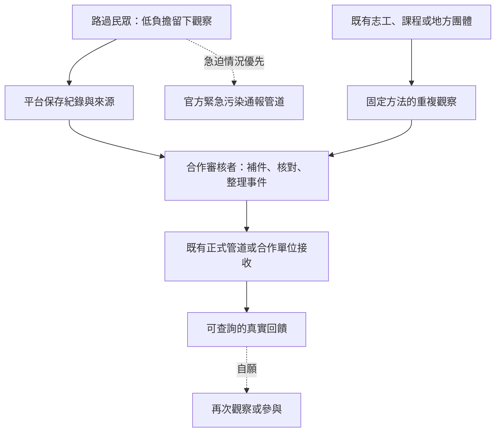

# 黑客松 2026｜河好如初公民科學：完整參賽攻略

> **正式命題：如何運用公民科學，讓民眾加入河川永續的行列**  
> 賽事：2026 永續智慧創新黑客松競賽，11-M 中文組。  
> 原查證基準：2026-09-27；本次核對與更新：2026-10-03。本文是研究與提案決策文件，不是官方簡章、評審內部評分表、法律意見或得獎保證。  
> 對象：已有拍照回報系統，正思考如何把「三十秒隨手回報」轉成符合命題、可被質疑與驗證的參賽方案之團隊。

## 閱讀方式與證據標記

- **【官方】**：主辦方命題、公告、當年度表單／範本，或主管機關資料直接寫明；引用時分清資料所屬年度與適用範圍。
- **【報導】**：官方平台報導或受訪者敘述；能證明「曾如此描述」，不等於本研究獨立驗證其效能。
- **【分析／INFERENCE】**：根據前述資料的解讀，不冒充主辦方內部動機或實際落選理由。
- **【建議】**：本攻略提出的產品、研究與競賽準備方法，不是官方強制規格。
- **【待驗證】**：目前欠缺資料、實測、合作承諾或公開成果。

所有數量目標、測試人數、工作量估算，除標示官方規定外，均為建議或假設。作品名稱、隊伍名稱、入圍排名與決選名次分開處理。文末的來源編號可直接點擊。

### 本次核對範圍與使用限制

| 項目 | 已核對範圍 | 不應延伸的結論 |
|---|---|---|
| 2026 行政與命題 | 官網、命題頁、報名表、計畫書範本、切結書 | 不宣稱已取得所有補充規則；官方資料矛盾需主辦書面確認 |
| 歷屆作品 | 公開名次、作品介紹、工作坊評語與部分後續報導 | 公開描述不等於獨立驗收；未公開不等於未實作或停止 |
| 公民科學與既有制度 | ECSA 原則、EPA 品質方法、地方巡守制度及個資法相關條文 | 國外方法不是臺灣法規，也不是本賽事另加的資格要求 |
| 自家方案 | 使用者原有敘述與待驗證計畫 | 本次未驗收 RiverEye 現行程式、真人成效、合作承諾或環境改善 |

**本報告的「完整」指把已知事實、方法、風險與待確認事項放在同一份文件；不代表未知資料已被補齊。** 沒有足夠證據時保留缺口，不以推薦方向替代事實，也不以歷屆名次推算今年得獎機率。

### 目錄

1. 結論：這次真正要解決的問題
2. 正式題目全文與競賽交付要求
3. 主辦、命題與執行分工：不要再混淆
4. 五場賽事的正確時間軸
5. 第一場：2025 大同工作坊作品深析
6. 第二場：2025 黑客松作品與事後發展
7. 第三場：2026 東海工作坊作品深析
8. 第四場：2026 清華工作坊作品深析
9. 第五場：2026 黑客松命題轉向
10. 他們想要什麼：可證實期待與不能證實的動機
11. 現有三十秒回報方案的評審式批判
12. 建議定位：低承諾入口、可信紀錄、可追蹤交接
13. 把回報變成公民科學，而不是換皮陳情
14. AI、資料品質、個資與安全邊界
15. 如何吸收前人經驗，而非再做一次
16. 缺什麼、怎麼補：實證與補強計畫
17. 截止日前的執行節奏與停止條件
18. 計畫書、簡報、展示與問答攻略
19. 提交前檢核表與前述討論更正
20. 來源與待補資料

---

## 1. 結論：這次真正要解決的問題

**最有根據的定位，不是「再做一套更快的檢舉 App」，而是：降低民眾留下可用河川觀察的成本，並讓觀察能被查核、整理、交接、回饋。**

使用者提出的原始假設有清楚的行為鏈：

> 民眾看到疑似污染／死魚，或聞到異味 → 有不滿與回報意願 → 找不到渠道、覺得程序麻煩 → 延後 → 放棄。

這是**值得驗證的假設**，不是已經被證實的普遍事實。第一項任務是查清楚人們究竟卡在哪裡：不知道管道、填寫負擔、擔心具名、怕報錯、以為沒用，還是現場根本沒有網路？不同原因，需要不同解法。

「三十秒」可以是有力的設計目標，但必須回答三件事：

1. **三十秒完成的是什麼？** 平台收到一筆觀察，不等於環保機關受理，也不等於問題解決。
2. **被省掉的資訊由誰補？** 若民眾省二十秒，卻讓承辦多花十分鐘找位置、補時間、追照片，未必改善整體流程。
3. **回報後到底發生什麼？** 沒有查核、接收者、用途與回饋，資料庫只是新的終點。

### 本攻略推薦的主張

> **讓路過河邊的人，在低負擔流程中留下可追溯的異常觀察；由合作審核者整理成可使用的事件紀錄，再透過明確管道交接與回饋。民眾不必先認養一條河，才有資格貢獻一次觀察。**

這不是宣稱已完成的成果。是否能成立，取決於後文的實測與合作證據。

### 不要再採用的勝利敘事

- 「前人都死了，我們第一個做出系統」：公開資料不足以支持，且不尊重已有作品。
- 「五項評分有六成是傳播」：參與、影響、擴散不是同義詞，不能如此加總解讀。
- 「有 Demo＋CSV 就拿滿可行性」：執行者、品質、成本與接收單位都還沒被證明。
- 「沒有硬體就不符合競賽」：命題沒有此要求。
- 「沒走訪就一定落選」：不是已知官方規則；真正的風險是需求與可行性缺乏證據。

### 可選路線與推薦適用條件

【分析／INFERENCE】本攻略優先討論回報資料鏈，是因團隊原已有拍照回報構想；**不是今年命題只接受通報平台。** 其他可對應命題的路線包括：支援既有巡守隊的紀錄與整理、學校／地方團體的固定觀測與回饋、以教育或文化活動帶入有方法的公民觀察，以及有明確需求與驗證的感測工具。

對本團隊，另建入口只有在「現有流程存在可證明的缺口，而且新流程降低雙端負擔」時才值得。若既有管道足夠，改成引導、方法教材或接收端整理工具也合理；若真正阻力是信任或用途不明，就不應只砍填寫時間。推薦是待推翻的假設，不是所有功能都必須實作的清單。

---

## 2. 正式題目全文與競賽交付要求

### 2.1 正式命題全文

以下轉錄官方命題頁的企業介紹、命題說明、評分與建議方向；省略網站導覽與裝飾。來源：[S01]。

#### 如何運用公民科學，讓民眾加入河川永續的行列

**聯合報系**

**企業官網：** [聯合報系](https://www.udngroup.com/)、[河好如初](https://river.udn.com/river/index)  
**企業影片：** [河好如初](https://youtu.be/s3vxRw1SUVU)  
**社群網址：** [Facebook](https://www.facebook.com/river.udn)

**企業介紹：**

兼具監督的能量與關懷的溫度，是聯合報系不變的核心精神，也是媒體存在的價值。聯合報系長期關注台灣永續發展，透過追蹤報導及各式活動為台灣帶來正向改變，努力讓台灣更好。

聯合報系不只要做有影響力的媒體，更要做有影響力的「永續媒體」，成立「永續工作室」，落實環境保護、推動社會共融，依據聯合國公布的17項永續發展目標，繼續策動社會的正向改變，實踐永續媒體角色，讓媒體從倡議議題的報導者成為策動轉變的行動者。

聯合報系永續工作室於2025年推動「河好如初」，透過「河好如初」，媒體從報導者、倡議者，走向了行動者。喚起台灣各界河川永續的重視，對生物多樣性的關心。

**命題說明：**

本場次為【中文組】，計畫書與決賽簡報使用請以中文為主。

- 透過推動科技賦能與在地社群培力，利用數位監測工具引導民眾在日常生活中進行河川觀測與記錄，將科學調查轉化為人人可參與的全民運動，重塑民眾對河流的認同感。
- 藉由整合數據共享與促進公私協力，將民眾蒐集的環境資訊與政府決策體系對接，讓公民科學的成果協力河川保護政策轉型與永續發展。

**一、命題範籌說明：**

本命題特別對應以下評分面向，每項各佔20%：

1. 創新性：方案是否展現新穎的思維、技術或應用模式
2. 參與度：能否有效吸引並留住年輕人與社區的長期參與
3. 可行性：在現實環境中落地與持續運作的可能性
4. 影響力：對河川生態、社會意識與社區連結的正面影響
5. 擴散性：能否透過社群、媒體或網絡擴大影響並被複製

**二、設計聚焦建議方向：**

**子題1：發展科技賦能 × 社群參與機制：**

- 透過數位工具，降低參與科學調查的技術障礙。
- 將數據採集轉化為對河流的認同與守護意識。
- 導入互動設計，提升民眾長期參與河川觀測。

**子題2：建構數據共享 × 協作治理對話：**

- 建立公民科學數據的品質控管，確保資料的公信力。
- 整合民間觀測點位，提供更即時的環境監測。
- 建立數據回饋與對話機制落實公私協作。

**命題介紹影片：** [官方影片 Q7b1XCvdTBw](https://www.youtube.com/watch?v=Q7b1XCvdTBw)

> 影片列為必要延伸資料；本攻略未逐字核對影片口述內容，不宣稱影片另有未列出的要求。

### 2.2 官方交付規格與日期

【官方】截至本次核對日，首頁與當年度文件列示：[S02]、[S31]、[S32]、[S33]

| 項目 | 日期／要求 |
|---|---|
| 報名開放 | 2026-09-15 |
| 報名截止 | 2026-11-06 |
| 初賽資料繳交截止 | 2026-11-18 |
| 晉級名單公告 | 2026-11-26 |
| 決賽 | 2026-12-13，中國醫藥大學水湳校區 |
| 初賽必繳 | 提案計畫書、團隊參賽切結書、學生證影本／在學證明影本 |
| 計畫書頁數 | 官網寫「不包含封面 4～10 頁內」；範本另列排除項及最多 10 頁，詳見下方差異說明 |
| 計畫書格式 | 字型不限；主文 12 pt、單行間距；上下邊界 2.5 公分、左右 3 公分；標題可自行設計 |
| 計畫書內容 | 需求洞察、創意計畫構想、目標對象、市場調查分析、目標設定、執行規劃；範本章節可增修 |
| 選配補充資料 | 影片、海報等；影片 3 分鐘內、YouTube 不公開，標題依官網指定「團隊名稱/Track名稱_2026永續智慧創新黑客松競賽」，隨計畫書附網址 |
| 決賽展示 | 10 分鐘簡報＋5 分鐘問答；可搭配影片、模型、海報等 |

【官方】官網表示報名後於 3 個工作天內回覆是否報名成功；收到確認信後依指定流程上傳初賽資料。報名入口為 [S31]，初賽資料入口以確認信及當年度官網為準，不以本文連結代替最後一次核對。

**頁數表述存在差異，不能自行決定優先順序：** [S32] 中文原句為「提案計畫書內容不含封面頁、團隊介紹、參考資料等，不得超過10頁」；英文另列排除附錄（appendices）。首頁則寫不含封面 4～10 頁。範本未重述下限，不代表首頁的 4 頁下限自動失效；英文提及附錄，也不代表可無限增加附件。

【建議】未取得主辦書面澄清前，採同時滿足兩種表述的保守編排：主文 4～10 頁，並檢查所有非封面頁是否仍能控制在 10 頁內；如需額外團隊介紹、參考資料或附件，先確認是否計入。這是減少格式風險的建議，不是代替主辦裁定。

範本另有「預期效益與商業化」方向，涵蓋成本、商業／營運模式與持續性。公益方案不必編造盈利模式，但應交代經費來源、維護人力與接手責任；此為對營運可行性的回應，不是要求把公益服務改成收費產品。

### 2.3 時間代表什麼

從本次更新日 10/03 到 11/18 尚有 46 天；到 12/13 尚有 71 天。這仍可安排小範圍需求訪談、可用性比較與短期試行，**不是只能交紙面概念，也不是被要求完成半年或全台營運**。原 9/27 的估算不再當成目前剩餘時間。

11/26 晉級後到 12/13 只有十七天，不能把首次現場驗證全部押到晉級後。另一方面，不能因硬體時間較長就說硬體「不可能」；也不能把既有原型、合作基礎較深的其他團隊排除。

### 2.4 2026 參賽資格、組隊與文件矛盾

【官方】2026 報名表載明：臺灣與日本大專校院在學學生（大學及碩、博士生），不限校系、年級、國籍及領域，可跨校／系組隊；每隊 2～7 名學生，含隊長 1 名作為主要聯絡窗口。[S31] 隊長不是上限 7 人以外額外增加的一人。計畫書範本寫指導老師至多兩位或不設指導老師。[S32]

| 待釐清事項 | 2026 官方資料的不同文字 | 提交前處理 |
|---|---|---|
| 組員與命題修改 | 表單開頭寫「報名資料到報名截止前，組員、命題場次報名等可再修改；隊長請勿更換」；同表內文又寫「報名後不得更換或替補」 | 不自行認定截止前一定可換人、截止後一定可刪減；詢問主辦可修改項目、時點與程序，保留回信 |
| 指導人數 | 中文「指導教授/業界專家至多2位」；英文「up to two advisors and two industry experts」 | 不自行採用 2＋2；可先按合計至多 2 位編排，有不同需求再請主辦確認 |
| 計畫書頁數 | 官網不含封面 4～10 頁；範本排除項不同，英文另列附錄 | 依 §2.2 保守編排，確認各類頁面是否計入及 4 頁下限 |

**本節已查證的是當年度原文，不是上述矛盾已獲官方解決。** 2026 獎金／獎項金額、同人多隊或同提案多場限制，及特殊人員異動情況，本次未取得明確當年度依據；不得引用網站 2022 等舊規則代替。

### 2.5 切結、智慧財產權、AI 與後續義務

【官方】當年度切結書要求報名與繳件資料正確，無侵犯專利、著作權等智慧財產權，遵守 AI 科技輔助相關規定，且無抄襲、變造或填寫不實；違反相關聲明可能涉及退回獎金及獎狀、取消獎勵／得獎資格與法律責任。隊長須親簽並填日期。[S33]

獲獎後另須配合後續追蹤、頒獎交流與文宣編製，並同意執行單位使用團隊產品及服務資訊於行銷、團隊推廣與媒體曝光。[S33] 提交前須確認可公開內容，避免把受訪者個資、合作方未授權資料或第三方影像放入展示。

**本次在該切結書未見「全部著作權／智慧財產權讓渡」條款；這不等於整套參賽文件或第三方素材使用完全無權利風險。** AI 具體允許範圍、標註位置、揭露與授權證明方式，切結只提供原則性要求，本次尚未取得完整操作細則。可先保存模型／工具名稱、用途、人工修改與素材授權紀錄，再向主辦確認；此紀錄建議不能冒充官方指定格式。

### 2.6 行政確認窗口與問題清單

命題疑問依官方要求經主辦／執行單位代為聯繫，不私下問出題企業。[S03] 11-M 負責單位東海大學窗口：羅際鋐，`chlo@thu.edu.tw`；整體主辦表單所列信箱：`sustainbilityhack.cmu@gmail.com`（依官方原拼寫，少一個 a，不自行改成 sustainability）。[S03]、[S31]

建議一次書面詢問：頁數計算與下限、組員／命題修改、指導人數、重複參賽、2026 獎金與 AI 細則。保留回信日期與適用場次；尚未回覆就維持「待確認」，不要自行補答案。

---

## 3. 主辦、命題與執行分工：不要再混淆

| 層級 | 2026 已核對資訊 | 對參賽策略的意義 |
|---|---|---|
| 整體賽事主辦 | 中國醫藥大學 | 競賽流程、資料繳交、行政規範以賽事公告為準 |
| 本命題企業 | 聯合報系；命題內容連結河好如初 | 研究本題的河川公民科學需求，不擴張成聯合報所有業務 |
| 11-M 負責單位 | 東海大學 | 它是本命題負責單位，不等於獨自主辦整場 2026 比賽 |
| 相關但不同系列 | 河好如初設計思考工作坊 | 可參考作品與公開評語，但不能套用其賽制為黑客松規定 |

來源：[S03]。官網明確要求：**命題疑問透過主辦／執行單位代為聯繫，不私下聯繫出題企業。**

一般河川田野訪談與向地方團體詢問需求，不等同向命題企業索取競賽解答；仍需清楚說明身分與用途，不冒稱官方合作。

### 五場研究範圍

只收錄直接屬於河好如初工作坊系列，或在外部黑客松以河好如初河川議題命題的五次活動。不把單純刊登在河好如初網站的別家競賽算成自辦，也不收新聞部其他命題。

這是**目前查證到的五次相關競賽活動**，不是以搜尋結果證明世界上絕無其他活動。工作坊與外部黑客松是兩條並行線，不是同一比賽連續五屆。

---

## 4. 五場賽事的正確時間軸

### 4.1 依起始活動／命題公布時間排列

| 時序 | 活動 | 啟動／公布 | 當時公開核心 | 決選與後續須另看 |
|---|---|---|---|---|
| ① | 首屆設計思考工作坊，大同場 | 2025-05-03 | 河川永續；各隊自行界定河川問題 | 該批團隊決選於 2026 年 1 月東海場進行 |
| ② | 2025 永續智慧創新黑客松，河好如初命題 | 2025 年 8 月公布；12/13 決賽 | 青年參與、科技文化生活、都市友善河岸 | 瓶中信後續綠川實踐與日本交流報導在 2026 年 |
| ③ | 第二屆設計思考工作坊，東海場 | 2026-01-10～11 | 河川問題、現場觀察與設計思考 | 該批八隊於 2026 年 6 月清華場決選 |
| ④ | 第三屆設計思考工作坊，清華場 | 2026-06-27～28 | 校園水域踏查、跨域提案 | 五組名次屬當場入圍排序，不是後續決選冠亞季軍 |
| ⑤ | 2026 永續智慧創新黑客松，公民科學命題 | 2026-08-25 命題頁發布；12/13 預定決賽 | 參與、品質控管、數據共享、公私協作 | 截至 10/03 尚無本屆決賽成果可分析 |

來源：[S04]、[S05]、[S06]、[S07]、[S08]、[S01]、[S02]；大同啟動、東海同場首屆決選及清華 6/27～28 日期另由 [S34]、[S35] 直接支持。

「首屆」就是第一屆的正常中文稱呼。先前因官方用了「首屆」而非「第一屆」三字，就改叫「前傳」，沒有根據，撤回。

### 4.2 解讀趨勢最重要的三條紀律

1. **活動日不等於刊登日。** 2026 年 1 月的首屆決選報導，評的是 2025 年大同場開始的團隊。
2. **後來成果不等於當時得獎依據。** 2026 年 7 月報導瓶中信的綠川實踐，不能當成 2025 年 12 月評審已看見的成果。
3. **先後不等於因果。** 清華場文化提案得獎，不能證明它受到瓶中信啟發；更不能說「沒有瓶中信就不會有河你在一起」。

一個尤其容易犯的錯：2026 年 9 月刊出的瓶中信路燈、節慶構想，晚於 8/25 的新命題公布。除非另有內部證據，不能用這篇報導證明新命題因它而改寫。

---

## 5. 第一場：2025 大同工作坊作品深析

### 5.1 命題與證據範圍

【報導】5/3 活動以河川永續為主題，由學生針對關心的問題發想。公開報導列五組入圍及後續決選評語。[S04]、[S09]、[S10]

**未找到與黑客松命題頁相同形式的完整獨立題本，不代表主辦方當時沒有書面教材或課程要求。** 不可寫成「確定無書面命題」。

### 5.2 五組入圍、後來成果與應該學的事

| 隊伍／作品 | 當時機制與問題定義 | 後來公開成果／評語 | 本攻略分析與可吸收經驗 |
|---|---|---|---|
| 好河伴，清華 | 頭前溪產官學研社資訊斷鏈；用 LINE Chatbot 串活動、政策討論、知識與導覽 | 首屆決選第一名；評審建議先小規模測試再推廣 | 核心不是聊天介面，是把既有組織資源接起來。即使獲首獎仍被要求驗證，證明得獎不等於成熟營運 |
| ReRiver，北商與中山女高 | 用視覺情境解釋生活用品與水污染，再以成分查詢、替代商品、點數引導選擇 | 決選第二名；評審要求釐清公益與商業定位、建立透明標準 | 一旦平台推薦、評級或分配注意力，就必須交代依據與利益衝突；AI 不能取代透明標準 |
| Don't污Me，長榮與嘉藥 | 二仁溪廢五金與重金屬，規劃 AIoT 監測、找污染熱點 | 成本過高，改成遊戲化教具；獲佳作，評審肯定誠實面對問題 | 應從受限的資源縮小主張，而不是以更大的 AI 敘事掩蓋缺口。教育成果也必須用適合教育的指標評估 |
| 與河同行，大同 | 河岸生活地圖、散步景點與社群，兼具異味／異常回報 | 決選報導另列大同 EGather 獲佳作：記錄河岸生活、垃圾回報；評審批評核心不清、被運動與流浪動物等議題分散 | 兩作品疑似同一脈絡，但原文未明示改名，不能斷言。可確定的教訓是別讓生活社群、觀光、環境通報同時搶核心 |
| 筏子溪環境教育，東海 | 空拍、物種觀察、影像辨識與互動課程，讓環境被看見 | 決選第三名；評審認為受眾有限，建議可複製模組 | 擴散不是宣告「全台都能用」，而是別人拿到教材、流程、工具後是否能真的再辦一次 |

資料來源：[S09]、[S10]。以上評語只援引公開報導，非取得評審完整評分表。

### 5.3 本場真正能支持的結論

【分析／INFERENCE】資訊轉譯、民眾參與、科技監測與環境教育，從第一場就並存。Don't污Me 原案含 AIoT，筏子溪方案含空拍，**不能概括成「五隊全軟體」**。

對三十秒回報案最直接的提醒：

- 要比「與河同行／EGather」更聚焦，不是功能更多。
- 要比「好河伴」更清楚提出一次小試行的證據，不是更快宣稱全台擴張。
- 要吸收 ReRiver 的標準透明問題：照片怎麼變成標籤？標籤怎麼影響處理順序？錯了怎麼改？
- 不需證明前人失敗，只需證明你有系統地補上公開評語指出的缺口。

補充公開未入圍構想包括「讓惠來變回來」卡牌宣導、「筏子溪親子環境教育計畫」、「川流平台 Co-River」等。[S04] 這些不是完整全體參賽作品庫，不能用可搜尋的隊數計算全場成敗率。

---

## 6. 第二場：2025 黑客松作品與事後發展

### 6.1 正式命題在要什麼

2025 永續智慧創新黑客松中，聯合報系提出命題 **「『河好如初』青年永續行動方案設計」**。[S05]

官方命題指出，當時的核心問題是：許多年輕人對河川停留在遠觀或污染印象，缺乏直接接觸與參與機會；希望運用年輕人熟悉的語言與工具，把河川議題轉成可參與、可體驗、可分享的行動。

設計方向分成兩條：

1. **年輕世代 × 河川永續創新挑戰**
   - 吸引年輕人參與河川保護與復育。
   - 結合科技、文化與生活。
   - 建立可持續推廣、形成社群動能的參與模式。

2. **都市友善河岸 × 青年行動設計**
   - 兼顧生態復育與公共使用。
   - 讓年輕世代願意駐足、互動與參與。
   - 融合生態、教育與休閒功能。

正式命題列出的評分面向為：**創新性、參與度、可行性、影響力、擴散性，各占 20%。**[S05]

【分析／INFERENCE】因此，2025 題目並不是單純要求「設計河岸空間」，也沒有要求一定做硬體。文化體驗、數位平台、AI、GIS、AR、感測器、教育及社群機制，都可以作為解法；關鍵是能否形成青年願意參與、可以持續、可以產生影響的河川行動。

這和 2026 命題的重要差別是：2025 已談參與、科技與持續性，但**沒有像 2026 一樣，把「公民科學、資料品質控管、數據共享、公私協作、政府決策對接」明確列成題目核心。**因此不能把 2025 作品直接用 2026 標準判定合格或失敗。

---

### 6.2 六強與最終名次其實都有公開資料

先前版本只查到六強隊名與首獎相關報導，因此寫成「未取得完整決選名次與多數作品內容」。這項判斷需要撤回。

2025 官方網站不只公布六強，也公布完整決選名次；河好如初網站於 2025 年 12 月 18 日另有一篇決選結果專文，介紹全部六件作品。[S11][S28][S29]

六強隊伍、作品與結果可交叉核對如下：

| 隊伍 | 公開作品名稱 | 學校 | 決選結果 |
|---|---|---|---|
| WARM | 瓶中信的流動故事 | 東海大學 | 第一名 |
| RiverRun 青年溯源隊 | 以 AI 讓河川說話 | 逢甲大學 | 第二名 |
| 破境重圓 | 青流行動計畫－破境重圓 | 中山醫學大學 | 第三名 |
| 欸逼溪 | RIVER+ARISE：流域守護者 | 逢甲大學 | 佳作 |
| 青河力 | 一拍即河 | 逢甲大學 | 佳作 |
| 細胞重組 | RiverLink 讓青春重新流進河裡 | 國立臺北商業大學 | 佳作 |

隊伍名稱與作品名稱不同，必須分開處理。例如「青河力」是隊名，「一拍即河」才是作品；不能因搜尋作品名稱找不到隊名，就認為作品資料不存在。

全賽事的 **417 隊報名、138 隊進決賽**，仍然是所有命題合計，而非河好如初單題參賽數。[S06]

另外要區分兩種評分資訊：

- 正式命題頁列五項評分，各占 20%。[S05]
- 決賽報導另以方案完整性、可行性、創新程度與社會影響力描述評審綜合評選。[S06][S29]

未取得個別隊伍的完整評分表，因此不能由最終名次倒推出某一項到底拿幾分，也不能斷言某隊因某項功能而輸贏。

---

### 6.3 六件作品逐案分析

#### 6.3.1 第一名 WARM：「瓶中信的流動故事」

【報導】作品從「如何重新感受一條河」切入，以河岸 QR Code 與數位瓶中信，讓民眾留下文字與故事；公開介紹也提到結合地景裝置、跨文化故事及水質／環境數據，希望形成可參與的城市公共平台。[S29]

它處理的主要摩擦不是「民眾不知道去哪裡檢舉污染」，而是：

> **河就在城市裡，但人沒有理由停下來與它建立關係。**

這和單純改善表單完全不同。

【分析／INFERENCE】它的重要性不是證明「故事一定比科技有效」，而是提醒：**操作成本低，不代表人就有參與動機。**一個三十秒回報系統可以解決「想做但嫌麻煩」，卻不會自動解決「我為什麼要做」。

公開決賽資料不足以確認：

- QR Code 實際掃描率。
- 決賽當時有多少真實使用者。
- 水質資料以何種方式產生、校正或與平台整合。
- 長期留存率。
- 第一名各評分項目的分數。
- 評審究竟是因文化、科技、故事、可行性或其他因素給第一名。

因此不能寫成「評審偏愛故事」「文化案一定贏技術案」或「瓶中信證明 QR Code 模式有效」。

---

#### 6.3.2 第二名 RiverRun 青年溯源隊：「以 AI 讓河川說話」

【報導】團隊使用 ArcGIS 等工具分析河川環境，將河川健康狀況轉譯成擬人化的「情緒」；公開敘述以健康、難過、焦慮或驚嚇等狀態，讓一般民眾較容易理解河川資訊。[S29]

團隊的出發點與筏子溪死魚等環境觀察有關，希望將原本較專業的資訊，轉成一般使用者容易理解的表現方式。

【分析／INFERENCE】值得學的不是「一定要把河川做成角色」，而是：

**科學資料與一般人看得懂的資訊之間，需要轉譯層。**

如果三十秒回報案未來累積大量觀察，前端不能把複雜的品質狀態、異常類別與後續處理全部直接丟給民眾；資料如何轉成可理解、但又不過度簡化的狀態，本身就是設計問題。

但公開資料不足以證明：

- AI 模型實際使用哪些輸入。
- 「河川情緒」和真實水質指標的對應公式。
- 模型準確度。
- 是否已有持續營運的監測資料。
- 「焦慮」等狀態是否可以可靠預測突發污染。

因此不能因作品名稱有 AI，就把它當成已完成且經驗證的污染預測系統。

對本案的直接提醒是：**視覺化或 AI 結論的可信程度，不能超過底層資料本身。**

---

#### 6.3.3 第三名破境重圓：「青流行動計畫」

【報導】團隊提出「智慧河川行動治理平台」，公開介紹同時包含 AI、IoT、AR 與數位孿生：感測器用於環境／水質資訊，AR 作為現場導覽，數位孿生呈現河川狀況與變化，希望降低參與門檻並提高互動。[S29]

這證明一件事：

**2025 評選並沒有排斥大量科技整合。**

因此不能從第一名是瓶中信，就推論「評審不喜歡硬科技」；前三名裡就有相當明確的數位與感測構想。

但反過來也不能因為它拿到第三名，就認定：

- IoT 已完成長期佈署。
- 數位孿生已有完整模型。
- AR 已被大量使用。
- AI 已達可作治理判斷的準確度。

公開報導介紹的是競賽方案，不是第三方技術驗收報告。

【分析／INFERENCE】對三十秒回報案真正值得吸收的是反面提醒：**不要靠堆疊技術名稱製造完整感。**

若規則＋人工可以驗證資料品質，就沒有必要同時塞 AI、AR、IoT、數位孿生。技術只有在能減少一個已證實的摩擦時，才應成為主線。

---

#### 6.3.4 佳作欸逼溪：「RIVER+ARISE：流域守護者」

【報導】團隊以 AR 遊戲、流域角色與現地任務提高青少年接近河川的意願；參與者需要實際走到河岸完成任務，並設想與地方店家及獎勵機制結合。[S29]

它處理的問題是：

> **知道河川重要，不等於願意花時間真的走到河邊。**

因此使用遊戲、故事、角色與獎勵，把環境參與轉成較具體的行動。

【分析／INFERENCE】對本案可以吸收的是「情境入口」，不是直接複製積分與遊戲。

三十秒回報若只處理：

> 看見問題 → 打開網站 → 上傳

還需要驗證更前面的：

> **為什麼使用者會願意停下腳步、拿出手機、允許定位、拍照並提交？**

但公開報導裡「帶來改變」等表述屬作品理念描述，沒有提供足以獨立驗證長期河川改善、重複參與率或商家合作成效的資料。

所以不能推論「遊戲化已證明有效」，只能把它視為值得測試的參與機制。

---

#### 6.3.5 佳作青河力：「一拍即河」——本案最不能忽略的直接前例

這是先前攻略最大的漏查。

【報導】「一拍即河」以 **LINE 官方帳號**為核心，希望降低額外下載 App 的門檻。公開作品介紹包含：

- 污染即時通報。
- 污染地圖。
- 線上參與行動。
- 將回報污染點轉成可認領任務。
- 由 AI 或後台人員協助審核。
- 積分、實體獎勵或公益回饋。
- 希望形成持續參與機制。[S29]

也就是說，至少在公開構想層次上，2025 年已經有人提出：

> **低門檻數位入口＋污染回報＋地圖＋後台／AI 審核＋後續任務＋長期參與。**

這與目前「拍照、快速回報、未來大量資料再導入 AI 分類」的方向有高度重疊。

因此，以下說法全部不應再當作本案的主要創新：

- 「我們第一個把科技用在河川回報。」
- 「我們第一個讓民眾用手機快速通報。」
- 「我們第一個用 AI 審核河川污染。」
- 「我們第一個把污染點放上地圖。」
- 「我們第一個想把一次回報變成長期參與。」
- 「前人只做教育／故事，我們才做真正系統。」

以上至少與公開資料不符或缺乏證據支持。

但這**不代表三十秒回報方案已被前人做完。**

真正應比較的是：

| 面向 | 一拍即河公開構想 | 本案需要拿出的差異證據 |
|---|---|---|
| 入口 | LINE OA、降低下載門檻 | 實測首次使用時間、失敗率與完成率 |
| 回報 | 即時污染通報 | 定義「觀察」而非直接判定污染，保留時間、位置、來源 |
| 地圖 | 污染點地圖 | 不把回報數直接當污染率；處理事件合併與觀察偏差 |
| 審核 | AI 或後台審核 | 人工規準、品質狀態、可更正紀錄、AI 權限 |
| 後續 | 污染點轉任務 | 明確區分觀察者、審核者、正式處理者的責任 |
| 激勵 | 積分／獎勵 | 不預設人人需要點數；先測真實回饋是否足以促成再參與 |
| 治理 | 公開介紹著重參與與即時處理 | 證明資料真的能被某個接收角色理解、整理、交接 |
| 科學 | 公開摘要未交代完整公民科學方法 | 研究問題、採集規則、資料品質、偏差與可推論邊界 |

【分析／INFERENCE】所以，最穩健的差異化不是：

> 「我們比一拍即河功能更多。」

而是：

> **「相似的低門檻回報構想已經存在；我們把今年新增的公民科學要求轉成可測量的資料品質、人工審核、觀察－事件追溯、接收端可用性與真實回饋流程。」**

如果這些仍沒有實測，就只能稱為「本案要驗證的差異」，不能提前寫成已完成優勢。

---

#### 6.3.6 佳作細胞重組：「RiverLink 讓青春重新流進河裡」

【報導】團隊提出 RiverLink 平台構想，把青年行動、環境數據與故事串聯；公開介紹包含 App 產生河川健康分析、媒體傳播、教育課程、企業認養河段，以及公開可追蹤的影響指標，希望形成青年、企業、學校與媒體共同參與的治理模式。[S29] 原報導標題使用 RiverLink，內文另出現 Remberlink，拼寫不一致；本文依標題稱呼，不據此推定為兩個不同產品。

它的重要性在於：

**2025 已經有人把「資料 → 故事 → 媒體 → 企業 → 治理」講成完整制度敘事。**

所以本案也不能只因為有 CSV、Dashboard、公開地圖或「給政府使用」，就宣稱自己第一次完成資料治理。

真正需要回答的是：

- 河川健康分析由什麼資料產生？
- 接收者真的需要哪些欄位？
- 企業、媒體或政府各自有什麼權限？
- 誰負責核對？
- 回報錯了怎麼改？
- 接收者是否真的使用過樣例？
- 公開指標與真實環境效果如何區分？

公開資料沒有提供足夠證據確認 RiverLink 已完成上述所有環節，因此不能說它已成功建立治理體系；但也不能假設它「只有簡報沒有實作」。

【分析／INFERENCE】它對本案形成第二種直接壓力：

- **一拍即河**已佔據「低門檻污染回報」敘事。
- **RiverLink**已佔據「數據串聯與治理平台」敘事。

因此，本案不能只把兩者的功能重新排列一次。

---

### 6.4 第一名 WARM：必須把「得獎時」與「後來發展」完全拆開

WARM 是目前六隊中公開後續資料最豐富者，因此最容易發生時間倒置。

| 時間 | 可確認的公開資訊 | 不能倒推的結論 |
|---|---|---|
| 2025-12 決賽 | 「瓶中信的流動故事」第一名；QR／數位瓶中信、文化故事及環境資訊構想 | 不能說之後所有活動、教具及地方合作都是當時得獎依據 |
| 2026-02 | 團隊延伸為「WARM 綠川守護龍探索包」，使用 TDS 檢測筆與積木，把水質資訊轉成兒童可操作的環境教育體驗 [S30] | 後來做出教具，不代表 2025 決賽時已有相同完成度 |
| 2026-07 | 7/28 報導「小小巡河員」綠川活動，使用水質試紙等教材 [S12] | 此活動與 2 月 TDS 筆教具分開看；辦過活動不等於已證明長期留存或河川品質改善 |
| 2026-09 | 隊長赴日交流後提出河流再生節、路燈故事、LINE 集點、特色人孔蓋等延伸方向 [S13] | 路燈、人孔蓋、節慶等不能全部寫成已經穩定營運的成果 |

2026 年 2 月的公開報導已可確認：團隊確實把競賽理念延伸成較具體的環境教育教具，用 TDS 檢測筆搭配模型，將數據轉成孩子能操作、看見的體驗。[S30]

這比單純說「賽後繼續做」更具體。

但仍須注意：TDS 是特定水質指標，不能把它當成所有污染或水質健康的總代理；教育活動的完成，也不能自動證明河川環境改善。

2026 年 9 月的日本交流報導則顯示團隊正在思考如何把一次性活動延長成日常參與，包括河流再生節、路燈故事、LINE 掃碼集點等。[S13]

其中部分仍屬構想、規劃或洽談，不應全部寫成已落地成果。

---

### 6.5 重新解讀 WARM／瓶中信：真正值得學的是什麼

先前容易把瓶中信簡化成：

> 「故事感很強，所以拿第一。」

公開資料不足以支持這種因果判斷。

更有用的分析是：

**它選擇解決的不是表單效率，而是參與起點。**

民眾可能不是「找不到入口」，而是根本沒有動機在那一刻關心河流。瓶中信試圖以故事、文化、實體場域與互動，先讓河川變成值得接近的東西。

這對三十秒回報案形成一個非常重要的互補：

> **三十秒處理的是「想做之後有多麻煩」；WARM 處理的是「為什麼一開始會想做」。**

兩者不能互相取代。

因此，本案不必變成瓶中信、吉祥物或節慶活動，但需要至少回答：

- 哪一種情境真的會讓人願意開始回報？
- 是看到死魚？
- 聞到異味？
- 看到大量垃圾？
- 本來就在巡河？
- 學校課程指定？
- 收到地方社群提醒？

沒有這一層，操作再快也可能沒人打開。

---

### 6.6 2025 六件作品真正形成的競爭基線

把六件作品放在一起後，2025 並不是「只有首獎有內容、其他未知」，而是已形成相當完整的探索範圍：

| 路線 | 代表作品 | 已公開的核心 |
|---|---|---|
| 情感／文化入口 | 瓶中信 | QR、故事、地景、參與 |
| 資料轉譯 | 以 AI 讓河川說話 | GIS／AI 概念、河川健康情緒化 |
| 多技術治理平台 | 青流行動計畫 | AI、IoT、AR、數位孿生 |
| 遊戲化現場參與 | RIVER+ARISE | AR、現地任務、角色、獎勵 |
| 低門檻污染回報 | 一拍即河 | LINE OA、通報、地圖、AI／人工審核、任務 |
| 數據與跨角色治理 | RiverLink | 數據、媒體、教育、企業認養、治理敘事 |

因此，2026 年再提出一個「平台＋AI＋地圖＋回報＋社群」並不天然新穎。

【分析／INFERENCE】這使今年的命題轉向更值得注意：**實測可以補強可行性與效益；創新性仍須指出相對既有方法的新思維、技術或協作機制，不能只因自己有測試就宣稱新穎。** 前例未公開某環節的驗證，不代表該隊從未驗證，也不能據此占有首創地位。

例如：

- 回報資料到底能不能用？
- 同一事件多人上傳怎麼處理？
- 如何區分原始觀察與事件？
- 缺資料怎麼補？
- 誰審？
- 審一件多久？
- 什麼能用 AI？
- 接收者真正需要什麼？
- 送出去與正式受理怎麼區分？
- 資料如何回到參與者？
- 沒有固定採樣分母時可以推論什麼？

這些正好與 2026 題目明寫的資料品質、共享、回饋及公私協作相接。

---

### 6.7 對「三十秒回報」的四類比較基準與合作資源

現有方案至少應同時研究下列四類基準。官方制度與巡守團體也可以是合作對象，不必一律稱為競爭者。

#### 基準 A：官方公害陳情管道

比較的是：

> **為什麼不直接使用現有正式通報？**

需要證明流程、完成率、資料可用性或接收端負擔有實際改善，而不是假設政府系統什麼都沒有。

#### 基準 B：2025「一拍即河」

比較的是：

> **同樣主打低門檻污染回報，2026 的版本增加了什麼實證價值？**

這是最接近的直接競品。

如果沒有實測，「三十秒」「AI」「地圖」「免 App」本身都不足以建立強差異。

#### 基準 C：2025 RiverLink

比較的是：

> **你所謂的資料治理，是一個願景圖，還是真的有人可以使用？**

CSV、Dashboard、媒體曝光與「公私協力」文字都不是治理證據。

本案若能拿出一個真實接收角色看過去識別樣例，指出：

- 哪些資料有用；
- 哪些缺失會造成補件；
- 他如何判斷下一步；
- 整理一件要多久；
- 什麼格式可以交接；

即使規模很小，也比再畫一張大型治理生態系圖更有資訊量。但民間接收者看過樣例，僅能證明該角色的需求，不等於政府已採用。

#### 基準 D：既有水環境巡守制度與地方觀測團體

【官方】環境部自民國 92 年起推廣巡守制度與污染／髒亂點通報。臺北市環保局巡守專區列明：截至 2025 年底有 26 隊、616 名巡守隊員；2025 年執行 1,319 次巡守、464 次簡易水質檢測，並通報 52 次污染或異常情形。[S36] **這是臺北市統計，不是全臺總數，也不是本團隊成效。** 中央另有巡檢路線、照顧區、教育訓練與污染通報的制度說明。[S39]

【分析／INFERENCE】既有制度已涵蓋長期參與、現地觀測、異常通報與公部門關係。新案不能假設「沒人巡守、沒資料、沒窗口」；應先找試點所在地巡守隊、河川團體或環保局，理解其紀錄、補件、排班、判讀與回覆的真正斷點。

可合作的補位包括：把路人線索整理給既有巡守者、改善紀錄追溯與事件合併、提供共同方法與去識別交接、把實際用途回饋給參與者。是否需要另建平台應由這些需求決定；**加入巡守體系不是本賽事已知資格門檻，也不代表加入後資料就自動符合所有科學或行政用途。**

---

### 6.8 不能再使用的競爭敘事

完成這次補查後，下列敘事應明確停用：

- 「2025 六強除了首獎都查不到作品。」
- 「前一屆沒有人做污染回報。」
- 「前一屆都只做故事或活動。」
- 「我們第一個做低門檻河川通報。」
- 「我們第一個把 AI 放進河川回報。」
- 「我們第一個想把資料給治理單位。」
- 「前人沒有系統，所以我們只要有 Demo 就贏。」
- 「一拍即河只是概念，所以可以忽略。」
- 「瓶中信第一名證明評審不要技術。」
- 「青流第三名證明堆越多科技越好。」
- 「佳作代表方案失敗。」

名次只能證明該場競賽的結果；沒有完整評分表，就不能把自己的猜測變成落選原因。

---

### 6.9 對本案應採用的新定位

補完 2025 競品後，原先「三十秒快速回報」不能單獨作為差異核心。

更能承受質疑的定位是：

> **既有方案已經提出低門檻污染回報、AI／人工審核與治理平台。我們不把創新建立在重新發明這些功能，而是驗證：路過民眾能否以低負擔留下「可使用的公民觀察」，平台能否保留來源與品質、把多筆觀察整理成可追溯事件，並降低實際接收者的補件與整理負擔，再將真實處理結果回到參與者。**

這個定位有四個好處：

1. **不否認前人。**  
   一拍即河、RiverLink 等公開前例直接列入相關工作。

2. **正面回應 2026 新題目。**  
   重點落在公民科學、品質、共享、回饋與治理對接。

3. **可以被實驗推翻。**  
   若三十秒造成資料品質變差，或平台讓接收端工作更多，就必須修改。

4. **證據支撐差異，但不代替創新。**  
   前人提出過相近概念不妨礙改進；把關鍵流程測通可展示可行性與效益，但仍須說明方法或協作機制的新意，不能把「有實測」本身當成創新性 20% 的答案。

---

### 6.10 2025 黑客松到底告訴我們什麼

目前證據可以支持：

- 2025 題目接受文化、科技、遊戲、AI、GIS、IoT、AR、數據平台等多種方向。[S05][S29]
- 六強作品與完整名次已有公開資料。[S11][S28][S29]
- 低門檻河川污染回報不是本案首創；「一拍即河」是直接前例。[S29]
- 資料串聯與治理平台也不是本案第一次提出；RiverLink 已有相近敘事。[S29]
- WARM 在得獎後確實持續延伸方案，至少公開有環教教具與後續地方行動構想。[S30][S13]

目前證據不能支持：

- 第一名的單一勝因。
- 六隊各項正式分數。
- 佳作隊伍落後前三名的具體理由。
- 各件作品所有宣稱功能都已工程完成。
- 所有作品都有真實長期使用者。
- 任一作品已證明長期改善河川環境。
- 一拍即河已完整解決污染通報問題。
- RiverLink 已完成政府／企業治理整合。
- WARM 後來的成果可以倒推成 2025 決賽當時已有的證據。

**【本章結論】2025 最大的教訓不是「哪種點子會贏」，而是本案原本以為新穎的功能，很多其實已經有人提出。2026 真正的機會，是把「快速回報」從功能概念推進成一條有方法、有品質、有接收者、有回饋，而且知道自己不能證明什麼的公民科學資料鏈。**

---

## 7. 第三場：2026 東海工作坊作品深析

### 7.1 賽事與階段

1/10～11 的第二屆工作坊從十四組選八組入圍，後續於 6 月清華場決選。[S07]、[S14] 同一東海場也辦理了上一批大同團隊的決選。[S34] **不要用舉辦地點替作品重新編屆。**

公開資料有現場走訪、模型與 AI 使用的敘述；這不等於官方強制要求每一隊交硬體或用 AI。

### 7.2 八隊逐案分析

下表的「限制／驗證」是本攻略分析，不冒充該隊收到的評語。

| 入圍隊伍／作品 | 機制 | 後續公開證據 | 限制、風險與可吸收經驗 |
|---|---|---|---|
| 波賽噸 | 自動收集河川漂浮垃圾，兼水質觀察與採樣 | 第二屆決選第一名；專訪記載實體無人船、多場域測試、秤重紀錄 | 把任務拆成可量測結果值得學；但單次條件下的回收量不能直接外推不同流速、垃圾密度。已有洽詢不等於量產成交 |
| 河情河理──智慧模組化生態浮島 | 明秀湖起點，植栽淨化、智慧監測、模組化 | 第二屆決選第三名；有實作歷程報導 | 浮得起來、感測可用、長期淨化有效，是三個不同驗證問題。應分階段主張，不把原型完成等同生態成效 |
| 接管汙水，河川不再髒臭 | 以住宅污水接管為目標，從認知、誘因、制度與企業參與設計公共行動 | 公開入圍介紹列出 2040 年住宅接管率 90% 的提案目標 | 它是制度／服務設計，不能歸類成硬體。長期政策目標須拆到學生可做的小規模行為或流程試驗；未得首獎不證明評審反政策 |
| 從「頭」開始行動，一起當水源的守護者 | 頭前溪走讀、源頭教育、分齡教案 | 公開入圍介紹 | 課程可建立理解；還要證明何種理解帶來何種後續行為。回報服務的短教學可借用分齡、情境化思路 |
| 北港溪沼氣發電眾包平台 | 串畜牧廢水、資金、技術與收益共享 | 公開入圍介紹 | 平台只是表面，困難在原料量、資本、設置、營運與利益契約。借鏡是先找真接收者與真責任人，不要用「媒合」掩蓋執行缺口 |
| 濕在必行──讓板橋人工濕地被看見 | 濕地資訊轉譯、參與式行動；後續發展影像／數位介面與污染回報溝通 | 第二屆決選第二名；有華江濕地踏勘與聯繫管理單位、志工的報導 | 是最直接的同路線案例。公開敘述支持「不只寫介面」，但不能據此保證已有穩定政府串接或長期營運。學的是場域關係，而不是猜它技術不完整 |
| 橘生溪望行動隊 | 以果皮酵素串社區、店家、學校，提案改善都市溪流有機污染 | 公開入圍介紹 | 酵素淨水是需要實驗支持的環境效能主張，不能因入圍就當有效；不能鼓勵向河裡倒入未驗證材料。你的 AI 污染判定也須遵守同一原則 |
| 塘裡不要你，青塘守門員 | 空拍與公民行動，回應埤塘吳郭魚外來種問題 | 公開入圍介紹 | 需核對辨識、移除權責與生態安全。對你的啟示是觀察者不等於執法者或處置者，不鼓勵民眾自行下水清理、採樣或追查 |

來源：[S14]、[S15]、[S16]、[S17]、[S18]、[S08]。

### 7.3 波賽噸到底可學什麼

【報導】團隊描述約五分鐘回收超過一公斤垃圾、逐次秤重，在不同水域測試；教練要求將回收量、續航、成本與尺寸量化。[S15]

應學的是：**把承諾翻譯成測試方法、測試條件、失敗情境與量測紀錄。**

- 你的對應指標不是公斤，是有效紀錄比例、首次成功率、補件次數、審核分鐘數與交接成功率。
- 量化不等於所有數字都可信。專訪中的效能是團隊自述，沒有原始數據不能獨立重算。
- 報導把約 1555 Hz 與低噪音一起描述，但 Hz 是頻率，不能直接當成音量或低噪音證明。本攻略不沿用它作性能證據。
- 「只有波賽噸落地」沒有可支持的全面追蹤資料，不能再說。

### 7.4 濕在必行對拍照回報案最重要的提醒

真正值得比較的是：

1. 對方已接觸具體濕地、志工與管理單位，你是否也知道誰會使用資料？
2. 照片服務的是環境教育、維護回報、科學觀測，還是三者都有？如何分清？
3. 團隊縮減後還能繼續，並非可接受的標準營運模式。你的方案是否把所有審核、聯絡與維護都壓在一人身上？
4. 不能以「對方只剩一人」推論其得獎只靠故事，也不能推論其系統沒完成。

---

## 8. 第四場：2026 清華工作坊作品深析

### 8.1 先分清兩個排行榜

清華場同時有第二屆的成果決選，以及第三屆新提案的入圍評選。[S08]

- 第二屆決選：波賽噸、濕在必行、河情河理分別第一、二、三名。
- 第三屆新提案：下列五組排名只是當場入圍序，不是後續決選結果。

個別文章以「第三屆活動」描述濕在必行得獎，閱讀時須以起始梯次與總覽交叉對照；不要把它再算成新一屆作品。

### 8.2 五組入圍的價值與待驗證問題

| 入圍序／作品 | 提案機制 | 可取之處 | 不能跳過的驗證 |
|---|---|---|---|
| 1 河你在一起 | 越南水上木偶、峇里島儀式與頭前溪豆腐岩，建立人水連結 | 參與入口不一定是科技；文化經驗可降低距離感 | 活動安全、地方接受度、文化詮釋是否合適、活動後的參與。不以「文化」替代成效，也不假定因跨國故事而得第一 |
| 2 生境浮臺－以茶點炭 | 德基水庫周邊茶渣生物炭，搭太陽能、抽水與浮島 | 把在地資源與水域需求連起來 | 材料製程、污染物吸附／營養鹽去除、飽和後處置、能源與維護成本；並未查得足以證明長期優養化改善的數據 |
| 3 溪望之島 | 植物攔截網，結合 IoT 水質／垃圾量監測 | 同時想到收集、觀測與清除時機 | 防洪阻塞、纏繞生物、清運、感測校正、極端天候；公開提案不能當成高中生已完成成熟 IoT 系統 |
| 4 布袋蓮綠色循環鏈／淨水蓮盟 | 把布袋蓮轉成吸附材料，面向畜牧廢水 | 嘗試將生物質處理與污染治理合併 | 曬乾研磨不等於完成製炭，需確認真正製程；吸附污染物後的材料不能逕當安全肥料，需檢驗及合規處置 |
| 5 志同道河 | 水資源與污染數位遊戲，搭瓦磘溝親子工作坊 | 具體年齡層、具體場域，優於泛稱全民教育 | 學習前後差異、重返參與、知識正確性與活動之外的資料用途 |

來源：[S19]。表中驗證要求是本攻略分析，不是原文已發表的評審判詞。

### 8.3 非入圍的「河你河我」應怎麼看

【報導】學員投稿提出整合水質、底泥、重金屬與污染資訊，搭 AR、拍照巡查與公民回報，並表示未獲獎。[S20]

**可以確認：** 類似「整合資料＋民眾回報」的構想已出現。  
**不能確認：** 它沒有工程、沒有系統、因功能太多而落選、或評審反對這條路線。

【分析／INFERENCE】對新提案的啟示不是避開拍照回報，而是不要只列「整合、AR、AI、公民參與」；要提出一條完整且經驗證的資料使用鏈。沒有完整評分資料，不能拿這組當失敗因果證據。

---

## 9. 第五場：2026 黑客松命題轉向

### 9.1 真正有證據的「期待改變」

最可靠的比較是同一黑客松河好如初命題的 2025 與 2026 原文，而非用五場不同賽制的首獎造一條線性故事。[S05]、[S01]

| 面向 | 2025 原文著重 | 2026 原文著重 | 對成果要求的分析 |
|---|---|---|---|
| 民眾角色 | 參與者、體驗者、河岸使用者 | 日常觀察與記錄的公民科學參與者 | 不只來過活動，還需留下可用觀察 |
| 科技角色 | 與文化、生活結合的工具 | 降低科學調查障礙、支援數位監測 | 技術要對應調查任務，而非裝飾 |
| 資料 | 可以存在，但未條列品質機制 | 明寫品質控管、公信力、點位與共享 | 要解釋哪些資料可信、哪些仍待核對 |
| 治理 | 生態復育與公共使用 | 明寫政府決策、公私協力、回饋對話 | 要有接收者、用途與回覆，而非只有匯出鍵 |
| 持續性 | 可持續推廣、社群動能 | 長期參與河川觀測 | 兩年都要持續；不是今年才突然想到留存 |
| 評分 | 五項各 20% | 同樣五項各 20% | 內容焦點改變，權重沒有改成偏重科技或傳播 |

**【分析／INFERENCE】可概括為：從「如何讓人參與河川行動」，收斂到「如何讓參與形成可信、可被使用的公民觀察」。** 這是文字差異支持的策略判讀；不能斷言改題是因前屆失敗、內部 KPI 改變或某一隊的影響。

### 9.2 五場的趨勢，不是五級進化論

按時間可看到不同解法反覆出現：資訊平台、教育、文化體驗、監測、材料、清理、制度。它們是並行探索，不是先軟體、再硬體、最後文化的一條單行線。

更有用的累積觀察是：

- **2025 大同**已出現資訊斷鏈與回報問題，不是本案首創。
- **2025 黑客松**容許多元青年行動，首獎有文化與數位結合的例子。
- **2026 東海及其決選**提供了實作與場域接觸的比較樣本，不只有漂亮簡報。
- **2026 清華**仍接受文化、教育與技術等不同路線，不能推論評審已統一偏愛硬體。
- **2026 黑客松原文**對資料品質和治理對接要求更明確；這才是新方案最該直接回應的改變。

### 9.3 2025 的表現如何參考，才不犯時間錯誤

可以用瓶中信的後續經驗設計今年的試行：人不一定願意掃碼、需要情境與回饋、一次活動未必留下持續行為。但那些後續證據不能倒灌成 2025 得獎原因。

同理，你不必在 2026 年 11 月證明三年運作成功；應證明短期流程真的走得通，並用合理的人力、成本與責任分配說明三年如何可能。

---

## 10. 他們想要什麼：可證實期待與不能證實的動機

### 10.1 三種角色的要求分開看

1. **賽事主辦方【官方】**：要按時提交符合格式、對應命題的提案與展示。[S02]
2. **命題方【官方】**：要科技降低參與障礙、長期觀察、資料公信力、共享與公私對話。[S01]
3. **評審【報導＋分析】**：公開評語顯示會追問小規模驗證、聚焦、透明標準、複製方式與資源限制。[S10] 但 2026 實際評審名單與個別權重不能用往年人員直接代入。

### 10.2 他們可能期望收到的五種成果

以下是從命題推導的成果形態，不是另加的官方交件清單。

| 成果 | 不是什麼 | 可檢查的實物／證據 |
|---|---|---|
| 一個經驗證的參與切口 | 「大家都討厭污染」的空泛口號 | 訪談紀錄、拒絕原因、任務流程與失敗案例 |
| 一個可執行的觀察方法 | 一張照片就稱水質監測 | 欄位定義、採集規則、能／不能推論的界線 |
| 一個品質與審核機制 | AI 說了算 | 人工覆核、品質標記、修正紀錄、漏判處理 |
| 一個資料被使用的流程 | 匯出 CSV 就算治理 | 接收者回饋、資料樣例、交接紀錄與用途 |
| 一個可維持、可複製的行動方案 | 全台上線、用戶自然湧入 | 營運分工、工時、成本、培訓與另一場域試行條件 |

### 10.3 人才培育確實重要，但不代表環境只是藉口

周秀專、林惠真、羅國俊的公開專訪分別談長期陪伴、學生持續投入、培養未來參與公共事務的人。[S21]、[S22]、[S23]

【分析／INFERENCE】因此，除了作品本身，團隊是否能學習、修正、跨域合作與持續行動，可能是主辦方重視的價值。但不能推論：

- 「真正 KPI 只有人次」；沒有取得內部績效資料。
- 「報導生產線才是本體」；報導很多不等於辦賽只為內容。
- 「只要能拍照、有故事，就比科學效果重要」；與今年品質控管要求相衝突。
- 「意志力故事讓濕在必行拿第二」；沒有該項因果證據。

**最穩健的策略是讓作品同時可理解、可操作、可查證，而非猜評審的隱藏偏好。**

---

## 11. 現有三十秒回報方案的評審式批判

### 11.1 原討論現況與本次驗收界線

原 9/27 文件依當時使用者自述記錄：已有回報系統，構想是民眾拍照上傳，目標三十秒完成；預期大量回報後再導入 AI 分類輕重緩急，當時尚未實際河川走訪或硬體實作。這是原討論快照，不是本次 10/03 更新對團隊最新進度的驗收。

本文未重新驗收程式、使用者數據或正式營運流程，不把討論過的後台、CSV、免登入、去重、AI 等一律視為已完成，也不斷言上述缺口現在仍未補上。下文是待逐項核對的風險與方法；展示前依實際進度更新已完成、已測試與未完成清單。

### 11.2 五項評分下最可能被追問的漏洞

| 評分項目 | 可能的評審質疑【分析】 | 現在缺什麼 | 有效補強，不是話術 |
|---|---|---|---|
| 創新性 20% | 官方、巡守隊與前例已有相近功能，新意在哪裡？ | 明確族群、既有方法基準、方法／協作機制差異及成效 | 說明新思維或機制如何改善任務；公平比較可支持效益，但不自動證明首創 |
| 參與度 20% | 一次不滿如何變成持續觀察？又為何逼每個路人認養？ | 參與動機與不同角色的路徑 | 保留一次性貢獻，另由志願者／組織提供持續觀察；測試回饋是否有用 |
| 可行性 20% | 收到之後誰看？週末誰值班？每天很多筆怎麼辦？ | 場域、接收者、人力、SOP、成本 | 小規模影子試行，記錄實際審核工時；沒有即時值班就不得承諾即時處置 |
| 影響力 20% | 報了很多，是污染更多，還是你宣傳更多？有誰真的用了？ | 使用情境、觀察偏差、結果鏈 | 分清觸及、完成、有效、交接、回饋、環境結果；不把件數當污染率 |
| 擴散性 20% | 換河流、地方團體或承辦人後還能運作嗎？ | 可交接流程與在地適配成本 | 方法表、欄位字典、培訓教材、角色權責及移轉試驗 |

### 11.3 需求假設要分開驗證

| 假設 | 需要什麼證據 | 如果不成立，怎麼改 |
|---|---|---|
| 民眾不知道找誰 | 訪談最近一次真實經驗；無提示請他找管道 | 若多數知道，改處理其他真正摩擦，不再主打資訊不足 |
| 民眾嫌步驟太多 | 觀察完成任務、停在哪一步、補件負擔 | 如果主要原因是怕具名，應處理信任與資料用途，而不是再砍欄位 |
| 三十秒能提升完成率 | 與基準流程比較時間、完成率與資料有效性 | 只變快但有效率下降，就調整引導，不把速度當唯一目標 |
| 民眾會大量回報 | 真實招募、曝光與實際提交的分母 | 在證明前不要優先蓋龐大 AI 管線；先處理少量但有效的資料 |
| 回報可以供治理使用 | 請實際使用者拿樣本判讀，記缺哪些資料 | 若不能用，調整觀察協定；若只是要轉正式陳情，承認是流程支援 |

### 11.4 沒田野、沒硬體，究竟哪個嚴重

**沒硬體不是缺陷本身。沒接觸需求與接收流程，才是重大證據缺口。**

走訪不是為了湊三張死魚照片；是了解安全距離、河岸能否抵達、定位是否偏到另一岸、光線如何、照片是否足以辨識情境、居民如何描述問題。沒有遇到異常也是有效觀察，不可為交作業尋找危險污染點或製造情境。

負面情緒也不是錯的動機。厭惡、擔憂、不滿都可以促成公共參與；要驗證的是能否低負擔地轉成有用紀錄，而非斷言「厭惡不會變認同」。

---

## 12. 建議定位：低承諾入口、可信紀錄、可追蹤交接

### 12.1 聚焦一句話

**【建議定位】以一段可安全接近的河岸為試點，降低路過民眾留下異常觀察的負擔，並驗證這些紀錄能否減少合作審核者的補件與整理成本。**

不要一開始承諾「即時全台污染監測」「政府自動派案」「AI 精準判斷污染」。三十秒、可信資料、可交接，是要一起驗證的設計張力。

### 12.2 不是所有人都要走到「認養」

先前提出「第一次回報、第二次鉤子、第三次認養」過於僵化；沒有證據顯示使用者一定依此順序轉化。

改用**不同角色並存**：

| 角色 | 需要做什麼 | 不應被要求什麼 |
|---|---|---|
| 偶爾路過者 | 一次留下有用觀察 | 註冊社群、認養、承諾每週回報 |
| 想知道後續者 | 自願保留查詢連結，或另行同意接收通知 | 不知情被加入名單、綁定帳號才看得到進度 |
| 願意再次參與者 | 自願補充、複訪或協助核對 | 所有人都變成固定巡守員 |
| 既有團體／課程／志工 | 提供較穩定的觀察、審核或方法指導 | 被暗示已免費承接所有平台案件 |

一次性貢獻者本身也有價值。長期資料的穩定性，可由既有組織提供，不必全部靠把路人「升級」成認養人。

### 12.3 三層服務，而不是三個強制關卡

不要求一開始就把全部服務自動化。人工審核、人工彙整與人工正式交接，如果有紀錄、同意與明確責任，可以是真實的早期流程；不能把人工假裝成 AI 或自動政府串接。

### 12.4 三十秒入口的最小資訊

建議先測試下列資訊是否足夠，最終應由資料接收者與方法顧問確認：

- 看見／聞到什麼：異味、疑似魚類死亡、水色／泡沫異常、廢棄物等；用觀察詞，不預先定罪。
- 哪裡：定位＋可修正地圖或簡短地標。定位失敗可以手動輸入，不能直接丟棄。
- 何時：區分觀察時間與上傳時間；舊照片不可自動當成現在。
- 照片：鼓勵提供場景照；純異味不可用「沒有照片就不收」排除。照片拍不到氣味。
- 簡短情境：必要時才追問，例如是否仍在發生、是否在安全距離觀察。
- 送出前清楚告知用途與平台身分；聯絡方式與正式陳情需要的具名資料，分階段、明確同意處理。

**不是欄位越少越好，而是保留可用性的最少資訊。**

### 12.5 不讓民眾誤以為已完成官方報案

【官方】公害污染陳情網路受理系統要求具體地點、污染類別與情形，並提供真實姓名及聯絡方式；緊急或立即性案件請撥 0800-066-666 或洽地方環保局。[S24]

因此，前端應區分：

- 「觀察紀錄已保存」：本平台收到。
- 「已送合作審核」：有人接到審核任務。
- 「已透過正式渠道送出」：確實提交才顯示。
- 「機關已受理」：有官方回執／案號才顯示。

免登入、免在平台先留姓名，不能被包裝成已經免除正式陳情所需資料。若幫忙整理或轉交，需確認適用規範、同意、接收方式；不要自行假設可以批次代報。

### 12.6 接收、合作與政府決策對接：證據層次要分開

【建議】用下表記錄目前進度，不把每一層包裝成「完成治理」；這不是官方合作分級。

| 證據狀態 | 足以支持的主張 | 還不能支持的主張 |
|---|---|---|
| 已辨識潛在接收者，尚無回覆 | 有具體對象與用途假設 | 已合作、已採用 |
| 民間團體看過樣例／願試用 | 該團體的早期需求、格式或試行意向 | 政府受理、政府決策對接 |
| 透過正式管道送出，有回執／案號 | 某次資料確實送出／被受理，依回執內容表述 | 形成常態合作、問題已處理 |
| 政府或權責單位核對欄位與用途 | 已有可追溯需求對話或試行約定 | 長期正式採用、政策成效 |
| 有資料被用於具體巡查／監測／管理的紀錄 | 某次使用情境與結果，可依證據限定範圍 | 全面改善河川、制度化常態採用 |

對接需求表至少寫明：接收單位與角色、要支援的決定、必要欄位／品質、接收管道、回執與回饋責任、是否有持續承諾。公開合作人員姓名或會議內容前取得適當同意；不能用一張合照代替承諾。

沒有正式接口時可人工交接，但須誠實區分民間用途與政府路徑；若尚無政府接通，仍可驗證其他可用價值並寫清接通條件。**不因合作尚未取得而自行新增「不能參賽」門檻；也不因命題明寫政府決策而把這一層從提案中刪掉。**

---

## 13. 把回報變成公民科學，而不是換皮陳情

### 13.1 三個層次別混在一起

| 層次 | 例子 | 能主張什麼 |
|---|---|---|
| 陳情便利化 | 幫使用者找到窗口、備妥地點與照片 | 減少流程摩擦；本身未必構成科學調查 |
| 結構化公民觀察 | 依共同規則記錄時間、位置、現象，保留品質與來源 | 可形成可查核的觀察資料集 |
| 公民科學 | 有清楚問題、採集方法、限制分析、結果回饋，資料能回答問題或支援管理 | 可主張對某個具體知識／管理問題的貢獻，但仍受觀察偏差限制 |

ECSA 公民科學原則強調實質科學成果、參與者回饋、資料品質、偏差、合法倫理與資料共享邊界。[S27] **這不是本賽事另加的規定，而是檢查自己有沒有只借用名詞的參考框架。**

### 13.2 適合本案的小研究問題

【建議例，不是已完成研究】

> 在某段河岸，哪些地點與時段反覆出現「可供人工核對的異常觀察」？加入情境化引導，是否能提升紀錄可用率、減少接收者補件？

可同時研究兩件事，但不要混為一談：

1. **服務問題**：使用者是否更容易完成有用紀錄？
2. **環境觀察問題**：有限觀察中哪些異常重複出現，足以支持下一步現場查核？

照片通常不能直接證明重金屬、溶氧、化學污染或違法排放。水色、泡沫、魚類死亡是值得關注的現象，不等於原因診斷。

### 13.3 隨手回報最大的科學限制：沒有分母

報十次不等於污染發生十次；沒報不等於沒有污染。人多的步道可能比偏遠河岸得到更多報告，宣傳後件數上升也可能只是更多人知道平台。

建議：

- 分開記錄「觀察筆數」與「整理後事件數」。
- 若要比較地點／時段，需補充觀察努力量，例如志工走訪次數、觀察時段、巡查範圍。
- 自願的重複觀察可包含「未見異常」，但只代表那次、那個可見範圍，不是水質安全證明。
- 如果沒有足夠分母，使用「回報分布」「待查核熱點」等名稱，不發布「污染率排行」。
- 民間目視資料和官方儀器測站量測的是不同東西，不能宣稱直接取代水質測站。

### 13.4 四個維度：流程、證據品質、適用用途、緊急度

原先把「未檢視、基本資訊完整、人工核對、有外部回饋」排成一張品質表，混合了案件流程與資料證據。**收到回覆不會讓原始觀察自動更真實；人工看過，也不等於足以作所有用途。**

【建議】分開記錄，分類與門檻再交合作方確認，不當成官方品質分級：

| 維度 | 可用的狀態／資訊 | 判讀界線 |
|---|---|---|
| 流程狀態 | 已保存、待審、待補、已交接、外部受理／回覆 | 每次轉移有來源與時間；回覆未必代表問題解決 |
| 證據品質 | 時間地點完整性、現象描述可判讀性、附件可核查性、獨立佐證、審核疑義 | 保留原始與補充資料的時間差；不得把事後照片當成當時證據 |
| 適用用途 | 教育展示、待查核線索、安排巡查、特定範圍分析 | 同一資料可適合一項用途、不適合另一項；由用途與接收者要求決定 |
| 緊急度 | 是否仍在發生、可能立即危害、需優先查看的現象與不確定性 | 資料少也可能急迫；不能因品質不足先攔住官方緊急通報 |

核對者應寫明「核對了什麼」：位置可理解、觀察時間明確、照片支持某現象，或只確認欄位齊全。外部採樣／稽查結果另附來源、方法與時間，不覆蓋原觀察；結論衝突時保留兩者與待釐清原因。

### 13.5 一頁觀測協定：先定用途，再定方法

【建議】協定是整個試行的方法文件，**不是要求每位路人填完整張科學表單**。路人線索與固定重複觀察可分流；各欄位是否必填，取決於任務與資料用途。EPA 的分級方法強調計畫複雜度及預定用途不同，所需品質文件詳細程度可不同；需要影響決策時應先確認接收機關接受的資料類型。[S37] 此為美國方法參考，不是臺灣法規或本賽事強制 QAPP。

| 協定項目 | 必須先做的決定／紀錄 | 避免的錯誤 |
|---|---|---|
| 研究／管理問題 | 例如某河段哪些位置／時段反覆出現可核查異常，足以安排下一次巡查 | 只有「保護河川」口號，沒有資料用途 |
| 觀察範圍與點位 | 河段、可安全抵達範圍、拍攝方位；固定觀察另定點位與路線 | 把所有照片都視為同點觀測；忽略對岸與定位誤差 |
| 週期與事件觀察 | 團隊／志工固定方法的時段、週期、持續時間；另標路人偶發觀察 | 把路人回報當等頻率抽樣，或硬逼路人固定巡查 |
| 現象操作定義 | 類別、可見特徵、例圖、何時標「不確定」；由領域者檢視 | 用自訂照片閾值冒充污染標準 |
| 時間與情境 | 實際觀察與上傳時間、已知天氣／降雨情境、位置精度與資訊來源 | 自動把上傳當觀察；未蒐集的情境靠猜 |
| 負觀察與努力量 | 在固定觀察中記「該時段／可見範圍未見指定異常」，並記走訪次數、時間、範圍 | 把沒回報當無異常；把未見異常當水質安全 |
| 附件／量測方法 | 需要哪些場景照；如有儀器，記型號、單位、校正與操作條件 | 以 EXIF 缺失判假、要求拍不到的氣味照片，或把 TDS 當全面水質 |
| 審核、抽查與一致性 | 誰審、查什麼、選哪些樣本複核；同一批由不同審核者判讀並記分歧 | 不先定規準就報準確率；任意訂一個百分比充當官方門檻 |
| 接受標準與限制 | 各用途必要資訊、拒用／補件條件、不能推論的原因或污染物 | 所有資料一律二分可信／不可信 |
| 修正與版本 | 原始保留、追加與更正時間、事件拆併、協定版本變動 | 為提高一致率改原始數據，或悄悄變分類規則 |
| 回饋與承認 | 何時回覆、回覆哪種結果、如何承認自願貢獻及公開範圍 | 只收資料不回饋；強制公開身分 |

現象例：水面泡沫可記外觀、範圍及持續情況，不診斷化學原因；魚類不動／翻浮先記「疑似死亡」與可見情境，不直接推定缺氧或毒物。操作定義與抽查比例需依試點共同制定，本文不編造通用科學閾值。

### 13.6 分開呈現服務效益、科學成果與環境結果

1. **服務效益**：完成有用紀錄是否更容易、補件與整理是否更少。
2. **科學／管理成果**：共同方法產生的有限觀察是否回答具體問題，或支援一次可追溯的管理行動；承認抽樣限制與不確定性。
3. **環境結果**：水質、生態或污染是否改善，需要適當指標、較長追蹤及其他證據，不能由下載量、回報量或個別採用直接推出。

ECSA 原則容許科學成果支援保育、管理與政策；不要求一定有儀器或學術論文，但仍要求實質成果、參與者回饋、偏差意識、合法倫理與貢獻承認。[S27] 公開資料與詮釋資料可促進重用，涉及安全／隱私時應限制，而不是在「全公開」與「完全不共享」間二選一。

---

## 14. AI、資料品質、個資與安全邊界

### 14.1 AI 不必刪掉，但必須降到合適權限

原本「大量回報後由 AI 判斷輕重緩急」的方向，不是絕對不能做；問題是目前未證明量、標準與可接受錯誤。

| 功能 | 建議順序 | 必要限制 |
|---|---|---|
| 基本欄位檢查、時間合理性 | 優先，通常規則即可 | 不用 AI 也能解決，不為了比賽硬加模型 |
| 模糊／過暗照片提示 | 可早期測試 | 提醒重拍，保留「仍要送出」；安全現場不強迫靠近重拍 |
| 疑似重複與同事件聚類 | 有資料後再做 | 提供建議，保留每筆原始觀察，不把不同時間的有用紀錄刪掉 |
| 文字摘要、類別建議 | 可在人工審核端輔助 | 不擅自增加照片看不出的污染物或責任者 |
| 優先查看建議 | 最後，先有人工規準與標記資料 | 顯示理由、允許覆寫、記錄漏判；不能成為緊急通報的必經閘門 |
| 自動認定污染源、危險水質或違法 | 不納入本階段承諾 | 需要不同層級的科學與行政證據，照片模型不能代替 |

如果規則＋人工在現階段更可靠、更便宜，就採用它。能清楚說明「何時才值得導入 AI」，比先塞 AI 再找用途更有說服力。

### 14.2 AI 評估不是只報準確率

- 由具領域知識者訂人工分類規準，再標註；不能由模型產標籤、再用自己標籤證明自己準。
- 保留不確定／需複核選項。
- 分開看重要異常漏判、誤報、每件處理時間及不同天氣／手機下的表現。
- 同一事件相似照片不分散進訓練與測試集，避免看似很準的資料洩漏。
- 小樣本只報探索性結果，不宣稱普遍準確率。
- 沒有人工運作時段與緊急處理能力，就說明平台不是二十四小時緊急服務。

### 14.3 去重不是刪資料

相同照片反覆上傳可能是重複；不同人在同一地點、不同時間的照片可能是有價值的交叉觀察。

建議資料關係：

- **觀察紀錄**：每一次提交，保留來源、原始時間、照片與修正歷程。
- **事件**：人工確認後把多筆可能相關的觀察連在一起。
- **交接紀錄**：送給誰、何時、透過何管道、回執與狀態。

合併應可撤銷；不能為了把後台看起來乾淨，刪除時間序列和相互矛盾的證據。

### 14.4 最小資料字典建議

這是設計建議，不代表目前程式已具備，也不需要第一版一次實作所有欄位。

| 欄位群 | 建議欄位／資訊 | 原因 |
|---|---|---|
| 追溯 | `observation_id`、`event_id`、資料版本 | 區分一次觀察與一件事件，追查修正 |
| 時間 | `observed_at`、`submitted_at`、時區、時間估計與否 | 避免舊照冒充現在 |
| 地點 | 經緯度、定位精度／手動來源、河岸地標 | GPS 不保證拍到的就是該點，須保留不確定性 |
| 觀察 | 現象分類、原始描述、媒體參照、可見範圍 | 不把主觀描述直接當量測 |
| 品質與用途 | `evidence_status`、缺項／疑義、核對內容、適用用途、審核者角色與修正原因 | 與案件流程分開，不用一個黑箱可信度分數代替 |
| 交接 | `handoff_status`、接收單位、時間、可核對回執 | 區分平台收件與外部受理 |
| 權利 | 告知／同意版本、影像授權、公開範圍 | 共享不等於洩漏個資 |

聯絡方式應與公開觀察資料分離管理。公開匯出移除個人姓名、電話、精確個人軌跡與敏感影像；CSV 需有欄位說明、單位、時間格式與版本，也需處理試算表公式注入等風險。這些是資料交付基本條件，不是治理合作本身。

### 14.5 安全與倫理底線

- 不為測試製造污染、丟垃圾、移動死魚或倒入試驗材料。
- 不要求下水、靠近排放口、跨越圍欄、進入私地或追逐疑似污染者。
- 明顯緊急污染優先顯示官方即時管道；有人身危險時優先人身安全與適當救援。
- 影像中的人臉、車牌、住家等，公開前採取適當遮蔽與審核；保留原始證據時限制權限。
- 不直接公開未查證的廠商指控或把單一照片標成「違法排污」。
- 不把 EXIF 缺失當成造假證明；相簿與通訊軟體常會改變影像中繼資料。
- 拒絕率過高的防濫用機制也會傷害參與，需要測試；匿名不等於沒有責任、具名也不等於資料一定正確。

### 14.6 資料治理要能執行：告知、保存、刪改、授權與責任

【官方／法規】個資法第 8 條規定直接蒐集時應明確告知蒐集者、目的、資料類別、利用期間／地區／對象／方式、當事人權利與不提供的影響；條文另有法定例外，不能自行把便利當例外。第 11 條包含資料正確性、更正與爭議處理，以及目的消失／期限屆滿或違法蒐集等情況的刪除、停止處理利用要求與例外。[S38] 本次引用有效的第 8、11 條；同頁標示部分修法施行日未定，不把未生效條文寫成現行要求。本節不是個別法律合規保證。

【建議】試行前至少形成以下可執行決策，不必先開發龐大權限系統，但不能只有口號：

| 項目 | 試行前寫清楚什麼 |
|---|---|
| 決策與處理責任 | 哪個團隊／單位決定用途，誰管理資料、受理權利請求、核准公開與更正；合作方與雲端服務各做什麼 |
| 蒐集告知 | 保存觀察與正式陳情分開說明；聯絡、通知訂閱與影像公開各自目的，不默認綁定 |
| 保存期限 | 分別訂原始影像、聯絡資料、去識別觀察、交接回執的期間或終止條件、理由與執行人；無限保存不是預設 |
| 刪除與更正 | 提供可用窗口／查詢方式；說明身分確認、處理流程、已轉交資料如何通知更正與依法需保留的例外 |
| 存取與公開 | 原始影像／聯絡資料限必要角色；公開版本移除個資並評估敏感點位、自然生態位置與軌跡風險 |
| 雲端／AI 外送 | 列服務、送出的欄位／影像、地區、保存及是否訓練等已確認條款；不清楚時不外送敏感資料，不宣稱不留存 |
| 著作權與資料授權 | 投稿影像的使用許可、第三方素材授權、可重用的欄位與條件；選授權前確認有權授權，不任意把所有投稿改為開放授權 |
| 共享文件 | 交付欄位字典、方法／品質版本、限制、授權與更新方式；公開個資剔除後仍檢查再識別可能 |
| 貢獻承認 | 以自願署名、化名、匿名／集體致謝等適當方式承認貢獻；不要為了署名強迫公開姓名 |
| 權限交接與終止 | 成員退出、合作結束或試行停止時，誰撤權、備份、刪除或合法移交，如何維持必要追溯 |

資料可追溯不等於所有人都可看到個資；刪除聯絡資料也不必然要求刪除合法保留的非個人觀察。實際分類、法源與保留方式須依情境確認。若招募未成年人或涉及學校研究，另核對適用同意、安全與倫理程序，不由本文自行提供通用豁免。ECSA 的共享、貢獻承認與倫理原則可作檢核參考。[S27]

---

## 15. 如何吸收前人經驗，而非再做一次

### 15.1 以評語轉成可驗證規格

| 前例／證據 | 不該怎麼學 | 可轉成的驗證要求 |
|---|---|---|
| 好河伴：先小規模測試再推廣 | 再畫一個全台平台藍圖 | 找一小段河岸、一個資料接收角色，完成一輪真實試行 |
| EGather：核心不清、議題分散 | 加旅遊、運動、寵物、社群，宣稱黏著度 | 首屏只解「留下有用異常觀察」；其他功能必須證明有助同一任務 |
| ReRiver：標準與公益商業定位 | 用 AI 品牌取代分類依據 | 公布審核規準、資料用途、利益衝突與更正方式 |
| 筏子溪：可複製模組 | 說系統放雲端就能擴散 | 讓新夥伴只靠文件就理解資料與執行方法，測試移轉成本 |
| Don't污Me：承認成本、調整方案 | 沒做到就補更多技術名詞 | 設計可行的人工基準，再驗證 AI 是否值得加入 |
| 濕在必行：有場域與管理單位接觸 | 拿相似介面當比對結果 | 比較接收端理解、補件次數與回饋流程，不貶低對方的未知成果 |
| 波賽噸：把功能量化、反覆試驗 | 硬做一個沒有必要的硬體 | 把三十秒與有效率、工時寫成可重現測試 |
| 瓶中信：QR 不一定帶來參與 | 認定吉祥物、點數、節慶必勝 | 先測人們為何不願開始；用真實回饋而不是更強推銷回應 |
| 河你河我：有整合與回報構想 | 宣稱它因沒工程而落選 | 明示前例，再提出自己的實測方法與不同服務邊界 |
| 溪望之島等技術提案 | 把入圍當環境效能認證 | 每一項物理／AI／生態效果都另給證據，不互相借光 |

### 15.2 對外怎麼說「繼承」

可用的表述：

> 我們整理既有河好如初提案中資訊整合、環境回報與公民參與的路線。公開評語提醒了聚焦、透明標準、小規模驗證與可複製性。我們保留低門檻拍照入口，但把驗證重心放在紀錄能否被使用，以及是否降低使用者與接收者的總負擔。

不要說「我們修好了所有前人的失敗」。尚未做實驗時，應說「我們把這些評語轉成設計與驗證要求」。

### 15.3 可作差異化的三個方向

1. **雙端減負，而非單端變快。** 同時改善民眾完成率與接收端補件／整理成本。
2. **觀察到事件的可追溯鏈。** 多筆資料可彙整、可修正、不抹掉原始證據。
3. **非強制的持續參與。** 路人可只貢獻一次；有興趣者看後續；組織補穩定觀察，不逼所有人認養。

這三項都只能在完成驗證後成為賣點。目前是待檢驗的差異化假設。

---

## 16. 缺什麼、怎麼補：實證與補強計畫

### 16.1 優先順序

**先補需求與接收流程，再補資料方法；介面計時與 AI 並不是唯一重點。**

| 優先 | 缺口 | 最小補法【建議】 | 看什麼結果 | 不成立時的決策 |
|---|---|---|---|---|
| P0 | 真正放棄原因未知 | 訪談有回報經驗／曾放棄／沒興趣的不同民眾，並觀察任務 | 阻力是否真在程序與窗口 | 改問題定義，別硬守三十秒 |
| P0 | 接收端未知 | 訪談地方團體或相關工作者，讓其看匿名樣例 | 哪些資料足以安排下一步？誰有權處理？ | 縮成可明確服務的對象，不宣稱政府整合 |
| P0 | 安全與正式管道混淆 | 寫明平台邊界、緊急指引、同意與移交流程 | 用戶是否誤以為已官方報案 | 調整文案與狀態，再談擴大 |
| P1 | 方法不清楚 | 一頁觀察協定，交領域者檢視 | 現象分類、時間地點能否支持用途 | 先降主張，不要求照片說出不存在的量測 |
| P1 | 三十秒與有效率未驗證 | 手機首次使用測試，含權限與弱網情境 | 時間、失敗、有效率與補件工時 | 保留必要引導，必要時放棄硬性三十秒口號 |
| P1 | 沒真實使用流程 | 小範圍影子試行，人工審核與回饋 | 是否有用、誰會看、總共花多少時間 | 重設接收流程或停止額外平台 |
| P2 | 持續性未知 | 先提供真實進度／結果，再觀察自願回訪 | 有需要者是否能回來、回來做什麼 | 不用點數掩飾無用途；改由組織承接周期觀察 |
| P2 | 擴散未知 | 請未參與開發者照方法整理一批樣例 | 訓練時間、錯誤、在地改動 | 補文件與方法，不急著全台上線 |
| P3 | AI 價值未知 | 跟規則＋人工比較同批去識別資料 | 是否省時間且沒有增加重要漏判 | 先不用 AI，不影響核心提案 |

### 16.2 現場與訪談：不是去湊污染照片

建議先有兩至三次不同時間的安全走訪，作為探索，不當成統計代表性門檻。重點記錄：

- 使用者站的位置與想回報的位置是否相同？對岸照片怎麼標？
- 光線、雨後水色、手機網路、定位權限、老人閱讀與操作。
- 地方居民對河川異常的用語，是否和開發者的選項一致。
- 人們說不願意用的原因，而非只收「很方便」的讚美。
- 合作方現在怎麼收資料、排班、留證、回覆；不是只問願不願意支持創意。

**沒有觀察到死魚或污染照樣能完成田野。** 真異常由正式渠道通報；情境測試使用已取得授權且清楚標記的素材，不捏造環境事件。

### 16.3 既有管道比較：公平且不浪費公共資源

【官方】公害報報已有 GPS 定位、污染項目圖示與案件查詢；官方也有網路陳情及電話管道。[S24]、[S25]、[S26]

所以不能寫「政府沒有拍照／定位／追蹤」。差異必須實測。建議比較：

| 比較面向 | 必須控制的條件 |
|---|---|
| 找到入口 | 從收到指令到找到可用服務，兩邊是否給同樣提示 |
| 首次使用 | 是否包含開頁、下載、權限、登入與閱讀告知 |
| 資料負擔 | 同樣必要資訊與相近任務，不拿匿名平台收件比完整具名陳情 |
| 完成定義 | 平台保存、正式提交、官方受理分開計時 |
| 資料品質 | 接收者能否理解位置、時間、現象；需幾次追問 |
| 順序與熟悉度 | 交錯兩種流程順序，或採條件相當的不同參與者；記先前使用經驗，避免永遠讓自家流程後測而受惠學習 |
| 判讀公平性 | 事先定可用標準；可行時讓審核者不知道資料來自哪個流程，保留分歧與失敗 |

不要為了比賽打假陳情、重複報不存在的案件或製造客服負擔。可先做不送出的流程觀察、經同意的測試環境、過往經驗訪談；若做真的正式通報，必須是真實事件且誠實說明。

### 16.4 三十秒到底怎麼量

分三個時鐘：

1. **動機時鐘**：看到事件到決定回報；多靠現場觀察與訪談，不能只由網站日誌精確推定。
2. **操作時鐘**：打開入口到按送出；含新使用者權限與必要告知。
3. **完成時鐘**：打開入口到伺服器確認保存；含拍照與網路傳送，不能用本機預覽成功冒充。

另量「正式交接時間」，不塞進同一個三十秒承諾。

【建議探索規模】先找約 8–12 名非開發成員做多樣情境可用性觀察，然後依發現擴大；這不是官方規定，也不足以估計全台人口比例。測試應包含拒絕、失敗與不熟悉手機者，而不是只挑會成功的同學。

公開結果至少包含：樣本數、任務、裝置／網路、起迄定義、中位數、較慢案例、成功率、缺項率與失敗原因。小樣本 P90 不穩定，可列原始時間分布而非包裝成精準推估。

### 16.5 使用者快，不等於系統整體快

【建議】試行前定義「可用」：資料足以支持哪個下一步、由誰按什麼標準確認；不可在看完結果後只挑成功個案更改分母。

> 每筆可用事件平均總人時 = 所有嘗試的民眾操作、補件、平台審核與接收者整理人時總和 ÷ 達到事先標準的事件數。

失敗、拒用與補件也計入總人時；同事件多筆觀察合併後不再當多個事件。同步報告嘗試人數／筆數、完成觀察數、可用觀察數、整理事件數、可用事件數及失敗原因。若可用事件為零，報「本輪無可用事件，無法計算」，不填零成本或無限提升。

**總人時與等待時間分開：** 排隊、網路、機關回覆的曆時可能很長，不等於有人一直投入工作；兩者都可能重要，但不能混在一個速度數字，也不能重複計算同一步驟。

例如入口省三十秒、審核每件多五分鐘，可能只是把成本轉嫁。雙端減負是可驗證的效益問題，並不自動證明方法首創。

【假設算例，非實測】一天 100 筆、每筆初審 3 分鐘，就要 300 分鐘，尚未含補件與交接。若只有 60 分鐘可投入，必須限制服務範圍、改良分流或增加人力；不能用「之後 AI 會處理」充當營運計畫。

---

### 16.6 證據包應長什麼樣

建議準備可去識別展示的八件資料：

1. 訪談摘要與反例，不只成功故事。
2. 現有流程地圖與資料接收端需求表。
3. 一頁觀察／品質協定。
4. 原型操作錄影與原始計時表。
5. 至少一輪試行的觀察紀錄→審核→回饋範例。
6. 實際接收者對樣例的評語；若沒有合作，就標「尚未承諾」。
7. 每件人工工時、成本與維護分工。
8. 尚未做到、不能推論、下一輪要改什麼的限制表。

這些是證據建議，不是硬性規定一定要十人、三次走訪或某種數量才有資格參賽。

### 16.7 先完成三個核心交付，再決定擴充

1. **一頁觀測與交接協定＋真實接收者檢視。** 記其必要資訊、可用與拒用理由；沒有承諾就只稱需求檢視。
2. **一次完整真實流程。** 保留觀察、補件、核對、交接及回饋證據；若外部未回覆就停在已證實狀態，不補造受理或處置。沒有真異常時可以做固定無異常觀察及內部方法試行，展示與正式通報分開。
3. **同等資訊的雙端成本對照。** 比較相同用途所需的人時、完成率與品質，列學習效應、失敗及小樣本限制。

一次流程只能證明該條件下可走通；要討論環境時段／位置差異，另安排一致方法的重複觀察與努力量。短期探索不證明長期留存，更不代表全臺可行。

### 16.8 建議採用矩陣：不是追加功能清單

| 建議 | 採用判斷與條件 |
|---|---|
| 低承諾入口、一次性貢獻 | 可採用；不強迫認養，但長期觀察由自願角色／組織另作安排 |
| 先找接收者、單河段試行、人工先行 | 優先採用；依真需求訂方法與服務量，不假設對方免費承接 |
| 區分觀察、事件、平台保存與外部受理 | 應保留；每個狀態有時間與證據，不用文案補造進度 |
| 三十秒目標 | 條件採用；必要告知與資訊不可為速度刪掉，雙端負擔沒有改善就調整 |
| 8～12 人探索測試 | 可作第一輪建議規模；不是官方門檻、統計代表性或長期留存證據 |
| AI、地圖、獎勵、社群、硬體 | 先證明某個必要任務需要，再決定是否加入；不為功能數量或科技形象而做 |
| 創新敘事 | 說明相對既有方法／協作機制的具體新意；實測支撐效益，不等於首創 |
| 公私協力與治理採用 | 依 §12.6 分層，民間願收資料不冒充政府對接，單次受理不冒充常態採用 |
| 停止或轉向額外平台 | 若現有流程足夠、新平台轉嫁成本，改做既有管道引導／整理工具也是合理結果 |

---

## 17. 截止日前的執行節奏與停止條件

### 17.1 建議排程

| 時間 | 要完成的驗證／工作 | 不要忙什麼 |
|---|---|---|
| 10/03–10/04 | 盤點已完成工作；確定試點、查現有管道／巡守制度、第一輪訪談與接收端需求 | 把原 9/28 起算的過去排程當成已完成；首先做排行榜、AR 或擴充十種 AI 功能 |
| 10/05–10/11 | 安全走訪、資料協定、狀態與告知；盤點現有程式真的能做什麼 | 為了有照片刻意找危險污染點 |
| 10/12–10/25 | 首次使用測試、人工審核、基準比較、小範圍影子試行 | 用生成資料冒充真實使用；先宣稱大量採用 |
| 10/26–11/05 | 修掉測出的最大阻力，測自願回饋與資料交接；完成報名準備 | 只精修視覺，沒有新證據 |
| 11/06 | 報名截止，預留提早作業 | 把報名截止誤認為計畫書截止 |
| 11/07–11/17 | 整理證據、依 §2.2 核對頁數／範本及行政回信，定稿並查權利與資格 | 把未開始的合作寫成已合作，或自行假設附件不限頁 |
| 11/18 | 初賽繳件截止 | 最後一天才第一次測上傳 |
| 11/19–11/25 | 持續小試行、補限制與失敗案例 | 等入圍才開始看現場 |
| 11/26–12/12 | 入圍後製作十分鐘展示、問答演練、備援錄影 | 大改架構破壞已驗證路徑 |
| 12/13 | 決賽：用證據說清成果與邊界 | 把未來計畫講成既成事實 |

### 17.2 四個停止／轉向條件

- **需求不成立**：若真問題主要是怕報復或不信任，而非速度，就改為資料保護與可信回饋設計，不死守三十秒。
- **資料不能用**：若審核者仍需大量追問，就先調方法，不以大量回報當目標。
- **無法正式串接**：可繼續做合作團體內部的整理試驗，但撤回「政府已採用／已自動派案」主張，列清接通條件。
- **負擔沒有下降**：如果現有公害報報已足夠、額外平台只增加一層，應考慮改成既有管道的引導／整理工具，而非強行維持另一個入口。

這不是為了包裝失敗，而是讓研究真的有可能推翻原先想法。能說清楚何時不該做這套系統，是可信度的一部分。

### 17.3 持續運作的最低決策，不是三年成效承諾

【建議】提案應列服務範圍、人工可處理量、服務時段、審核／方法／維護／資料權利窗口、費用及替補責任。至少區分固定維護成本、每增加一筆的變動工時、雲端／AI／通知等支出與訓練／移轉成本，寫明由誰提供，而不是一律填零。

試行續行／擴張須有接收需求、品質與負擔的證據；換河段時重新確認地方管道、術語、安全、點位與資料用途。團隊畢業或合作終止時有撤權、資料處理及接手／停止方案。這些是持續性的可檢查設計，不能稱為已證明三年營運或環境改善。

---

## 18. 計畫書、簡報、展示與問答攻略

### 18.1 十頁主文的建議配置與頁數限制

以下是團隊自訂的內容配置，不是官方固定章節：[S02]、[S32]。頁數排除項尚有不同表述，詳見 §2.2；若非封面頁需一併限制在 10 頁內，應合併主文頁面，預留團隊介紹與參考資料，不可照表另加附件。

| 頁 | 主題 | 一定要有的內容 |
|---|---|---|
| 1 | 問題與任務邊界 | 哪一群人、哪段河岸、哪個放棄點；紀錄不等於正式陳情 |
| 2 | 需求洞察 | 田野、訪談、反例，區分假設與證據 |
| 3 | 市場／既有解法 | 公害報報、巡守制度、地方團體、前人提案；區分競品與合作資源，比較流程與成效 |
| 4 | 核心方案 | 三十秒入口、審核、交接、回饋，一條清楚主線 |
| 5 | 公民科學方法 | 研究問題、採集規範、品質、觀察偏差與可推論範圍 |
| 6 | 使用者測試 | 完成率、時間、有效率、失敗案例與修改前後 |
| 7 | 接收端與實際用途 | 誰看資料、如何使用、回饋證據、尚未接通部分 |
| 8 | 持續與營運 | 分工、人力成本、非強制再參與、人工與 AI 邊界 |
| 9 | 影響與複製 | 短中長期指標、觀察分母、移轉成本與限制 |
| 10 | 計畫與風險 | 下一步、停止條件、個資安全、來源摘要與資源需求 |

不要另外把五十頁附件當成規避頁數的捷徑；補充材料範圍以官方規範為準。

### 18.2 十分鐘簡報建議

- **0:00–1:00**：一個真實且去識別的放棄／補件案例，提出問題，不用煽情取代證據。
- **1:00–2:00**：既有渠道比較，承認它們已有哪些能力。
- **2:00–4:00**：展示最短完整流程，從觀察到後端紀錄，再到真實可用的交接／回饋。
- **4:00–6:00**：測試結果與失敗案例，說明如何迭代。
- **6:00–7:30**：公民科學方法與品質限制；AI 權限、個資、緊急處理。
- **7:30–9:00**：接收端價值、工時、持續與複製。
- **9:00–10:00**：已完成／未完成清單，以及需要的下一階段支持。

演示前核對每個狀態文字。未有外部受理回執的案例不能顯示「政府已受理」。測試資料明確標示，錄影備援也不能冒充現場真實操作。

### 18.3 評審尖銳問題與合格回答的證據

下表不是保證會被問的原話，而是用來壓力測試。

| 問題 | 不合格回答 | 應拿出的證據／誠實回答方向 |
|---|---|---|
| 為什麼不用公害報報？ | 政府很麻煩、我們更年輕 | 同樣任務的觀察結果；若沒比較，承認差異尚待驗證 |
| 三十秒少掉了什麼？ | 我們欄位少 | 定義保存與正式通報；必要資訊完整率、補件量 |
| 資料誰收？ | 我們可以給政府 CSV | 實際接收角色、格式與用途；未合作就明說 |
| 哪裡是公民科學？ | 民眾拍照就是科學 | 研究問題、方法、品質、偏差、結果回饋 |
| 怎麼知道是污染？ | AI 一看就知道 | 只辨識異常線索，原因由相應專業查核；說明不能量測的項目 |
| 沒有硬體怎麼監測？ | 我們之後加感測器 | 本案提供目視與情境觀察，不假裝化學量測；需要量測時有明確合作路徑 |
| 大量資料誰審？ | 之後交給 AI | 實測工時、服務量上限、排班與分流；未具備全天值守不宣稱即時 |
| 同事件多人上傳怎麼辦？ | 自動刪重複 | 保留觀察、關聯事件、可撤銷合併，避免刪掉時序資訊 |
| 無人再用怎麼辦？ | 發點數讓他回來 | 不強迫一次性用戶留下；用回饋測自願參與，穩定觀測由合作角色承接 |
| 政府沒回覆怎麼辦？ | 我們顯示處理中 | 區分送出／受理／回覆；公開自己可承諾的追蹤流程，不虛構進度 |
| 沒有環境改善數據？ | 回報多就是影響大 | 本階段驗證資料與處理流程；環境成效需要更長追蹤與其他證據 |
| 你只是照抄前人？ | 他們沒做出來 | 引用前例，說明方法／協作機制的新意及實測支持的有限效益；不把實測當首創，也不貶低未知成果 |

### 18.4 最好的賣點格式

不要用「我們第一個」「絕對最快」「完全解決」；用下列格式：

> 在【明確場景與樣本】下，我們用【方法】觀察到【結果與失敗】，相較【公平基準】改善【具體指標】；目前只能支持【有限結論】，尚不能支持【更大主張】。

沒有實測時，這個句型不能填入編造數字。可先把它當研究目標，而不是寫入摘要當成果。

---

## 19. 提交前檢核表與前述討論更正

### 19.1 提交前檢核表

以下是團隊待辦，不表示本文已替團隊完成實作或驗收。官方要求與研究建議分欄，避免把探索人數或合作承諾變成參賽資格。

#### 題目與行政要求

- [ ] 使用 11-M 正式題名、中文組與當年度截止日；報名與初賽繳件不是同一天。
- [ ] 依 [S31] 核對在學資格、2～7 人（含隊長）、跨校／系及指導人數。
- [ ] 就 §2 所列頁數、組員／命題異動與指導人數矛盾取得主辦書面確認；未確認不自行選有利解釋。
- [ ] 核對獎金、重複參賽與 AI 細則，不套舊年度競賽辦法。
- [ ] 計畫書格式、必繳三件、隊長親簽、在學證明、檔名與選附影片符合當年度公告／確認信；核對提交成功紀錄。
- [ ] 檢查素材、軟體／模型授權與切結聲明，理解後續追蹤／宣傳義務。
- [ ] 命題疑問透過主辦／執行單位，不私下向命題企業索取解答；工作坊規則不套成黑客松規則。

#### 需求與方法：本攻略建議

- [ ] 訪談與流程觀察支持至少一項真實阻力，保留拒絕與反例。
- [ ] 研究官方管道、試點巡守隊／地方團體與前例，區分合作資源及比較基準。
- [ ] 一頁協定有問題、範圍、操作定義、觀察努力量、核對與用途限制；固定觀察與路人線索分開。
- [ ] 沒有把照片當化學量測、沒回報當無污染、件數當污染率，或表單更快當環境改善。
- [ ] 審核記錄分歧與更正；流程、證據品質、用途、緊急度分開。

#### 產品、協作與證據：本攻略建議

- [ ] 首次貢獻不綁認養、下載或不必要的長期承諾；仍安排長期觀察角色。
- [ ] 用戶知道平台保存不等於正式送出／受理，所有外部狀態有證據。
- [ ] 接收者、用途、必要資訊與責任已確認；民間看 CSV、政府受理與決策使用不混稱。
- [ ] 公平對照控制任務／資訊／起點／順序，記失敗、補件、可用率、雙端總人時與等待時間。
- [ ] 拒絕定位、純異味、弱網、舊照片與相似事件有合理路徑；自家功能逐項驗收。
- [ ] 急迫情況不必等 AI；服務量／時段與實際人力相符，不承諾未具備的緊急處置。

#### 個資、倫理與呈現

- [ ] 告知、同意／適用法源、保存期限、刪改窗口、存取與公開範圍有具體規則。
- [ ] 第三方／AI 外送、資料及影像授權、貢獻承認、成員退出與終止處理已核對。
- [ ] 不製造污染、涉險採樣、假陳情或重複浪費公共資源；未查證指控不公開定罪。
- [ ] 前人評語有來源，分析不冒充評審原話；公開資料不足不寫成前人失敗。
- [ ] 自家功能分已實作、已測試、試行中、規劃中；合作、AI 數據、採用及成效不空填。
- [ ] 示範與備援資料明確標記，引用／限制可追溯，沒有未授權個資。

---

### 19.2 必須撤回或修正的前述說法

| 先前說法 | 本攻略修正 |
|---|---|
| 第一屆只是自行推論，應叫前傳 | 官方有「首屆決選」；首屆不是沒有編號。可稱首屆，大同啟動場 |
| 五場按工作坊三場、再黑客松兩場排序 | 正確為大同25 → 黑客松25 → 東海26 → 清華26 → 黑客松26 |
| 三屆賽制完全一樣 | 首場與後兩場時長、入圍數、陪跑敘述不同，不能一概而論 |
| 第一場五隊全軟體 | 含 AIoT 重金屬監測及空拍等構想 |
| 接管汙水是實體裝置 | 公開介紹是認知、誘因與制度設計 |
| 波賽噸是唯一落地、其他都死了 | 沒有全體長期追蹤，不能計算這種存活率或判定其他隊沒做出來 |
| 高中生提 IoT，證明已做得起 | 提案／入圍不等於完成實作，更不證明技術門檻變化 |
| EGather 已證實由與河同行改名 | 原文未明示，僅相似脈絡；保留待考 |
| 黑客松25其餘五強隊名、名次與作品都未公布 | 官方六強、完整名次與六件作品摘要已有資料；尚缺完整提案／簡報、各項分數及獨立實測資料 |
| 瓶中信先得獎，才發現沒人掃 QR | 後續文回顧「去年」嘗試，不能確定發生在得獎後 |
| 節日化、路燈集點已成功營運 | 報導中多屬計畫、洽談或長遠構想，不能當成完成成果 |
| 黑客松只重紙面，不重實證 | 官網要求可行性，也提供準備與工作坊期間，未排除／貶低實測 |
| 參與＋影響＋擴散就是六成傳播分 | 三者不同，五項等重；不能據此宣稱技術只占兩成 |
| 沒走訪零分、至少十人或三次才合格 | 沒有這種已知官方門檻。應補真實證據，但不偽造固定規則 |
| 認養是長期參與唯一答案 | 低承諾路人、回訪者與既有組織可分工，不強制所有人認養 |
| 二千次回報必然轉出二十位守望人 | 沒有轉化數據；只能是待驗證假設，不能當證據 |
| 台灣固定有38個監測點，平台補其缺口 | 先前數字來自特定歷史提案情境，不能泛化成現行全台測站數 |
| 低於1555Hz證明低噪音 | Hz是頻率，不是聲壓級；不拿此當低噪音證據 |
| 主辦方只想收人與故事，不在乎河 | 屬無充分證據的動機推斷；正式命題明確包含環境與治理 |

**本文刻意不延續「必死」「降維打擊」「點子不值錢」等判詞。評審可能質疑的是證據與完成度，不是由我們代替評審宣布命運。**

---

## 20. 來源與待補資料

### 20.1 一手來源索引

#### 當屆與前屆黑客松

- [S01] 2026 官方命題全文〈如何運用公民科學，讓民眾加入河川永續的行列〉。
- [S02] 2026 賽事首頁：報名、繳件、格式、決賽時間與地點。
- [S03] 2026 企業命題列表：11-M、負責單位、主辦窗口、聯絡限制。
- [S05] 2025 官方命題〈「河好如初」青年永續行動方案設計〉。
- [S06] 2025-12-13 決賽報導：河好如初首獎及全賽事數據。
- [S11] 2025 各命題六強名單：讀取表格，不能只抓文章段落。
- [S12] 2026-07-28〈黑客松「河好如初」首獎：「瓶中信」喚起孩子環境意識〉。
- [S13] 2026-09-14〈吳俊憲日本行：瓶中信在綠川的新可能〉。
- [S28] 2025 官方各命題決賽完整名次公告。
- [S29] 2025-12-18 河好如初黑客松決選結果專文：六件作品與名次介紹。
- [S30] 2026 年 2 月 WARM 賽後延伸報導：綠川守護龍探索包。
- [S31] 2026 官方報名表：在學資格、2～7 人、組隊／指導人數、資料修改與當年度窗口；部分文字彼此不一致。
- [S32] 2026 官方提案計畫書範本：格式、頁數排除項、章節與指導老師規定。
- [S33] 2026 官方切結書：資料真實、智慧財產權、AI、退獎責任及追蹤／宣傳義務。

#### 工作坊、作品與評語

- [S04] 2025 大同場學員與主題記錄，明述 5/3 活動。
- [S07] 2026 東海場報名公告，活動日 1/10～11。
- [S08] 2026 清華場總覽，區分前屆決選與本屆入圍。
- [S09] 2025 首場五組創新解方。
- [S10] 首屆決選報導：名次與公開評審建議。
- [S14] 東海場八組入圍作品介紹。
- [S15] 波賽噸冠軍專訪與團隊自述測試。
- [S16] 河情河理季軍報導。
- [S17] 濕在必行獲第二名報導。
- [S18] 濕在必行華江人工濕地踏勘報導。
- [S19] 清華場五組新提案入圍名單。
- [S20] 河你河我學員投稿：有構想與未獲獎敘述，沒有完整落選評分。
- [S21] 周秀專專訪：陪伴與深度參與。
- [S22] 林惠真專訪：教育與持續投入。
- [S23] 羅國俊專訪：培育未來公共事務參與者。
- [S34] 2026-01-17 東海工作坊報導：1/10～11 活動及上一批五組在同場決選，補強梯次／時間軸引用。
- [S35] 2026 清華工作坊報名公告：明述 2025 大同啟動、2026 東海，以及 6/27～28 清華日期。

#### 既有制度與方法依據

- [S24] 環境部公害污染陳情網路受理系統：具名／聯絡、地點與緊急通報要求。
- [S25] 官方公害報報 App 下載頁。
- [S26] 臺南市環保局公害陳情說明：定位、案件查詢與電話功能。
- [S27] ECSA《Ten Principles of Citizen Science》原始文件：科學／管理成果、回饋、品質、偏差、共享、貢獻承認與倫理；非競賽強制規則。
- [S36] 臺北市環保局水環境巡守隊專區：2025 年底隊伍／人數與全年巡守、簡測、異常通報統計；引用的是臺北市，不是全國。
- [S37] 美國 EPA 公民科學品質計畫 FAQ：依複雜度及用途分級，先確認資料使用者要求；非臺灣法規或本賽事 QAPP 義務。
- [S38] 全國《個人資料保護法》（臺北法規查詢系統）：引用第 8、11 條有效內容，留意頁面標示部分修法尚未施行。
- [S39] 環境部水質保護網「水環境巡守」：巡檢路線、照顧區、培訓與污染通報等既有制度。

### 20.2 不可用猜測補齊的缺口

1. 2025 黑客松各隊的完整提案、簡報、各項分數與獨立實測資料；六強隊名、最終名次及公開作品摘要已取得，不再列為缺口。
2. 各工作坊未被報導的參賽作品，以及全體團隊的長期存續與環境效果。
3. 2026 主辦方內部 KPI、未公開評審偏好、命題修改的實際內部決策原因。
4. 命題介紹影片的完整口述與可能補充；本文僅列影片，未把未核對內容當證據。
5. 目前自家系統逐項驗收、真人測試、真實合作與資料使用結果。
6. 2026 獎金／獎項金額、重複參賽、AI 操作細則，以及組員異動、指導人數、頁數計算的官方澄清。資格、人數、範本及切結主要條款已補入 §2，但不宣稱取得全套補充規則。
7. 試點所在地巡守／接收流程、實際觀測協定與品質門檻、資料治理決策與用途接受標準。本文提供模板與查證依據，不代表地方夥伴已確認或團隊已執行。

取得額外資料時，優先補這些缺口，不要再把搜尋得到的少數故事重複包裝成「全部歷屆已徹底證明」。

### 20.3 最後的決策準則

**保留「三十秒、零認養承諾」作為入口假設；把作品的重心從上傳速度，擴充到「可用紀錄是否真的更容易產生、接收者是否更容易使用、回報者是否得到真實回饋」。**

這條路線符合命題的可能性，來自它對參與、品質與協作的直接回應，不是來自「前人都失敗」或「主辦方只要故事」。如果試驗證明額外平台沒有改善，就應改設計；如果證明有效，就把有界線、有分母、有接收端的結果，當成效益證據。創新仍要另說清楚方法／機制的新意；政府採用、長期留存與環境改善則各需不同證據，不互相借光。

### 20.4 本次更新記錄（2026-10-03）

- 更正「未取得最終名次」與六件作品公開資料的矛盾，補時間軸直接來源、RiverLink 拼寫說明及 WARM 7 月活動來源。
- 補當年度報名表、範本與切結，將頁數／組員／指導人數矛盾與未取得的行政細則明列；沒有自行裁定。
- 加入巡守制度與合作資源、一頁觀測協定、四維品質／流程及政府對接證據層次。
- 補告知、保存、刪改、AI 外送、授權、貢獻承認與終止責任，區分法律條文及方法建議。
- 修正「實測等於創新」、雙端成本分母與公平對照；新增三個核心交付、建議採用條件及對應提交檢核。
- 更新剩餘時間、排程與官方陳情入口；保留原有歷屆案例，不把未知成果、合作或規則補成事實。

[S01]: https://sustainabilityhackathon-tw.org/如何運用公民科學，讓民眾加入河川永續的行列/ "2026公民科學命題"
[S02]: https://sustainabilityhackathon-tw.org/ "2026官方首頁與競賽期程"
[S03]: https://sustainabilityhackathon-tw.org/企業命題-3/ "2026企業命題、主辦與負責單位"
[S04]: https://river.udn.com/river/story/124359/8755443 "2025大同場學員與活動記錄"
[S05]: https://sustainabilityhackathon-tw.org/「河好如初」青年永續行動方案設計/ "2025河好如初命題"
[S06]: https://udn.com/news/story/6928/9201013 "2025黑客松決賽報導"
[S07]: https://river.udn.com/river/story/124367/9150020 "2026東海場報名公告"
[S08]: https://river.udn.com/river/story/124359/9594066 "清華場與前屆決選總覽"
[S09]: https://river.udn.com/river/story/124796/8757245 "2025首場五隊提案"
[S10]: https://river.udn.com/river/story/124359/9274076 "首屆決選名次與評語"
[S11]: https://sustainabilityhackathon-tw.org/各命題決賽入圍六強名單-3/ "2025六強名單"
[S12]: https://river.udn.com/river/story/124793/9551445 "瓶中信綠川實踐"
[S13]: https://river.udn.com/river/story/124793/9746521 "瓶中信日本交流與後續構想"
[S14]: https://river.udn.com/river/story/124359/9262907 "東海場八組入圍作品"
[S15]: https://river.udn.com/river/story/124359/9611440 "波賽噸冠軍專訪"
[S16]: https://river.udn.com/river/story/124359/9602834 "河情河理季軍報導"
[S17]: https://river.udn.com/river/story/124359/9598017 "濕在必行獲第二名"
[S18]: https://river.udn.com/river/story/124359/9393046 "濕在必行華江濕地踏勘"
[S19]: https://river.udn.com/river/story/124359/9602260 "第三屆五組入圍"
[S20]: https://river.udn.com/river/story/124359/9602801 "河你河我學員投稿"
[S21]: https://river.udn.com/river/story/124359/9603167 "周秀專專訪"
[S22]: https://river.udn.com/river/story/124359/9603220 "林惠真專訪"
[S23]: https://river.udn.com/river/story/124359/9603163 "羅國俊專訪"
[S24]: https://ww3.moenv.gov.tw/PubNuisancePetitionSvc/ "公害污染陳情網路受理系統現行入口；舊Public/Index.aspx會轉址"
[S25]: https://ww3.moenv.gov.tw/Public/Apps.aspx "公害報報App官方下載"
[S26]: https://web.tainan.gov.tw/epb/News_Content.aspx?n=15950&s=3736003 "官方公害陳情功能說明"
[S27]: https://zenodo.org/records/5127534/files/ECSA_Ten_Principles_of_CS_English.pdf "ECSA公民科學十原則"
[S28]: https://sustainabilityhackathon-tw.org/%E6%9C%80%E6%96%B0%E6%B6%88%E6%81%AF/%E5%90%84%E5%91%BD%E9%A1%8C%E6%B1%BA%E8%B3%BD%E5%90%8D%E6%AC%A1%E5%85%AC%E5%91%8A/ "2025官方各命題決賽完整名次"
[S29]: https://river.udn.com/river/story/124359/9210556 "2025河好如初黑客松六件決選作品與名次介紹"
[S30]: https://river.udn.com/river/story/124793/9332905 "WARM賽後延伸：綠川守護龍探索包"
[S31]: https://forms.gle/W1ZnbQXGWxFAJ4wV9 "2026官方報名表、資格與組隊規則"
[S32]: https://docs.google.com/document/d/1CfISMoKpYEYsOwChh7BDWi1Cj91nqAnS/edit "2026官方計畫書範本"
[S33]: https://docs.google.com/document/d/1O8dmPPbpfLM2QpHI3gYCQ2vbhb6wWe9t/edit "2026官方團隊參賽切結書"
[S34]: https://udn.com/news/story/7266/9272265 "東海1/10～11工作坊及上一批大同五隊同場決選"
[S35]: https://river.udn.com/river/story/124367/9502710 "工作坊大同起點、東海與清華6/27～28官方公告"
[S36]: https://www.dep.gov.taipei/News_Content.aspx?n=4391C9FF56692894&sms=2F9620DDD1E91CE4&s=9E2FF5FDEAE63062 "臺北市水環境巡守隊專區：2025年度統計"
[S37]: https://www.epa.gov/participatory-science/frequently-asked-questions-quality-assurance-project-plans "美國EPA品質計畫分級與資料用途說明"
[S38]: https://laws.gov.taipei/Law/LawSearch/LawArticleContent/FL010627 "個人資料保護法：第8、11條及未生效修法提示"
[S39]: https://water.moenv.gov.tw/Public/CHT/WaterEnv/Patrol.aspx "環境部水環境巡守制度"
